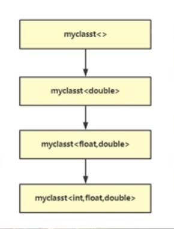

# 可变参类模板

## 通过递归组合方式展开参数包

两个类之间什么叫 组合关系？
组合关系也称为复合关系，实际上就是一种包含关系

```c++
namespace _nmsp1
{
    class B
    {
        // ........
    };
    
    class A
    {
    public:
        B b;    // A类中包含了B的对象，b做为类A的成员变量
    };
    
    // 这种就A和B的关系就是一种组合关系
    
    void func()
    {
        
    }
}
```


这种就说明是A类包含B对象，实心菱形在哪边，哪边就是包含，箭头指向哪个，哪个就是被包含

```c++
namespace _nmsp2
{
    // 主模板定义《泛化版本的类模板》
    template<typename...Args>
    class myclasst
    {
    public:
        myclasst()
        {
            std::cout << "myclasst::myclasst()泛化版本构造函数执行了， this = " << (void *)this << std::endl;
        }
    };
    
    template<typename First, typename... Others>
    class myclasst<First, Others...>
    {
    public:
        myclasst():m_i(0)
        {
            std::cout << "myclasst::myclasst()偏特化版本无参构造函数执行了， this = "<< (void*)this 
            << " sizeof...(Others) = " << sizeof...(Others) 
            << std::endl;
        }
        
        myclasst(First parf, Others... pros):m_i(parf), m_o(pros...)
        {
            std::cout << "---------------------------------begin---------------------------------" << std::endl;
            std::cout << "myclasst::myclasst()偏特化版本有参构造函数执行了， this = "<< (void*)this 
            << " sizeof...(Others) = " << sizeof...(Others) 
            << std::endl;
            std::cout << "成员变量m_i = " << m_i << std::endl;
            std::cout << "----------------------------------engl---------------------------------" << std::endl;
        }
        
        First m_i;
        
        // 注意这种递归组合方式和之前递归继承方式的区别，现在这里没有继承，所以这里用的是组合了一个同类型的成员变量
        // 类型参数是我们的参数包
        myclasst<Others...> m_o;
    };
    
    template<>
    class myclasst<>    // 一个特殊的特化版本，看起来像全特化，但是实际上不是全特化，可变参数类模板不存在全特化
    {
    public:
        myclasst()
        {
            std::cout << "myclasst::myclasst()特殊的特化版本构造函数执行了， this = " << (void*)this << std::endl;
        }
    };
    

    
    void func()
    {
        myclasst<int, float, double> myct(12, 100.34f, 88.90);
        // myclasst::myclasst()特殊的特化版本构造函数执行了� this = 0x7ffd78b8f5e8
        // ---------------------------------begin---------------------------------
        // myclasst::myclasst()偏特化版本有参构造函数执行了， this = 0x7ffd78b8f5e0 sizeof...(Others) = 0
        // 成员变量m_i = 88.9
        // ----------------------------------engl---------------------------------
        // ---------------------------------begin---------------------------------
        // myclasst::myclasst()偏特化版本有参构造函数执行了， this = 0x7ffd78b8f5d8 sizeof...(Others) = 1
        // 成员变量m_i = 100.34
        // ----------------------------------engl---------------------------------
        // ---------------------------------begin---------------------------------
        // myclasst::myclasst()偏特化版本有参构造函数执行了， this = 0x7ffd78b8f5d0 sizeof...(Others) = 2
        // 成员变量m_i = 12
        // ----------------------------------engl---------------------------------
       
    }
}
```

通过打印可以看到，递归组合展开参数包和递归继承展开参数包有个明显的区别就是this值不一样

递归继承展开参数包：每个实例化出来的类this指针都是相同的【实例化出来的类是继承关系】



递归组合展开参数包：每个实例化出来的类this指针都不相同【实例化出来的类是包含（组合方式）】


编译器在实例化myclasst<int, float, double>的时候，发现他里面有个myclass<float,double>类型的成员变量，

那么编译器就会先去实例化myclass<float,double>，然后在实例化myclass<float,double>的时候，发现他里面有一个

myclass<double>类型的成员变量，那么编译器就会先去实例化这个myclass<double>，然后实例化myclass<double>

的时候，发现他里面有个myclass<>，编译器就会先去实例化myclass<>。

这就是递归组合展开参数包的过程


## 通过tuple和递归调用方式展开参数包

tuple的概念和简单演示
tuple：元组 【实际上是一个可变参模板】

```c++
namespace _nmsp3
{
    // 可变参函数模板
    template<typename... T>
    void myFuncTuple(const tuple<T...>& t)
    {
        std::cout << "可变参函数模板被调用" << std::endl;
    }
    
    void func()
    {
        // 一个元组（tuple）,一堆各种数据的组合
        tuple<float, int, int> mytuple(12.34f, 100, 10);
        
        // 元组可以打印，使用标准库中的get （一个函数模板）
        std::cout << get<0>(mytuple) << std::endl;  // 12.34
        std::cout << get<1>(mytuple) << std::endl;  // 100
        std::cout << get<2>(mytuple) << std::endl;  // 10
        
        myFuncTuple(mytuple);
        // 可变参函数模板被调用
    }
}
```


如何用tuple和递归调用展开参数包
这种使用tuple和递归调用展开参数实际上是需要写类的特化版本的

**实现思路：**
有一个计数器（变量），从0开始，每处理一个参数，计数器+1
一直到把参数包里所有的参数处理完，最后需要提供一个模板偏特化，作为递归调用结束

```c++
namespace _nmsp4
{
    // 泛化版本
    // myCount: 用于计数，从0开始，myMaxCount表示可变参参数包大小（参数数量，可以用sizeof...()取得）
    template<int myCount, int myMaxCount, typename... T>
    class MyClassT
    {
    public:
    // 静态成员函数，借助tuple（类型）和标准库类函数模板get，就能够把每个参数提取出来
        static void myStaticFunc(const tuple<T...>& t)
        {
            std::cout << "value = " << get<myCount>(t) << std::endl;
            // 通过这行代码可以把每个参数取出来并输出到屏幕
            
            // 然后进行递归调用，注意这里计数器要进行+1
            MyClassT<myCount + 1, myMaxCount, T...>::myStaticFunc(t);
            // 注意这里myCount 要写成 myCount + 1，而不能写成++
            // 因为我们传递进来的是一个数字，不是一个变量
            // 比如：
            // 1++和++1都是错误的，因为++和--运算针对对象只能是单个的整型变量
        }
    };
    
    // 偏特化版本，用于做递归调用的出口
    template<int myMaxCount, typename... T>
    class MyClassT<myMaxCount, myMaxCount, T...>
    {
    public:
        static void myStaticFunc(const tuple<T...>& t)
        {
            // 这里不用做什么
        }
    };
    
    
    // 可变参函数模板
    template<typename... T>
    void myFuncTuple(const tuple<T...>& t)
    {
        MyClassT<0, sizeof...(T), T...>::myStaticFunc(t);
        // 这里注意：第一个参数为0，表示计数从0开始，第二个参数为可变参数量， 第三个为一个tuple对象
    }
    
    void func()
    {
        tuple<int, double, float, char, string> mytuple(10, 23.343, 334.2f, 'C', "std:string");
        myFuncTuple(mytuple);
        // value = 10
        // value = 23.343
        // value = 334.2
        // value = C
        // value = std:string
    }
}
```


## 基类参数包的展开

演示一个：某个类的基类也可以是可变参

```c++
namespace _nmsp5
{
    
    // 注意这里MyCT的父类，他的父类就是这个可变参，说明MyCT有0-任意多个父类（基类）
    template<typename... myclassPList>
    class MyCT:public myclassPList...
    {
    public:
        MyCT():myclassPList()...
        {
            std::cout << "MyCT::MyCT()构造函数执行了， this = " << this << std::endl;
        }
    };
    
    class PA1
    {
    public:
        PA1()
        {
            std::cout << "PA1::PA1()执行了，this = " << this << std::endl;
        }
        
    private:
        char m_s1[100];
    };
    
    class PA2
    {
    public:
        PA2()
        {
            std::cout << "PA2::PA2()执行了，this = " << this << std::endl;
        }
    
    private:
        char m_s1[200];
    
    };
    
    class PA3
    {
    public:
        PA3()
        {
            std::cout << "PA3::PA3()执行了，this = " << this << std::endl;
        }
        
    private:
        char m_s1[300];
    };
    
    class PA4
    {
    public:
        PA4()
        {
            std::cout << "PA4::PA4()执行了，this = " << this << std::endl;
        }
        
    private:
        char m_s1[400];
    };
    
    void func()
    {
        MyCT<PA1, PA2, PA3, PA4> objCt;
        // PA1::PA1()执行了，this = 0x7ffc7179f900
        // PA2::PA2()执行了，this = 0x7ffc7179f964
        // PA3::PA3()执行了，this = 0x7ffc7179fa2c
        // PA4::PA4()执行了，this = 0x7ffc7179fb58
        // MyCT::MyCT()构造函数执行了， this = 0x7ffc7179f900
        std::cout << "sizeof(objCt) = " << sizeof(objCt) << std::endl;
        // sizeof(objCt) = 1000
        
        // 注意看：这里打印的MyCT的对象大小为1000（100 + 200 + 300 + 400）
        // 然后，看this指向，发现每个父类的this指向都不相同，但是最终MyCT的对象的this指向和基类PA1的this指向相同
        // 因为这里是多种继承，有多个父类，第一个父类的this指针是和最终子对象的this指针是相同的，
        // 其他的父类this指针在此基础上依次偏移（this指针调整）
    }
}
```


## 特化

可变参模板不存在全特化，所以只有偏特化

```c++
namespace _nmsp6
{
    // 泛化版本
    template<typename... Args>
    class CT
    {
    public:
        CT()
        {
            std::cout << "CT::CT()泛化版本构造函数执行了， this = " << this
            << "   sizeof...(Args) = " << sizeof...(Args) << std::endl;
        }
    };
    
    // 偏特化版本1
    template<typename First, typename... Others>
    class CT<First, Others...>
    {
    public:
        CT()
        {
            std::cout << "CT<First, Others...>::CT()偏特化版本构造函数执行了， this = " << this
            << "   sizeof...(Args) = " << sizeof...(Others) << std::endl;
        }
        
        
    };
    
    // 偏特化版本2
    template<typename Arg>
    class CT<Arg>
    {
    public:
        CT()
        {
            std::cout << "CT<Arg>::CT()偏特化版本构造函数执行了， this = " << this << std::endl;
        }
    };
    
    
    // 偏特化版本3
    template<typename Arg1, typename Arg2>
    class CT<Arg1, Arg2>
    {
    public:
        CT()
        {
            std::cout << "CT<Arg1, Arg2>::CT()偏特化版本构造函数执行了， this = " << this << std::endl;
        }
    };
    
    void func()
    {
        CT<> ct1;
        // CT::CT()泛化版本构造函数执行了， this = 0x7ffc478d2293   sizeof...(Args) = 0
        CT<int> ct2;
        // CT<Arg>::CT()偏特化版本构造函数执行了， this = 0x7ffc478d2294
        CT<int, double> ct3;
        // CT<Arg1, Arg2>::CT()偏特化版本构造函数执行了， this = 0x7ffc478d2295
        CT<int, double, float> ct4;
        // CT<First, Others...>::CT()偏特化版本构造函数执行了， this = 0x7ffc478d2296   sizeof...(Args) = 2
        CT<int, double, float, string> ct5;
        // CT<First, Others...>::CT()偏特化版本构造函数执行了， this = 0x7ffc478d2297   sizeof...(Args) = 3
    }
}
```

