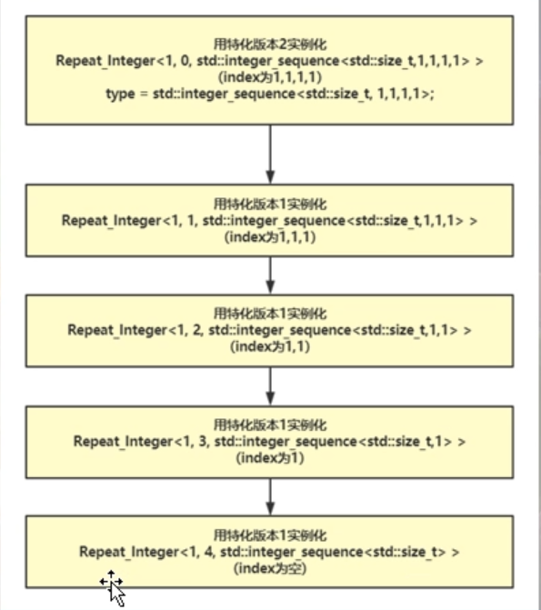

# std::integer_sequence

正向排列数字生成一个类型Integer_Sequence
linux下需要引入头文件 <utility>
std::integer_sequence是c++14中引入的一个类模板
源码如下：

```c++
template<class _Ty, _Ty... _Vals>
struct integer_sequence
{
    static_assert(is_integral_v<_Ty>, "integer_sequence<T, T...> requires T to be an intergral type ");
    

    using value_type;
    
    _NODISCARD static constexpr size_t size() noexcept
    {
        return sizeof...(_Vals);
    }

};
```


从代码字面意思看，std::integer_sequence大概意思就是产生一个整形数字序列（1， 2， 3， 4.。。）
`_Ty` 是一个类型模板参数，一般要求是一个和整形相关的类型参数 （int, unsigned int, char, short）
`_Vals`: 非类型模板参数包，一堆数字，这堆数字类型相同，都是_Ty类型

std::make_integer_sequence 别名模板，就可以理解成是一个std::integer_sequence，伪码大概：

```c++
template<class T, T N>
using make_integer_sequence = std::integer_sequence<T, 0, 1, 2, 3, ... N-1序列>
```

c++标准库中还引入了一个叫做 std::make_index_sequence的别名模板，他与make_integer_sequence非常类，但是make_index_sequence进一步简化，make_integer_sequence需要传递两个模板参数（类型参数和一个终值），而，make_index_sequence只需要传递一个模板参数

make_index_sequence伪代码

```c++
template<std::size_t N>
using make_index_sequence = std::integer_sequence<size_t, 0, 1, 2, 3, 4... N-1序列>;
```

对于make_index_sequence和make_integer_sequence的具体用途会在元组里讲到

```c++
namespace _nmsp1
{
    
    void func()
    {
        std::make_integer_sequence<int, 5> tmpobj;
        std::cout << "tmpobj 类型 = " << typeid(decltype(tmpobj)).name() << std::endl;
        // tmpobj 类型 = Std::integer_sequence<int, 0, 1, 2, 3, 4>
        // 可以看到，对于std::integer_sequence，我们给进入一个元素类型，然后给一个终值，
        // 通过这个模板make_integer_sequence，我们能得到一个integer_sequence类型
        // 该类型的尖括号中，第一个类型参数是数字元素类型，后面从第二个开始，是一系列数字，
        // 这个序列从0开始，正好到N-1结束
        
        std::make_index_sequence<4> tmpobj2;
        std::cout << "tmpobj2 类型 = " << typeid(decltype(tmpobj2)).name() << std::endl;
        // tmpobj2 类型 = Std::integer_sequence<unsigned int, 0, 1, 2, 3>
    }
}
```


## 正向排列数字生成一个类型Integer_Sequence

```c++
namespace _nmsp2
{
    // 正向排列数字生成一个类型Integer_Sequence
    // Integer_Sequence是一个我们自己需要实现的类模板
    // 
    // 研究如何通过make_integer_sequence<int, 5>得到类型std::integer_sequence<int, 0, 1, 2, 3, 4> 
    
    // 向Integer_Sequence末尾插入元素
    // 泛化版本
    // INISEQ代表的是整个的std::integer_sequence<>类型
    // 
    template<typename INISEQ, unsigned int NewElem>
    struct InSeq_PushBack;  // 因为不使用泛化版本，所以只声明不实现
    
    
    // 特化版本
    // 向std::integer_sequence的末尾插入元素
    // 泛化版本一般要求可变参放在最后，但是特化版本可以放在中间
    template<typename T, unsigned int... Elems, unsigned int NewElem>
    struct InSeq_PushBack<std::integer_sequence<T, Elems...>, NewElem>
    {
        using type = std::integer_sequence<T, Elems..., NewElem>;
    };
    
    
    // 泛化版本
    template<typename T, unsigned int N>
    struct Integer_Sequence
    {
        // 这里需要依次遍历出4， 3， 2， 1
        // 然后往末尾插入元素（所以这里还需要引入一个 InSeq_PushBack 这么一个操作来往末尾插入数字序列）
        
        using type = typename InSeq_PushBack<typename Integer_Sequence<T, N-1>::type, N-1>::type;
        // 这里把：：type理解成函数调用，把type理解成调用的函数名
    };
    
    // 特化版本
    template<typename T>
    struct Integer_Sequence<T, 1>   // 这里是 1 ，意味着递归到 1 就可以了
    {
        using type = std::integer_sequence<T, 0>;
    };
    
    // 为了方便使用，可以定义一个别名模板
    template<typename T, unsigned int N>
    using Integer_Sequence_T = typename Integer_Sequence<T, N>::type;
    
    // 注意，这里Integer_Sequence_T实现的就是std::make_integer_sequence
    
    void func()
    {
        Integer_Sequence_T<int, 5> tmpobj;
        
        std::cout << "tmpobj的类型为 = " << typeid(decltype(tmpobj)).name() << std::endl;
        
        // Integer_Sequence_T<int, 5> tmpobj; 等价于
        // Integer_Sequence<int, 5>::type tmpobj;   把：：type看成函数调用
        // 然后这行调用泛化版本
        // using type = typename InSeq_PushBack<typename Integer_Sequence<int, 4>::type, 4>::type;
        // ------先展开 typename Integer_Sequence<int, 4>::type 得到
        // -----------using type = typename InSeq_PushBack<typename Integer_Sequence<int, 3>::type, 3>::type;
        // -----------继续展开typename Integer_Sequence<int, 3>::type
        // ----------------using type = typename InSeq_PushBack<typename Integer_Sequence<int, 2>::type, 2>::type;
        // ----------------继续展开typename Integer_Sequence<int, 2>::type
        // ---------------------using type = typename InSeq_PushBack<typename Integer_Sequence<int, 1>::type, 1>::type;
        // ---------------------继续展开typename Integer_Sequence<int, 1>::type 【这里调用特化版本】
        // --------------------------using type = std::integer_sequence<int, 0>;    
        // --------------------------递归结束，往回回溯【注意往回回溯的时候，InSeq_PushBack是向integer_sequence末尾插入内容】
        // ---------------------using type = std::integer_sequence<int, 0, 1>
        // ----------------using type = std::integer_sequence<int, 0, 1, 2>
        // -----------using type = std::integer_sequence<int, 0, 1, 2, 3>
        // ------using type = std::integer_sequence<int, 0, 1, 2, 3, 4>
        // 最终结果就是 using type = std::integer_sequence<int, 0, 1, 2, 3, 4>
        
        
    }   
}
```


## 逆向排列数字生成一个类型Integer_Sequence_Reverse

```c++
namespace _nmsp1
{
    // 逆向排列数字生成一个类型Integer_Sequence_Reverse
    
    // 向integer_sequence头部插入元素
    
    // 泛化版本
    template<typename INTSEQ, unsigned int NewElem>
    struct InSeq_PushFront;
    
    // 特化版本
    template<typename T, unsigned int... Elems, unsigned int NewElem>
    struct InSeq_PushFront<std::integer_sequence<T, Elems...>, NewElem>
    {
        using type = std::integer_sequence<T, NewElem, Elems...>;
    };
    
    // ----------------------------------------------------------------
    
    // Integer_Sequence_Reverse
    // 泛化版本
    // Count 计数（从1开始）
    template<typename T, unsigned int N, unsigned int Count = 1>
    struct Integer_Sequence_Reverse
    {
        using type = typename InSeq_PushFront<typename Integer_Sequence_Reverse<T, N-1>::type, N-Count>::type;
    };
    
    // 特化版本
    template<typename T, unsigned int N>
    struct Integer_Sequence_Reverse<T, N, N>
    {
        using type = std::integer_sequence<T, N-1>;
    };
    
    // ----------------------------------------------------------------
    
    // 定义别名模板
    template<typename T, unsigned int N>
    using Integer_Sequence_Reverse_T = typename Integer_Sequence_Reverse<T, N>::type;
    
    void func()
    {
        Integer_Sequence_Reverse_T<int, 5> tmobj;
        std::cout << "tmobj类型 = " << typeid(decltype(tmobj)).name() << std::endl;
        // tmobj类型 = std::integer_sequence<int, 4, 3, 2, 1, 0>
        // Integer_Sequence_Reverse_T<int, 5> tmobj; 等价于
        // Integer_Sequence_Reverse<int, 5>::type; // 把::type看成函数调用，走到泛化版本
        // （因为泛化版本默认提供了第三个非类型模板参数1，而这里没有提供那个计数参数，所以比对下来就选择走非类型模板参数，很好理解，等到递归到计数参数和N相等之时，就走特化版本）
        // ----using type = typename InSeq_PushFront<typename Integer_Sequence_Reverse<int, 4>::type, 4>::type;
        // ----Integer_Sequence_Reverse<int, 4>::type 展开如下
        // --------using type = typename InSeq_PushFront<typename Integer_Sequence_Reverse<int, 3>::type, 3>::type;
        // --------Integer_Sequence_Reverse<int, 3>::type 展开如下
        // ------------using type = typename InSeq_PushFront<typename Integer_Sequence_Reverse<int, 2>::type, 2>::type;
        // ------------Integer_Sequence_Reverse<int, 2>::type 展开如下
        // ----------------using type = typename InSeq_PushFront<typename Integer_Sequence_Reverse<int, 1>::type, 1>::type;
        // ----------------Integer_Sequence_Reverse<int, 1>::type 展开如下、这行展开调用的就是特化版本
        // --------------------using type = std::integer_sequence<int, 0>;  // 这行之后，递归结束，开始回溯
        // ----------------using type = std::integer_sequence<int, 1, 0>;
        // ------------using type = std::integer_sequence<int, 2, 1, 0>;
        // --------using type = std::integer_sequence<int, 3, 2, 1, 0>;
        // ----using type = std::integer_sequence<int, 4, 3, 2, 1, 0>;
        // 最终结果就是 
        // using type = std::integer_sequence<int, 4, 3, 2, 1, 0>;
        
        
    }
}
```


## 将一个数字重复多次生成一个类型Repeat_Integer



```c++
namespace _nmsp2
{
    
    // 将一个数字重复多次生成一个类型 Repeat_Integer
    // 前面是通过递归调用的方式实现，现在这个采用递归继承的方式实现
    // 泛化版本
    template<std::size_t Num, std::size_t RepeatTime, typename INISEQ = std::integer_sequence<std::size_t>>
    class Repeat_Integer;
    
    // 特化版本
    template<std::size_t Num, std::size_t RepeatTime, std::size_t... index>
    class Repeat_Integer<Num, RepeatTime, std::integer_sequence<std::size_t, index...>>
    :public Repeat_Integer<Num, RepeatTime-1, std::integer_sequence<std::size_t, index..., Num>>
    {};
    
    // 特化版本（用于结束递归的特化版本）
    template<std::size_t Num, std::size_t... index>
    class Repeat_Integer<Num, 0, std::integer_sequence<std::size_t, index...>>
    {
    public:
        using type = std::integer_sequence<std::size_t, index...>;
    };
    // ----------------------------------------------------------------
    // 定义别名模板
    template<std::size_t Num, std::size_t RepeatTime>
    using Repeat_Integer_T = typename Repeat_Integer<Num, RepeatTime>::type;
    
    
    void func()
    {
        Repeat_Integer_T<9, 5> tmobj;
        std::cout << "tmobj类型 = " << typeid(decltype(tmobj)).name() << std::endl;
        // tmobj类型 = std::integer_sequence<size_t, 9, 9, 9, 9, 9>
        // 因为Repeat_Integer_T<9, 5> tmobj;存在，所以编译器会根据Repeat_Integer的特化版本实例化出如下类
        // Repeat_Integer<9, 5, std::integer_sequence<std::size_t>>
        // 要想实例化出这个，根据继承关系，就得先有 如下父类
        // Repeat_Integer<9, 4, std::integer_sequence<std::size_t, 9>>
        // 要想实例化出这个，根据继承关系，就得先有 如下父类
        // Repeat_Integer<9, 3, std::integer_sequence<std::size_t, 9, 9>>
        // 要想实例化出这个，根据继承关系，就得先有 如下父类
        // Repeat_Integer<9, 2, std::integer_sequence<std::size_t, 9, 9, 9>>
        // 要想实例化出这个，根据继承关系，就得先有 如下父类
        // Repeat_Integer<9, 1, std::integer_sequence<std::size_t, 9, 9, 9, 9>>
        // 要想实例化出这个，根据继承关系，就得先有 如下父类
        // Repeat_Integer<9, 0, std::integer_sequence<std::size_t, 9, 9, 9, 9, 9>>
        
        Repeat_Integer_T<9, 5, std::integer_sequence<std::size_t, 10, 100, 1000>> tmobj2;
        std::cout << "tmobj类型 = " << typeid(decltype(tmobj2)).name() << std::endl;
        // tmobj2类型 = std::integer_sequence<size_t, 10, 100, 1000, 9, 9, 9, 9, 9>
        // 这里实例化 Repeat_Integer<9, 5, std::integer_sequence<std::size_t 10， 100， 1000>>
        // 实例化的是第一个特化版本，那么非类型可变参模板参数 index... 就是这里的 10， 100， 1000
        // 
    }
}

```

在递归结束时，即使用Repeat_Integer的特化版本2来进行实例化Repeat_Integer时，使用了using来定义类型别名type，此时type就相当于 std::integer_sequence<std::size_t, 9, 9, 9, 9, 9>