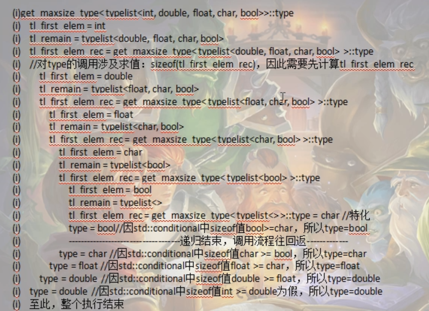
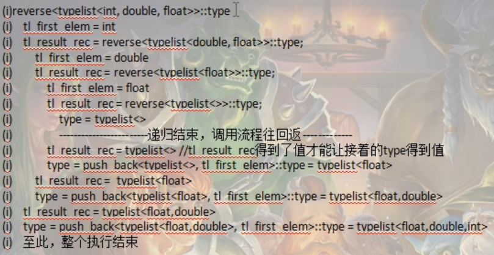
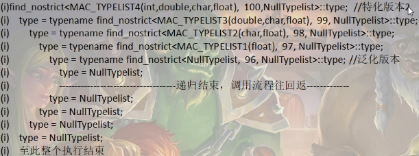

# typelist的实现（类型计算的范例）

《Modern C++ Design》-(c++设计新思维)，在这本书中通过设计了一个叫做Loki的库实现typelist（采用列表头 + 嵌套列表技术来实现，因为03年c++还不支持可变参模板）

typelist是一个类模板，是用来操作一大堆类型的c++容器，就像c++标准库中的list容器（能对各种数值提供各种基本操作）

typelist与之类似，但是他操作的不是数值，而是针对类型进行操作。所以typelist简单来说就是一个类型容器，能够对类型提供一系列操作，把类型当成数据来操作

从实现上来讲，typelist是一个类模板，中文名“类型列表”。该类模板表示一个列表，在该列表中存放一堆类型

之前对于元编程的学习，了解到，元编程很大一部分是针对类型进行计算的

## 设计和基本操作接口（算法）

可以考虑把typelist相关的定义放到一个命名空间中，避免全局命名空间被污染

### 取得typelist中的第一个元素（front）

既然typelist是一个类型列表，也就是他是保存类型的容器，那么毫无疑问，取得typelist中的第一个元素肯定也是一个类型

```c++
// ------------------------------------------------------------------------------
    // 取得typelist中的第一个元素（front）
    // 写一个类模板，他的能力就是从typelist中取得第一个元素
    // TPLT 就代表整个typelist<...>类型
    // 泛化版本，因为用不到，所以只需要声明，
    template<class TPLT>
    class front;
    
    // 特化版本
    // 这里要尤其注意这里特化版本的写法，因为泛化版本中只有一个类型参数 TPLT，
    // 所以在特化版本，front后面的尖括号中也应该要保证，只能有一个具体类型 typelist<First, Other...>
    // 然后，在根据特化版本中front后面的<>中的类型，来确定模板中应该有哪些模板参数，即 <class First, class... Other>
    template<class First, class... Other>
    class front<typelist<First, Other...>>
    {
    public:
        using type = First;
    };
```

### 取得typelist容器中元素的数量（size）

```c++
// 取得typelist容器中元素的数量（size）
    // 泛化版本
    template<class TPLT>
    class size;
    
    // 特化版本
    template<class ...Args>
    class size<typelist<Args...>>
    {
    public:
        static inline size_t value = sizeof...(Args);
    };
```

### 从typelist中移除第一个元素（pop front）

```c++
// 从typelist中移除第一个元素（pop front）
    // 泛化版本
    template<class TPLT>
    class pop_front;
    
    // 特化版本
    template<class First, class... Other>
    class pop_front<typelist<First, Other...>>
    {
    public:
        using type = typelist<Other...>;
    };
```

### 向typelist的开头和结尾插入一个元素（push_front、push_back）

```C++
// 向typelist的开头和结尾插入一个元素（push_front、push_back）
    // push_front
    // 泛化版本
    // NewElem 要插入的新类型
    template<class TPLT, class NewElem>
    class push_front;
    
    // 特化版本
    template<class... Args , class NewElem>
    class push_front<typelist<Args...>, NewElem>
    {
    public:
        using type = typelist<NewElem, Args...>;
    };
    
    // push_back
    // 泛化版本
    // NewElem 要插入的新类型
    template<class TPLT, class NewElem>
    class push_back;
    
    // 特化版本
    template<class... Args , class NewElem>
    class push_back<typelist<Args...>, NewElem>
    {
    public:
        using type = typelist<Args..., NewElem>;
    };
```


### 替换typelist的开头元素（replace_front）

```C++
// 替换typelist的开头元素（replace_front）
    // 泛化版本
    // NewElem 表示要替换进来的那个类型
    template<class TPLT, class NewElem>
    class replace_front;
    
    // 特化版本
    template<class First, class... Other, class NewElem> 
    class replace_front<typelist<First, Other...>, NewElem>
    {
    public:
        using type = typelist<NewElem, Other...>;
    };
```


### 判断typelist是否为空（is_empty)

```C++
 // 判断typelist是否为空（is_empty)
    // 泛化版本
    template<class TPLT>
    class is_empty : public std::false_type
    {};
    
    // 特化版本
    template<>
    class is_empty<typelist<>> : public std::true_type
    {};
```

main中调用上述功能接口，执行的结果

```c++
int main()
{
    std::cout << typeid(tplt::front<TPL_NM1>::type).name() << std::endl;
    // int 
    // 如果typelist中不包含任何元素，那么使用当前这个front来取，是会报编译错误的（报未定义错误）
    // 因为对于这种空的typelist，在进行front调用的时候，是不满足特化版本的，因为特化版本时要求至少要有一个元素的，
    // 所以这种情况下，他只能去调用front的泛化版本，但是泛化版本因为只是进行声明，没有实现定义，所以就报未定义错误
    // std::cout << typeid(tplt::front<TPL_NM2>::type).name() << std::endl;
    
    // 所以其实这里是故意不写泛化版本的，这样做了之后，反而达到了检查错误的效果（因为这里对于没有类型的typelist（空typelist）你却要去返回一个类型）
    // 这种写法本身就是错误的。这种错误在编译的时候就能发现这个错误
    
    // ------------------------------------------------------------------------------
    std::cout << tplt::size<TPL_NM1>::value << std::endl;
    // 5
    std::cout << tplt::size<TPL_NM2>::value << std::endl;
    // 0
    
    // ------------------------------------------------------------------------------
    std::cout << typeid(tplt::pop_front<TPL_NM1>::type).name() << std::endl;
    // double
    std::cout << tplt::size<tplt::pop_front<TPL_NM1>::type>::value << std::endl;
    // 4
    
    // ------------------------------------------------------------------------------
    std::cout << typeid(tplt::push_front<TPL_NM1, bool>::type).name() << std::endl;
    // bool
    std::cout << tplt::size<tplt::push_front<TPL_NM1, bool>::type>::value << std::endl;
    // 6
    
    // ------------------------------------------------------------------------------
    std::cout << typeid(tplt::push_back<TPL_NM1, bool>::type).name() << std::endl;
    // int
    std::cout << tplt::size<tplt::push_back<TPL_NM1, bool>::type>::value << std::endl;
    // 6
    
    // ------------------------------------------------------------------------------
    std::cout << typeid(tplt::replace_front<TPL_NM1, std::string>::type).name() << std::endl;
    // std::string
    std::cout << tplt::size<tplt::replace_front<TPL_NM1, std::string>::type>::value << std::endl;
    // 5
    
    // 当然，对于这种替换操作，我们也可以直接使用pop + push 达到一样的效果
    using TnpType = tplt::push_front<tplt::pop_front<TPL_NM1>::type, unsigned>::type;
    std::cout << tplt::size<TnpType>::value << std::endl;
    // 5
    std::cout << typeid(TnpType).name() << std::endl;
    // unsigned
    
    // ------------------------------------------------------------------------------
    std::cout << tplt::is_empty<TPL_NM2>::value << std::endl;
    // 1
    std::cout << tplt::is_empty<TPL_NM1>() << std::endl;
    // 0
    
    return 0;
}
```


## 扩展操作接口（算法）

### 根据索引号查找typelist的某个元素（find）

```c++
// ------------------------------------------------------------------------------
    // 根据索引号查找typelist的某个元素（find）
    // 因为要找到满足索引号对应的类型，所以不可避免的需要用到递归这种编程手法，递归的此时应该是从索引号开始
    // 每次递归减1，直到0结束。也就是递归是以我们下面的这个特化版本作为出口（递归结束），
    // 那这里这个特化版本的find类模板就应该以front做为父类比较合适
    // 
    // 然后泛化版本，每次递归我们要考虑移除第一个元素，每次移除一个，递归下去总会移除到我们索引号对应的那个元素上去
    // 也就是说，每次递归我们都要想办法利用pop_front移除第一个元素，同时索引计数减1
    
    // 泛化版本
    template<class TPLT, unsigned int V>
    class find : public find<class pop_front<TPLT>::type, V-1>
    {};
    
    // 特化版本
    // 索引值每次递归减1，减少到0的时候，就找到我们索引指向的那个类型值了，也就是这个开头元素
    // 然后继承自front，那front返回的那个值就是我们要取的那个
    // 那这个时候，特化版本就成立
    template<class TPLT>
    class find<TPLT, 0> : public front<TPLT>
    {};
```

find继承关系图


### 遍历typelist找到sizeof值最大的元素（get_maxsize_type）

遍历typelist找到sizeof值最大的元素（get_maxsize_type），一个typelist中有众多类型，这些类型所占用的内存是各不相同的，使用sizeof可以轻易求得这些类型所占用的内存字节数

​    元编程计算完整性

- ​    1）迭代构造（循环构造），也就是在 get_maxsize_type 模板中是需要融入递归编程
- ​    2）状态变量：指的就是类模板 get_maxsize_type 中的模板参数，因为这里的类模板的模板参数就是typelist
- ​    所以，每次递归，typelist中的元素数量必然要减少一个，最终才能符合递归结束条件
- ​    3）执行路径的选择，使用std::conditional 以及 get_maxsize_type 类模板的特化达到递归结束的效果
- ​    这个特化版本的特点就是模板参数 typelist 中的模板参数为 0 个
- ​    4）运算对象，类模板中的type成员里面记录的就是当前sizeof值最大的类型

```c++
// 泛化版本
    template<class TPLT>
    class get_maxsize_type
    {
    private:
        // 当前 get_maxsize_type 中 typelist（模板参数TPLT）的第一个元素
        using tl_first_elem = typename front<TPLT>::type;
        // 获取typelist中的第一个元素（这个元素其实就是一个类型）
        
        // 当前 get_maxsize_type 中 typelist（模板参数TPLT）去除第一个元素后的 剩余元素
        using tl_remain = typename pop_front<TPLT>::type;
        
        // 递归下去的 get_maxsize_type 中 typelist（模板参数 tl_remain）的第一个元素
        // 其实这个元素就是用来做sizeof值比较的
        using tl_first_elem_rec = typename get_maxsize_type<tl_remain>::type;
        
       
    public:
        using type = typename std::conditional<
            sizeof(tl_first_elem) >= sizeof(tl_first_elem_rec),
            tl_first_elem,
            tl_first_elem_rec
            >::type;
        
        // 递归的比较原则就是通过get_maxsize_type来取得typelist中的第一个元素，然后分别与typelist中的元素依次减少一个的
        // get_maxsize_type 中的那个 typelist 的第一个元素进行sizeof值的比较比较，将sizeof值比较大的类型存在type中
        
    };
    
    // 特化版本
    template<>
    class get_maxsize_type<typelist<>>
    {
        // 一直比较直到typelist中再没有元素的时候，就会满足 get_maxsize_type 的特化版本，
        // 特护版本中的这个type给的是char类型，char类型的sizeof值是,1是sizeof中最小的，
        // 因此在比较并寻找sizeof值最大的时候，这个char类型永远不会被选中，
        // 因此这里把char作为递归结束的type，完全没有问题，显得非常合适
    public:
        using type = char;
        // 这里给一个char，没有比char再小的类型了
    };
```

递归实例化流程



### 颠倒（翻转）一个typelist中的元素的顺序（reverse）

首先，每次递归，都能通过 tl_first_elem 取得本次递归的第一个元素，然后在递归出口处，type 这里保存的是一个空的typelist,当递归程序执行结束往回返的时候，使用 tl_result_rec 来接收 typelist为空的时候 reverse特化返回的值【typelist<>】，在typelist不为空的时候，在不为空的这个特化版本中，type 就通过 利用 tl_first_elem 和 ，tl_result_rec 的配合不断的利用push_back往 typelist中尾部插入元素，最终实现元素翻转

也就是说，在正向递归的时候，把每个头部拿到对应的递归层级的 tl_first_elem 中，然后在递归结束，回溯的时候，将这些值 通过 type 尾插到 空 typelist 中实现翻转

```c++
// 颠倒（翻转）一个typelist中的元素的顺序（reverse）
    // 泛化版本
    template<class TPLT, bool = is_empty<TPLT>::value>
    class reverse;
    
    // 特化版本
    // 处理typelist中还有元素的时候（也就是不为空的时候）
    // 不断把头弹出来，然后把弹出来的头往尾部加，（实现翻转）
    template<class TPLT>
    class reverse<TPLT, false>
    {
    private:
        using tl_first_elem = typename front<TPLT>::type;
        // 获取typelist中的第一个元素（这个元素其实就是一个类型）
    
        // tl_result_rec 就是把头部弹出来后，剩下的typelist
        // 初始递归的using，递归结束后，tl_result_rec负责配合 type 整理最终的结果
       using tl_result_rec = typename reverse<typename pop_front<TPLT>::type>::type;
       
    public:
        // 将头部插入到弹出后的尾部，实现翻转的关键
        using type = typename push_back<tl_result_rec, tl_first_elem>::type;
    };
    
    
    // 特化版本
    // 处理typelist中没有元素的时候
    // 没有元素的时候，你对列表进行翻转，就相当于没有翻转
    template<class TPLT>
    class reverse<TPLT, true>
    {
    public:
        using type = TPLT;
    };
```




## typelist的老式设计与typelist的思考

### typelist的老式设计

```c++
namespace tplt2
{
    // typelist 的老式设计
    
    
    // 定义一个空的typelist类
    class NullTypeList
    {};
    
    template<class T, class U = NullTypeList>
    class Typelist
    {
    public:
        using Head = T; // Typelist 中的第一个元素（列表头）
        using Tail = U; // Typelist 中的其余元素 （这里会用到嵌套列表，（因为在可变参类模板出世之前，不用这种技术很难做到可变参））
        
    };
    
    // ------------------------------------------------------------------------------
    // 取得Typelist容器中的第一个元素
    template<class TPLT>
    class front
    {
    public:
        using type = typename TPLT::Head;
    };
    
    // ------------------------------------------------------------------------------
    // 取得Typelist中的元素数量
    // 泛化版本
    template<class TPLT>
    class size;
    
    // 特化版本1
    // Typelsit为空
    template<>
    class size<NullTypeList>
    {
    public:
        static inline size_t value = 0;
    };
    
    // 特化版本2
    // Typelsit不为空
    // 注意啊：这里T是一个类型，U是一个Typelist。要这么理解
    template<class T, class U>
    class size<Typelist<T, U>>
    {
    public:
        static inline size_t value = size<U>::value + 1;
        // 递归
    };
    
    // ------------------------------------------------------------------------------
    // 从Typelist中移除第一个元素
    template<class TPLT>
    class pop_front
    {
    public:
        using type = typename TPLT::Tail;
    };
    
    // ------------------------------------------------------------------------------
    // 向Typelsit的开头插入元素
    template<class TPLT, class NewElem>
    class push_front
    {
    public:
        using type = Typelist<NewElem, TPLT>;
    };
    
    // ------------------------------------------------------------------------------
    // 判断Typelist是否为空
    template<class TPLT>
    class is_empty : public std::false_type
    {};
    
    template<>
    class is_empty<NullTypeList> : public std::true_type
    {};
    
    // ------------------------------------------------------------------------------
    // 根据索引号查找Typelist的某个元素
    // 泛化版本
    template<class TPLT, unsigned int index_v>
    class find:public find<typename pop_front<TPLT>::type, index_v - 1>
    {};
    
    // 特化版本
    template<class TPLT>
    class find<TPLT, 0> : public front<TPLT>    // 0 作为递归出口
    {};
    
    // 当然，这种find实现方式是参考新标准中（也就是上面我们的find写法）
    // 除了这种写法，还可以有另外一种比较清晰简短的写法
    // 泛化版本
    template<class TPLT, unsigned int index_v>
    class findS;
    
    // 特化版本1
    template<class Head, class Tail>
    class findS<Typelist<Head, Tail>, 0>
    {
    public:
        using type = Head;
    };
    
    // 特化版本2
    template<class Head, class Tail, unsigned int index_v>
    class findS<Typelist<Head, Tail>, index_v>
    {
    public:
        using type = typename findS<Tail, index_v - 1>::type;
    };
    
    // find（findS）这个类模板在根据索引查找Typelist的时候，如果索引值越界（超出元素个数），那么编译的时候会报错
    // 这种错误，某种意义上来说，是一个好事，因为它可以帮助程序员在编译期间进行代码纠错
    
    // 但是，话分两头，如果想提供一个新接口，在索引号超出范围的时候，返回一个空（NullTypelist）而不是报告编译错误的话，那这里该怎么实现？
    
    // ------------------------------------------------------------------------------
    // 根据索引号查找Typelist的某个元素（索引号操出返回NullTypelist）
    // 泛化版本
    template<class TPLT, unsigned int index_v, typename DefaultType = NullTypeList>
    class find_nostrict
    {
    public:
        using type = DefaultType;
    };
    
    // 特化版本1
    template<class Head, class Tail, class DefaultType>
    class find_nostrict<Typelist<Head, Tail>, 0, DefaultType>
    {
    public:
        using type = Head;
    };
    
    // 特化版本2
    template<class Head, class Tail, unsigned int index_v, class DefaultType>
    class find_nostrict<Typelist<Head, Tail>, index_v, DefaultType>
    {
    public:
        using type = typename find_nostrict<Tail, index_v - 1, DefaultType>::type;
    };
    
    
}
```

NullTypeList 代表空的typelist
Typelist<int, NullTypeList> 代表有一个元素的typelist
那我typelist中不止有一个元素呢?
那这个时候就需要用到列表头 + 嵌套列表
用可变参类模板表达一个有3个类型的typelist
using TPL_NM2 = typelist<int, double, char>;
用老式的typelist来表达
using TPL_NM3 = tplt2::Typelist<int, tplt2::Typelist<double, tplt2::Typelist<char, tplt2::NullTypeList>>>;
所以，从这里可以看出，老式的typelist无论是写起来还是观感上，都比可变参显得啰嗦和不容易理解
当然，为了简化老式的书写，我们这里可以定义一些宏来进行简化

```c++
#define MAC_TYPELIST1(T1)               tplt2::Typelist<T1, tplt2::NullTypeList>
#define MAC_TYPELIST2(T1, T2)           tplt2::Typelist<T1, MAC_TYPELIST1(T2)>
#define MAC_TYPELIST3(T1, T2, T3)       tplt2::Typelist<T1, MAC_TYPELIST2(T2, T3)>
#define MAC_TYPELIST4(T1, T2, T3, T4)   tplt2::Typelist<T1, MAC_TYPELIST3(T2, T3, T4)>
```

根据这种宏定义方法可以定义出许多个参数的Typelsit

```c++
using TPL_NM3 = MAC_TYPELIST3(int, double, char);
```

find_nostrickt调用关系图(当然，他这里是索引值100，我测试代码里用的是5，一样的思路，不想自己写了)



### typelist的思考

最开始提出typelist这个概念的时候，c++编译器还不支持可变参模板，而老式typelist的积极意义在于变相的支持可变参模板，这个在当时看来是很有借鉴意义和创新的技术。通过这个技术可以实现很多如今需要可变参模板才能支持的代码。

比如std::function。

typelist这个东西，它比较适合一次性传输很多类型的场合。比如在设计模式中，typelist就会有比较大的发挥空间。

```c++
// ------------------------------------------------------------------------------
    // 使用typelist老式设计，展示一个typelist的基本应用
    template<class Args>
    class TestTPclass
    {
    public:
        // 注意这里不要使用find，否者索引越界可能导致编译出错
        using Arg1 = typename find_nostrict<Args, 0>::type;
        using Arg2 = typename find_nostrict<Args, 1>::type;
        using Arg3 = typename find_nostrict<Args, 2>::type;
        using Arg4 = typename find_nostrict<Args, 3>::type;
        // ....可以根据需要加入更多的Arg开头类型....
        
        
        void myfunc(Arg1 v1, Arg2 v2)
        {
            std::cout << "myfunc(Arg1 v1, Arg2 v2)执行了，参数和 = " << v1 + v2 << std::endl;
        }
    };
```


## typelist 完整代码和测试

```c++

#include <stdio.h>
#include <iostream>


// typelist 
// 《Modern C++ Design》-(c++设计新思维)，在这本书中通过设计了一个叫做Loki的库实现typelist（采用列表头 + 嵌套列表技术来实现，因为03年c++还不支持可变参模板）
// typelist是一个类模板，是用来操作一大堆类型的c++容器，就像c++标准库中的list容器（能对各种数值提供各种基本操作）
// typelist与之类似，但是他操作的不是数值，而是针对类型进行操作。
// 所以typelist简单来说就是一个类型容器，能够对类型提供一系列操作，把类型当成数据来操作
// 从实现上来讲，typelist是一个类模板，中文名“类型列表”。该类模板表示一个列表，在该列表中存放一堆类型
// 之前对于元编程的学习，了解到，元编程很大一部分是针对类型进行计算的

// 设计基本操作接口（算法）
// 可以考虑把typelist相关的定义放到一个命名空间中，避免全局命名空间被污染

// ### 取得typelist中的第一个元素（front）
// 既然typelist是一个类型列表，也就是他是保存类型的容器，那么毫无疑问，取得typelist中的第一个元素肯定也是一个类型

// ### 取得typelist容器中元素的数量（size）

// ### 从typelist中移除第一个元素（pop front）

// ### 向typelist的开头和结尾插入一个元素（push_front、push_back）

// ### 替换typelist的开头元素（replace_front）

// ### 判断typelist是否为空（is_empty)

namespace tplt
{
    // 所有的typelist设计代码都放在这里
    // T 代表typelist中装的一包类型（typelist中的一系列元素，每个元素都是一个类型）
    template<class... T>
    class typelist
    {
        
    };
    
    // ------------------------------------------------------------------------------
    // 取得typelist中的第一个元素（front）
    // 写一个类模板，他的能力就是从typelist中取得第一个元素
    // TPLT 就代表整个typelist<...>类型
    // 泛化版本，因为用不到，所以只需要声明，
    template<class TPLT>
    class front;
    
    // 特化版本
    // 这里要尤其注意这里特化版本的写法，因为泛化版本中只有一个类型参数 TPLT，
    // 所以在特化版本，front后面的尖括号中也应该要保证，只能有一个具体类型 typelist<First, Other...>
    // 然后，在根据特化版本中front后面的<>中的类型，来确定模板中应该有哪些模板参数，即 <class First, class... Other>
    template<class First, class... Other>
    class front<typelist<First, Other...>>
    {
    public:
        using type = First;
    };
    
    // ------------------------------------------------------------------------------
    // 取得typelist容器中元素的数量（size）
    // 泛化版本
    template<class TPLT>
    class size;
    
    // 特化版本
    template<class ...Args>
    class size<typelist<Args...>>
    {
    public:
        static inline size_t value = sizeof...(Args);
    };
    
    // ------------------------------------------------------------------------------
    // 从typelist中移除第一个元素（pop front）
    // 泛化版本
    template<class TPLT>
    class pop_front;
    
    // 特化版本
    template<class First, class... Other>
    class pop_front<typelist<First, Other...>>
    {
    public:
        using type = typelist<Other...>;
    };
    
    // ------------------------------------------------------------------------------
    // 向typelist的开头和结尾插入一个元素（push_front、push_back）
    // push_front
    // 泛化版本
    // NewElem 要插入的新类型
    template<class TPLT, class NewElem>
    class push_front;
    
    // 特化版本
    template<class... Args , class NewElem>
    class push_front<typelist<Args...>, NewElem>
    {
    public:
        using type = typelist<NewElem, Args...>;
    };
    
    // push_back
    // 泛化版本
    // NewElem 要插入的新类型
    template<class TPLT, class NewElem>
    class push_back;
    
    // 特化版本
    template<class... Args , class NewElem>
    class push_back<typelist<Args...>, NewElem>
    {
    public:
        using type = typelist<Args..., NewElem>;
    };
    
    // ------------------------------------------------------------------------------
    // 替换typelist的开头元素（replace_front）
    // 泛化版本
    // NewElem 表示要替换进来的那个类型
    template<class TPLT, class NewElem>
    class replace_front;
    
    // 特化版本
    template<class First, class... Other, class NewElem> 
    class replace_front<typelist<First, Other...>, NewElem>
    {
    public:
        using type = typelist<NewElem, Other...>;
    };
    
    
    // ------------------------------------------------------------------------------
    // 判断typelist是否为空（is_empty)
    // 泛化版本
    template<class TPLT>
    class is_empty : public std::false_type
    {};
    
    // 特化版本
    template<>
    class is_empty<typelist<>> : public std::true_type
    {};
    
    // ------------------------------------------------------------------------------
    // 根据索引号查找typelist的某个元素（find）
    // 因为要找到满足索引号对应的类型，所以不可避免的需要用到递归这种编程手法，递归的此时应该是从索引号开始
    // 每次递归减1，直到0结束。也就是递归是以我们下面的这个特化版本作为出口（递归结束），
    // 那这里这个特化版本的find类模板就应该以front做为父类比较合适
    // 
    // 然后泛化版本，每次递归我们要考虑移除第一个元素，每次移除一个，递归下去总会移除到我们索引号对应的那个元素上去
    // 也就是说，每次递归我们都要想办法利用pop_front移除第一个元素，同时索引计数减1
    
    // 泛化版本
    template<class TPLT, unsigned int V>
    class find : public find<class pop_front<TPLT>::type, V-1>
    {};
    
    // 特化版本
    // 索引值每次递归减1，减少到0的时候，就找到我们索引指向的那个类型值了，也就是这个开头元素
    // 然后继承自front，那front返回的那个值就是我们要取的那个
    // 那这个时候，特化版本就成立
    template<class TPLT>
    class find<TPLT, 0> : public front<TPLT>
    {};
    

    // ------------------------------------------------------------------------------
    // 遍历typelist找到sizeof值最大的元素（get_maxsize_type）
    // 一个typelist中有众多类型，这些类型所占用的内存是各不相同的，使用sizeof可以轻易求得这些类型所占用的内存字节数
    // 元编程计算完整性
    // 1）迭代构造（循环构造），也就是在 get_maxsize_type 模板中是需要融入递归编程
    // 2）状态变量：指的就是类模板 get_maxsize_type 中的模板参数，因为这里的类模板的模板参数就是typelist
    // 所以，每次递归，typelist中的元素数量必然要减少一个，最终才能符合递归结束条件
    // 3）执行路径的选择，使用std::conditional 以及 get_maxsize_type 类模板的特化达到递归结束的效果
    // 这个特化版本的特点就是模板参数 typelist 中的模板参数为 0 个
    // 4）运算对象，类模板中的type成员里面记录的就是当前sizeof值最大的类型
    
    // 泛化版本
    template<class TPLT>
    class get_maxsize_type
    {
    private:
        // 当前 get_maxsize_type 中 typelist（模板参数TPLT）的第一个元素
        using tl_first_elem = typename front<TPLT>::type;
        // 获取typelist中的第一个元素（这个元素其实就是一个类型）
        
        // 当前 get_maxsize_type 中 typelist（模板参数TPLT）去除第一个元素后的 剩余元素
        using tl_remain = typename pop_front<TPLT>::type;
        
        // 递归下去的 get_maxsize_type 中 typelist（模板参数 tl_remain）的第一个元素
        // 其实这个元素就是用来做sizeof值比较的
        using tl_first_elem_rec = typename get_maxsize_type<tl_remain>::type;
        
       
    public:
        using type = typename std::conditional<
            sizeof(tl_first_elem) >= sizeof(tl_first_elem_rec),
            tl_first_elem,
            tl_first_elem_rec
            >::type;
        
        // 递归的比较原则就是通过get_maxsize_type来取得typelist中的第一个元素，然后分别与typelist中的元素依次减少一个的
        // get_maxsize_type 中的那个 typelist 的第一个元素进行sizeof值的比较比较，将sizeof值比较大的类型存在type中
        
    };
    
    // 特化版本
    template<>
    class get_maxsize_type<typelist<>>
    {
        // 一直比较直到typelist中再没有元素的时候，就会满足 get_maxsize_type 的特化版本，
        // 特护版本中的这个type给的是char类型，char类型的sizeof值是,1是sizeof中最小的，
        // 因此在比较并寻找sizeof值最大的时候，这个char类型永远不会被选中，
        // 因此这里把char作为递归结束的type，完全没有问题，显得非常合适
    public:
        using type = char;
        // 这里给一个char，没有比char再小的类型了
    };
    
    
    // ------------------------------------------------------------------------------
    // 颠倒（翻转）一个typelist中的元素的顺序（reverse）
    // 泛化版本
    template<class TPLT, bool = is_empty<TPLT>::value>
    class reverse;
    
    // 特化版本
    // 处理typelist中还有元素的时候（也就是不为空的时候）
    // 不断把头弹出来，然后把弹出来的头往尾部加，（实现翻转）
    template<class TPLT>
    class reverse<TPLT, false>
    {
    private:
        using tl_first_elem = typename front<TPLT>::type;
        // 获取typelist中的第一个元素（这个元素其实就是一个类型）
    
        // tl_result_rec 就是把头部弹出来后，剩下的typelist
        // 初始递归的using，递归结束后，tl_result_rec负责配合 type 整理最终的结果
       using tl_result_rec = typename reverse<typename pop_front<TPLT>::type>::type;
       
    public:
        // 将头部插入到弹出后的尾部，实现翻转的关键
        using type = typename push_back<tl_result_rec, tl_first_elem>::type;
    };
    
    
    // 特化版本
    // 处理typelist中没有元素的时候
    // 没有元素的时候，你对列表进行翻转，就相当于没有翻转
    template<class TPLT>
    class reverse<TPLT, true>
    {
    public:
        using type = TPLT;
    };
    
    // 首先，每次递归，都能通过 tl_first_elem 取得本次递归的第一个元素
    // 然后在递归出口处，type 这里保存的是一个空的typelist,当递归程序执行结束往回返的时候
    // 使用 tl_result_rec 来接收 typelist为空的时候 reverse特化返回的值【typelist<>】
    // 在typelist不为空的时候，在不为空的这个特化版本中，type 就通过 利用 tl_first_elem 和 
    // tl_result_rec 的配合不断的利用push_back往 typelist中尾部插入元素，最终实现元素翻转
    // 也就是说，在正向递归的时候，把每个头部拿到对应的递归层级的 tl_first_elem 中，然后
    // 在递归结束，回溯的时候，将这些值 通过 type 尾插到 空 typelist 中实现翻转
    
}

namespace tplt2
{
    // typelist 的老式设计
    
    
    // 定义一个空的typelist类
    class NullTypeList
    {};
    
    template<class T, class U = NullTypeList>
    class Typelist
    {
    public:
        using Head = T; // Typelist 中的第一个元素（列表头）
        using Tail = U; // Typelist 中的其余元素 （这里会用到嵌套列表，（因为在可变参类模板出世之前，不用这种技术很难做到可变参））
        
    };
    
    // ------------------------------------------------------------------------------
    // 取得Typelist容器中的第一个元素
    template<class TPLT>
    class front
    {
    public:
        using type = typename TPLT::Head;
    };
    
    // ------------------------------------------------------------------------------
    // 取得Typelist中的元素数量
    // 泛化版本
    template<class TPLT>
    class size;
    
    // 特化版本1
    // Typelsit为空
    template<>
    class size<NullTypeList>
    {
    public:
        static inline size_t value = 0;
    };
    
    // 特化版本2
    // Typelsit不为空
    // 注意啊：这里T是一个类型，U是一个Typelist。要这么理解
    template<class T, class U>
    class size<Typelist<T, U>>
    {
    public:
        static inline size_t value = size<U>::value + 1;
        // 递归
    };
    
    // ------------------------------------------------------------------------------
    // 从Typelist中移除第一个元素
    template<class TPLT>
    class pop_front
    {
    public:
        using type = typename TPLT::Tail;
    };
    
    // ------------------------------------------------------------------------------
    // 向Typelsit的开头插入元素
    template<class TPLT, class NewElem>
    class push_front
    {
    public:
        using type = Typelist<NewElem, TPLT>;
    };
    
    // ------------------------------------------------------------------------------
    // 判断Typelist是否为空
    template<class TPLT>
    class is_empty : public std::false_type
    {};
    
    template<>
    class is_empty<NullTypeList> : public std::true_type
    {};
    
    // ------------------------------------------------------------------------------
    // 根据索引号查找Typelist的某个元素
    // 泛化版本
    template<class TPLT, unsigned int index_v>
    class find:public find<typename pop_front<TPLT>::type, index_v - 1>
    {};
    
    // 特化版本
    template<class TPLT>
    class find<TPLT, 0> : public front<TPLT>    // 0 作为递归出口
    {};
    
    // 当然，这种find实现方式是参考新标准中（也就是上面我们的find写法）
    // 除了这种写法，还可以有另外一种比较清晰简短的写法
    // 泛化版本
    template<class TPLT, unsigned int index_v>
    class findS;
    
    // 特化版本1
    template<class Head, class Tail>
    class findS<Typelist<Head, Tail>, 0>
    {
    public:
        using type = Head;
    };
    
    // 特化版本2
    template<class Head, class Tail, unsigned int index_v>
    class findS<Typelist<Head, Tail>, index_v>
    {
    public:
        using type = typename findS<Tail, index_v - 1>::type;
    };
    
    // find（findS）这个类模板在根据索引查找Typelist的时候，如果索引值越界（超出元素个数），那么编译的时候会报错
    // 这种错误，某种意义上来说，是一个好事，因为它可以帮助程序员在编译期间进行代码纠错
    
    // 但是，话分两头，如果想提供一个新接口，在索引号超出范围的时候，返回一个空（NullTypelist）而不是报告编译错误的话，那这里该怎么实现？
    
    // ------------------------------------------------------------------------------
    // 根据索引号查找Typelist的某个元素（索引号操出返回NullTypelist）
    // 泛化版本
    template<class TPLT, unsigned int index_v, typename DefaultType = NullTypeList>
    class find_nostrict
    {
    public:
        using type = DefaultType;
    };
    
    // 特化版本1
    template<class Head, class Tail, class DefaultType>
    class find_nostrict<Typelist<Head, Tail>, 0, DefaultType>
    {
    public:
        using type = Head;
    };
    
    // 特化版本2
    template<class Head, class Tail, unsigned int index_v, class DefaultType>
    class find_nostrict<Typelist<Head, Tail>, index_v, DefaultType>
    {
    public:
        using type = typename find_nostrict<Tail, index_v - 1, DefaultType>::type;
    };
    
    // ------------------------------------------------------------------------------
    // 使用typelist老式设计，展示一个typelist的基本应用
    template<class Args>
    class TestTPclass
    {
    public:
        // 注意这里不要使用find，否者索引越界可能导致编译出错
        using Arg1 = typename find_nostrict<Args, 0>::type;
        using Arg2 = typename find_nostrict<Args, 1>::type;
        using Arg3 = typename find_nostrict<Args, 2>::type;
        using Arg4 = typename find_nostrict<Args, 3>::type;
        // ....可以根据需要加入更多的Arg开头类型....
        
        
        void myfunc(Arg1 v1, Arg2 v2)
        {
            std::cout << "myfunc(Arg1 v1, Arg2 v2)执行了，参数和 = " << v1 + v2 << std::endl;
        }
    };
    
}

// NullTypeList 代表空的typelist
// Typelist<int, NullTypeList> 代表有一个元素的typelist
// 那我typelist中不止有一个元素呢?
// 那这个时候就需要用到列表头 + 嵌套列表
// 用可变参类模板表达一个有3个类型的typelist
// using TPL_NM2 = typelist<int, double, char>;
// 用老式的typelist来表达
// using TPL_NM3 = tplt2::Typelist<int, tplt2::Typelist<double, tplt2::Typelist<char, tplt2::NullTypeList>>>;
// 所以，从这里可以看出，老式的typelist无论是写起来还是观感上，都比可变参显得啰嗦和不容易理解
// 当然，为了简化老式的书写，我们这里可以定义一些宏来进行简化

#define MAC_TYPELIST1(T1)               tplt2::Typelist<T1, tplt2::NullTypeList>
#define MAC_TYPELIST2(T1, T2)           tplt2::Typelist<T1, MAC_TYPELIST1(T2)>
#define MAC_TYPELIST3(T1, T2, T3)       tplt2::Typelist<T1, MAC_TYPELIST2(T2, T3)>
#define MAC_TYPELIST4(T1, T2, T3, T4)   tplt2::Typelist<T1, MAC_TYPELIST3(T2, T3, T4)>
// 根据这种宏定义方法可以定义出许多个参数的Typelsit


// 为了方便演示，这里在全局空间中定义两个类型别名
// int 4字节
// double 8字节
// float 4字节
// char 1字节
// bool 1字节
using TPL_NM1 = tplt::typelist<int, double, float, char, bool>;
using TPL_NM2 = tplt::typelist<>;   // 空容器

using TPL_NM3 = MAC_TYPELIST3(int, double, char);


int main()
{
    std::cout << typeid(tplt::front<TPL_NM1>::type).name() << std::endl;
    // int 
    // 如果typelist中不包含任何元素，那么使用当前这个front来取，是会报编译错误的（报未定义错误）
    // 因为对于这种空的typelist，在进行front调用的时候，是不满足特化版本的，因为特化版本时要求至少要有一个元素的，
    // 所以这种情况下，他只能去调用front的泛化版本，但是泛化版本因为只是进行声明，没有实现定义，所以就报未定义错误
    // std::cout << typeid(tplt::front<TPL_NM2>::type).name() << std::endl;
    
    // 所以其实这里是故意不写泛化版本的，这样做了之后，反而达到了检查错误的效果（因为这里对于没有类型的typelist（空typelist）你却要去返回一个类型）
    // 这种写法本身就是错误的。这种错误在编译的时候就能发现这个错误
    
    // ------------------------------------------------------------------------------
    std::cout << tplt::size<TPL_NM1>::value << std::endl;
    // 5
    std::cout << tplt::size<TPL_NM2>::value << std::endl;
    // 0
    
    // ------------------------------------------------------------------------------
    std::cout << typeid(tplt::pop_front<TPL_NM1>::type).name() << std::endl;
    // tplt::typelist<double, float, char, bool>
    std::cout << tplt::size<tplt::pop_front<TPL_NM1>::type>::value << std::endl;
    // 4
    
    // ------------------------------------------------------------------------------
    std::cout << typeid(tplt::push_front<TPL_NM1, bool>::type).name() << std::endl;
    // tplt::typelist<bool, int, double, float, char, bool>
    std::cout << tplt::size<tplt::push_front<TPL_NM1, bool>::type>::value << std::endl;
    // 6
    
    // ------------------------------------------------------------------------------
    std::cout << typeid(tplt::push_back<TPL_NM1, bool>::type).name() << std::endl;
    // tplt::typelist<int, double, float, char, bool, bool>
    std::cout << tplt::size<tplt::push_back<TPL_NM1, bool>::type>::value << std::endl;
    // 6
    
    // ------------------------------------------------------------------------------
    std::cout << typeid(tplt::replace_front<TPL_NM1, std::string>::type).name() << std::endl;
    // tplt::typelist<std::string, int, double, float, char>
    std::cout << tplt::size<tplt::replace_front<TPL_NM1, std::string>::type>::value << std::endl;
    // 5
    
    // 当然，对于这种替换操作，我们也可以直接使用pop + push 达到一样的效果
    using TnpType = tplt::push_front<tplt::pop_front<TPL_NM1>::type, unsigned>::type;
    std::cout << tplt::size<TnpType>::value << std::endl;
    // 5
    std::cout << typeid(TnpType).name() << std::endl;
    // tplt::typelist<unsigned, int, double, float, char, bool>
    
    // ------------------------------------------------------------------------------
    std::cout << tplt::is_empty<TPL_NM2>::value << std::endl;
    // 1
    std::cout << tplt::is_empty<TPL_NM1>() << std::endl;
    // 0
    
    // ------------------------------------------------------------------------------
    std::cout << typeid(tplt::find<TPL_NM1, 3>::type).name() << std::endl;
    // char
    // tplt::find<TPL_NM1, 3>::type
    // 调用的是 find的泛化版本，把这里 TPL_NM1 替换一下就是 
    // tplt::find<tplt::typelist<int, double, float, char, bool>, 3>::type
    // 然后该类就会被实例化出来。分析一下他的父类
    // find<class pop_front<tplt::typelist<int, double, float, char, bool>>::type, 2>
    // 经过这个父类中的popfront之后（移除int（头部）），实际上就变成
    // find<tplt::typelist<double, float, char, bool>, 2>
    // 然后实例化该类，又会继续继承，这时候他的父类就变成
    // find<class pop_front<tplt::typelist<double, float, char, bool>>::type, 1>
    // 经过这个父类中的popfront之后（移除double（头部）），实际上就变成
    // find<tplt::typelist<float, char, bool>, 1>
    // 然后实例化该类，又会继续继承，这时候他的父类就变成
    // find<class pop_front<tplt::typelist<float, char, bool>>::type, 0>
    // 经过这个父类中的popfront之后（移除float（头部）），实际上就变成
    // find<tplt::typelist<char, bool>, 0>
    
    // 那这个时候，就会走特化版本的find实例化，实例化的时候，继承的是front，即
    // front<tplt::typelist<char, bool>>
    // 然后递归结束，得到 char
    
    
    // std::cout << typeid(tplt::find<TPL_NM1, 30>::type).name() << std::endl;
    // 如果你这里找第30个元素的话，那么他在编译的时候就会报错（这种也能有效的防止下标越界，棒！）
    
    // ------------------------------------------------------------------------------
    std::cout << tplt::size<TPL_NM1>::value << std::endl;
    // 5
    std::cout << typeid(tplt::get_maxsize_type<TPL_NM1>::type).name() << std::endl;
    // double
    
    // ------------------------------------------------------------------------------
    std::cout << typeid(tplt::reverse<TPL_NM1>::type).name() << std::endl;
    // tplt::typelist<bool, char, float, double, int>
    
    // ------------------------------------------------------------------------------
    // ------------------------------------------------------------------------------
    
    std::cout << typeid(tplt2::front<TPL_NM3>::type).name() << std::endl;
    // int
    
    // ------------------------------------------------------------------------------
    std::cout << tplt2::size<TPL_NM3>::value << std::endl;
    // 3
    
    
    // ------------------------------------------------------------------------------
    std::cout << typeid(tplt2::pop_front<TPL_NM3>::type).name() << std::endl;
    // tplt2::Typelist<double, tplt2::Typelist<char, NullTypeList>>
    std::cout << tplt2::size<tplt2::pop_front<TPL_NM3>::type>::value << std::endl;
    // 2
    
    // ------------------------------------------------------------------------------
    std::cout << typeid(tplt2::push_front<TPL_NM3, std::string>::type).name() << std::endl;
    // tplt2::Typelist<std::string, TPL_NM3>
    
    // ------------------------------------------------------------------------------
    std::cout << tplt2::is_empty<TPL_NM3>() << std::endl;
    // 0
    std::cout << tplt2::is_empty<tplt2::NullTypeList>::value << std::endl;
    // 1
    
    // ------------------------------------------------------------------------------
    std::cout << typeid(tplt2::find<TPL_NM3, 1>::type).name() << std::endl;
    // double
    
    std::cout << typeid(tplt2::findS<TPL_NM3, 1>::type).name() << std::endl;
    // double
    
    // ------------------------------------------------------------------------------
    std::cout << typeid(tplt2::find_nostrict<TPL_NM3, 5>::type).name() << std::endl;
    // tplt2::NullTypeList
    
    std::cout << typeid(tplt2::find_nostrict<TPL_NM3, 2>::type).name() << std::endl;
    // char
    
    // ------------------------------------------------------------------------------
    tplt2::TestTPclass<MAC_TYPELIST4(int, float, double, std::string)> atp;
    atp.myfunc(78, 123.3f);
    // myfunc(Arg1 v1, Arg2 v2)执行了，参数和 = 201.3
    
    
    return 0;
}

```

