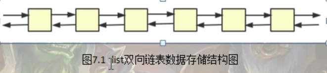
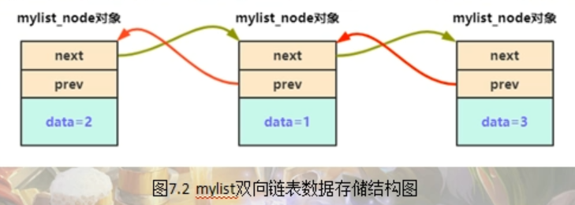
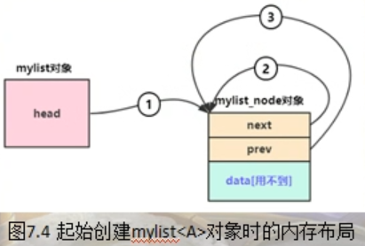
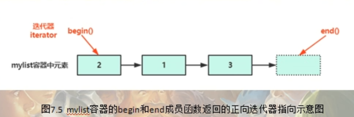
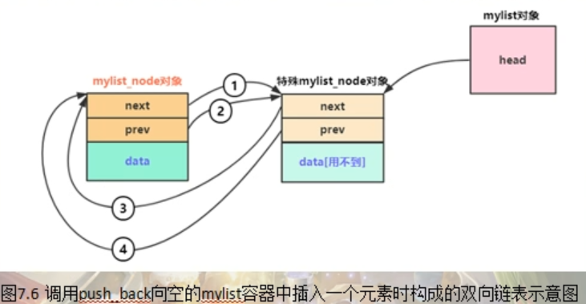
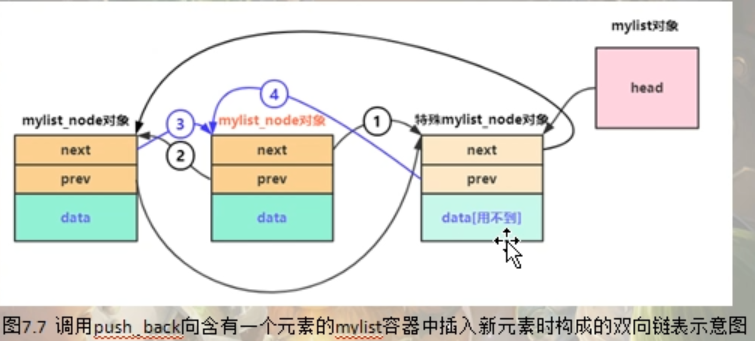
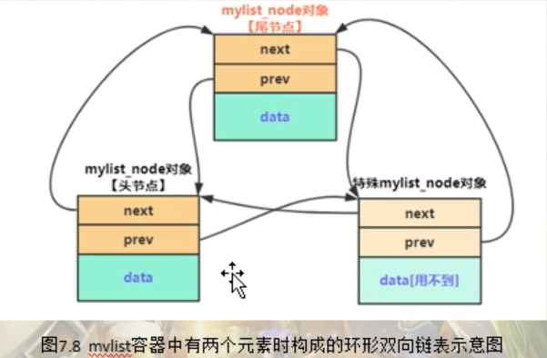

STL标准模板库代码

---

STL（标准模板库），它本身是包含在c++标准库中的，是使用模板与泛型编程开发的一个库，这个库中的各种接口，比如说容器，迭代器等等，在c++的开发中都是经常能使用到的。

# list容器的简单实现

c++中常用的容器有 vector, list, map等，他们有一个特点就是用来容纳同类型的多个元素

list容器它是一个双向链表，他的数据存储结构大致如下



```c++
namespace _nmsp1
{
    
    void func()
    {
        std::list<int> maglist;
        maglist.push_back(1);   // 末尾插入1，list容器中的内容是 1
        maglist.push_front(2);  // 开头插入2，list容器中的内容是 2，1
        maglist.push_back(3);   // 末尾插入3，list容器中的内容是 2，1，3
        
        for(std::list<int>::iterator iter = maglist.begin(); iter != maglist.end(); ++iter)
        {
            std::cout << *(iter) << std::endl;
        }
    }
}
```


## 基础代码



```c++
namespace lis
{
    template<typename T>
    struct mylist_node
    {
        mylist_node* next;  // 指向下一个元素的指针
        mylist_node* prev;  // 指向上一个元素的指针
        
        T data;     // 保存数据
    };
    
    // 容器和迭代器是密不可分的，迭代器一般是用于遍历容器中的元素，迭代器从理解角度，
    // 可以看做指向元素的指针（或者理解成迭代器是模拟指针的动作），实际上迭代器他不是一个指针，
    // 迭代器本身他也是一个类模板
    // 为mylist定义一个迭代器 mylist_iterator
    template<typename T>    // T代表容器中的元素类型
    struct mylist_iterator
    {
        // 为了防止一些隐式类型转换导致隐含的错误，写构造函数的时候全部用explicit来修饰
        // 默认构造函数
        explicit mylist_iterator() : node(nullptr){} 
        
        // 构造函数
        explicit mylist_iterator(mylist_node<T>* tmpv) : node(tmpv) {}
        
        // 基本接口，返回迭代器所指向的元素的引用
        T& operator*()
        {
            return node->data;
        }
        
        // 基本接口2，++ -- 让迭代器往前走和往后走
        // 重载前置 ++ (++iter)
        mylist_iterator& operator++()
        {
            node = node->next;  // 指向容器mylist中的下一个元素
            return *this;   // 这句代码的含义是返回 mylist_iterator这个对象本身
            // 但是因为我们上面不是重载了 * 嘛，有的人可能会认为，这里这个 * 被重载了，那这里是不是return 的 就是 T&
            // 其实并不是这样，因为对于 return *this, 这种代码行，因为在 这个从在函数里
            // 即 operator++这个代码行返回的是一个 mylist_iterator& (迭代器类型引用)
            // 所以编译器在处理这个代码行的时候很聪明，他知道这个 return *this,这个代码中的 *
            // 不应该被解析为 重载后的 *, 否者你返回类型他就不会是 mylist_iterator& 了，而是 T&
        }
        
        // 重载后置 ++ （iter++） ,后置++重载，圆括号中加一个int，以区别前置
        mylist_iterator operator++(int)
        {
            
            // 针对这行代码，编译器在处理的时候，首先会认为要调用mylist_iterator的拷贝构造函数来生成tmp对象
            // 所以这里的*依旧不会被解析为重载之后的*,这里的*this依旧会被解析为mylist_iterator对象本身
            mylist_iterator tmp(*this);
            node = node->next; // 当然这里也可以写成 ++*this；但是这样写的话就会调用重载的前置++
            // ++*this;
            return tmp;
            
            
            // 所以从这个写法上来看，后置++会生成一个临时对象，然后返回这个临时对象，但是前置++没有这个问题
            // 前置++不产生临时对象，所以遍历的时候提倡使用前置++
        }
        
        mylist_node<T>* node;  // 定义一个指向容器元素的指针
    };
    
    template<class T>
    class mylist
    {
    public:
        using iterator = mylist_iterator<T>;    // 迭代器类型
    };
    
    
    
}
```


## 插入新元素前的准备

设想一下，有一个整形变量 2,要加入到mylist容器中来，在整个的这个mylist双向链表中，就会多出一个被链入到这个链表中的mylist_node对象，并且最重要是是被链入的mylist_node对象 的data这部分的值代表的正是要加入的这个元素 2，所以就需要根据这个整形变量2来初始化一个mylist_node对象，也就是说我们需要为mylist_node这个类模板增加一个构造函数

```c++
namespace lis
{
    template<typename T>
    struct mylist_node
    {
        // 构造函数（根据容器中的实际元素来构造一个mylsit_node对象）
        // 同样为了避免隐式类型转换导致隐含的错误，构造函数全部使用explicit来修饰
        explicit mylist_node(const T& x) : data(x), next(nullptr), prev(nullptr)
        {
            
        }
        
        mylist_node* next;  // 指向下一个元素的指针
        mylist_node* prev;  // 指向上一个元素的指针
        
        T data;     // 保存数据
    };
    
    // 容器和迭代器是密不可分的，迭代器一般是用于遍历容器中的元素，迭代器从理解角度，
    // 可以看做指向元素的指针（或者理解成迭代器是模拟指针的动作），实际上迭代器他不是一个指针，
    // 迭代器本身他也是一个类模板
    // 为mylist定义一个迭代器 mylist_iterator
    template<typename T>    // T代表容器中的元素类型
    struct mylist_iterator
    {
        // 为了防止一些隐式类型转换导致隐含的错误，写构造函数的时候全部用explicit来修饰
        // 默认构造函数
        explicit mylist_iterator() : node(nullptr){} 
        
        // 构造函数
        explicit mylist_iterator(mylist_node<T>* tmpv) : node(tmpv) {}
        
        // 基本接口，返回迭代器所指向的元素的引用
        T& operator*()
        {
            return node->data;
        }
        
        // 基本接口2，++ -- 让迭代器往前走和往后走
        // 重载前置 ++ (++iter)
        mylist_iterator& operator++()
        {
            node = node->next;  // 指向容器mylist中的下一个元素
            return *this;   // 这句代码的含义是返回 mylist_iterator这个对象本身
            // 但是因为我们上面不是重载了 * 嘛，有的人可能会认为，这里这个 * 被重载了，那这里是不是return 的 就是 T&
            // 其实并不是这样，因为对于 return *this, 这种代码行，因为在 这个从在函数里
            // 即 operator++这个代码行返回的是一个 mylist_iterator& (迭代器类型引用)
            // 所以编译器在处理这个代码行的时候很聪明，他知道这个 return *this,这个代码中的 *
            // 不应该被解析为 重载后的 *, 否者你返回类型他就不会是 mylist_iterator& 了，而是 T&
        }
        
        // 重载后置 ++ （iter++） ,后置++重载，圆括号中加一个int，以区别前置
        mylist_iterator operator++(int)
        {
            
            // 针对这行代码，编译器在处理的时候，首先会认为要调用mylist_iterator的拷贝构造函数来生成tmp对象
            // 所以这里的*依旧不会被解析为重载之后的*,这里的*this依旧会被解析为mylist_iterator对象本身
            mylist_iterator tmp(*this);
            node = node->next; // 当然这里也可以写成 ++*this；但是这样写的话就会调用重载的前置++
            // ++*this;
            return tmp;
            
            
            // 所以从这个写法上来看，后置++会生成一个临时对象，然后返回这个临时对象，但是前置++没有这个问题
            // 前置++不产生临时对象，所以遍历的时候提倡使用前置++
        }
        
        // 重载 == 和 !=
        bool operator!=(const mylist_iterator& iter)
        {
            return node != iter.node;
        }
        
        bool operator==(const mylist_iterator& iter)
        {
            return node == iter.node;
        }
        
        mylist_node<T>* node;  // 定义一个指向容器元素的指针
    };
    
    template<class T>
    class mylist
    {
    public:
        using iterator = mylist_iterator<T>;    // 迭代器类型
        
    public:
        explicit mylist()   // 默认构造函数
        {
            void* point = new char[sizeof(mylist_node<T>)];
            head = reinterpret_cast<mylist_node<T>*>(point);
            
            // 这里如果不使用new char,而是直接new一个mylist_node对象不可以吗？
            // head = new mylist_node<T>();
            // 实际上这样不行，编译会出错，出错的原因就是mylist_node这个类模板他没有默认的构造函数
            // 他的构造函数是需要参数的
            // 然后另外一个出错的原因就是 mylist_node<A>,这个类型对象中是有一个A类型成员data
            // 那A类型你要是想构建成功的话，也不要忘了它是需要一个参数的，你必须得给他提供一个实参
            
            // 所以这里就必须只能使用上面的那两行代码来进行，而这两行代码的本意，其实只是我们想使用
            // mylist_node，我们把A类型传递进来，变成 mylist_node<A>，然后我们这里只是想使用这个实例化对象中的那个next和prev
            // 这两个成员，然后把这两个成员指向自己，在这里我们不需要使用它里面的data成员。虽然这个data对象在这里是用来存储A类对象的
            // 因为在这里他是一个特殊节点，所以在这个特殊节点中，data代表的这个A类型对象是不需要进行构造的
            // 所以这里才通过 new char然后结合 reinterpret_cast 类型转换类变通的（间接的）构造一个mylist_node对象
            
            head->next = head;
            head->prev = head;
        }
        
        ~mylist()   // 析构函数
        {
            delete (void*)head;
            head = nullptr;
        }
    
    public:
        iterator begin()
        {
            return iterator(head->next);    // 注意，head->next始终指向第一个元素，除非mylist列表为空，没有元素
        }
        
        iterator end()
        {
            return iterator(head);
        }
        
    private:
        mylist_node<T>* head;
    };
    
    // 设想一下，有一个整形变量 2,要加入到mylist容器中来，在整个的这个mylist双向链表中，
    // 就会多出一个被链入到这个链表中的mylist_node对象，并且最重要是是被链入的mylist_node对象
    // 的data这部分的值代表的正是要加入的这个元素 2，所以就需要根据这个整形变量2来初始化一个
    // mylist_node对象，也就是说我们需要为mylist_node这个类模板增加一个构造函数
    
    
}
```




> lis::mylist<A> msglist;

从这个图不难看到，msglist这个对象刚定义出来的时候，因为上面这行代码会执行mylist的构造函数，那么在mylist的构造函数中，它是用new在堆中创建了一个 `mylist_node<T>`这么一个对象，但是记住，这个对象可并不是用来保存任何mylist容器中的元素，这个对象虽然不保存任何mylist元素，但是他是有特殊地位的，在后续往mylist容器中插入元素的时候，这个对象的特殊地位就慢慢体现出来了。

同时，mylist对象有一个head成员，这个head成员指向的就是上面我们new出来的这个mylist_node对象。即head指向的这个mylist_node自己，然后next,prev也都是指向这个mylist_node自己。

这个特殊节点，其实就是mylist容器中end成员函数返回的位置，同样在元素为空的时候，end指向的也是这个特殊节点。所以也就实现了，如果一个容器的begin == end，那么就说明这个容器是空的



## 插入新元素



push_back主要做了4件事

修改新插入元素（也就是新插入的mylist_noe节点）的next指针，指向容器中的下一个mylist_node节点，这里只是因为我们当前值插入了一个元素，也就是容器中没有下一个节点，只有特殊的这个mylist_node对象节点存在，所以新插入进来的节点的next指向这个特殊的mylist_node节点

修改prev指针，因为新插入进来的prev指针应该是指向前一个mylist_node节点，但是同样因为这里没有前一个节点，所以这里就指向这个特殊节点

然后修改老的节点next指针，对于这个特殊节点，因为新插入的这个mylist_node存在，所以这个特殊节点的next指针就指向新插入进来的节点的next，这里额外还需要注意一点就是，这个特殊节点的next，要始终保证指向list的最前面那个元素，新插入进来这个节点在这种情况下就成为了这个最前面的那个元素，所以，这个特殊节点的next才指向这个新节点的next

老节点的prev指针，对于这个特殊节点，因为新插入的这个mylist_node存在，所以这个特殊节点的prev指针就指向新插入进来的节点的next

同样对于有一个元素存在的情况，使用push_back操作结果就是如图所示






```c++
public:
        void push_back(const T& tmpv)
        {
            // 创建一个待加入的节点
            mylist_node<T>* tnewNode = new mylist_node<T>(tmpv);
            if(head->next == head)  // 等价于if (begin() == end()) 判断当前list列表是否为空
            {
                // 列表为空
                tnewNode->next = head;
                // 新 mylist_node 对象节点的next指针指向这个链表的mylist_node特殊对象结点
                tnewNode->prev = head;
                // 新 mylist_node 对象节点的prev指针指向这个链表的mylist_node特殊对象结点
                head->next = tnewNode;
                // 对于已经存在的特殊mylist_node对象节点的next指针，始终要指向mylist整个容器中的最前面的元素
                // 所以在这里指向的应该是新的这个mylist_node对象节点
                head->prev = tnewNode;
                // 对于已经存在的特殊mylist_node对象节点的prev指针，始终要指向mylist整个容器中的最末尾的元素
                // 所以在这里指向的应该是新的这个mylist_node对象节点
            }
            else
            {
                // 当前容器元素不为空
                tnewNode->next = head;
                // 新插入的mylsit_node对象节点的next指针指向这个特殊的对象节点
                tnewNode->prev = head->prev;
                // 新插入的mylsit_node对象节点的prev指针指向这个特殊的对象节点的prev
                head->prev->next = tnewNode;
                // 将前一个的mylist_node节点的next指针更新指向新插入和这个节点上
                head->prev = tnewNode;
                // 将特殊mylist_node对象节点的prev指针更新指向新插入的这个mylist_node对象节点上
            }
        }
```


## 释放容器中元素所占用的内存

首先，计划添加一个clear函数来进行内存释放工作，但是这里并不打算在clear函数中释放这个特殊节点的内存，clear函数只释放这些真正存放数据的节点，特殊节点的内存可以放到mylist类模板的析构函数中进行

```c++
private:
        void clear()
        {
            if(head->next != head)
            {
                // 当前容器不为空
                mylist_node<T>* currentNode = head->next;
                // currentNode 指向第一个有效节点
                while(currentNode != head)
                {
                    // 一直循环遍历，只要当前节点不指向特殊节点
                    mylist_node<T>* nextnode = currentNode->next;
                    // nextnode指向当前节点的下一个节点
                    delete currentNode;
                    // 释放当前节点所指向的内存
                    currentNode = nextnode;
                    // 让currentNode指向下一个节点
                }
            }
        }
```

然后在析构函数中调用

```c++
 ~mylist()   // 析构函数
        {
            clear();
            // 注意clear的位置，要放在head内存释放之前
            delete head;
            // delete (void*)head;
            head = nullptr;
        }
```

如果我们new出来的指针是一个基本类型，没什么关系，内存还是会被释放的，但是如果是一个类对象指针，在处理过程中转成了void*，那就有问题了，析构函数将不会被调用。
 故new的指针类型要和delete的指针类型要保持一致。


## 实现find_if

```c++
/******************************************************************************

Welcome to GDB Online.
GDB online is an online compiler and debugger tool for C, C++, Python, PHP, Ruby, 
C#, VB, Perl, Swift, Prolog, Javascript, Pascal, HTML, CSS, JS
Code, Compile, Run and Debug online from anywhere in world.

*******************************************************************************/
#include <stdio.h>
#include <iostream>
#include <list>

namespace _nmsp1
{
    // T 代表迭代器类型， U代表可调用对象（可调用对象常常被作为算法参数）
    template<class T, class U>
    T myFindIf(T first, T last, U funcObj)
    {
        for(; first != last; ++first)
        {
            if(funcObj(*first))
            {
                break;
            }
        }
        return first;
    }
    
    
    void func()
    {
        std::list<int> mylist;
        mylist.push_back(1);
        mylist.push_back(3);
        mylist.push_back(7);
        mylist.push_back(2);
        
        auto result = std::find_if(mylist.begin(), mylist.end(), [](int val){
            if (val > 0) {
                return true;
                // 返回true就停止遍历
            }
            return false;
        });
        
        auto result2 = myFindIf(mylist.begin(), mylist.end(), [](int val){
            if (val > 4) {
                return true;
                // 返回true就停止遍历
            }
            return false;
        });
        
        // 这里find_if的第三个参数，一般被称为 谓词 （predicate），
        // 可以理解成用在算法中作为参数来定义某些运算规则或者指明算法要进行何种操作的可调用对象
        // 可调用对象在调用后一般都会返回true或者false
        
        if (result == mylist.end())
        {
            std::cout << "没找到" << std::endl;
        }
        else
        {
            std::cout << "找到结果 = " << *result << std::endl;
            // 找到结果 = 1
        }
        
        if (result2 == mylist.end())
        {
            std::cout << "没找到" << std::endl;
        }
        else
        {
            std::cout << "找到结果 = " << *result2 << std::endl;
            // 找到结果 = 7
        }
    }
}

int main()
{
    _nmsp1::func();
    
    return 0;
}

```

