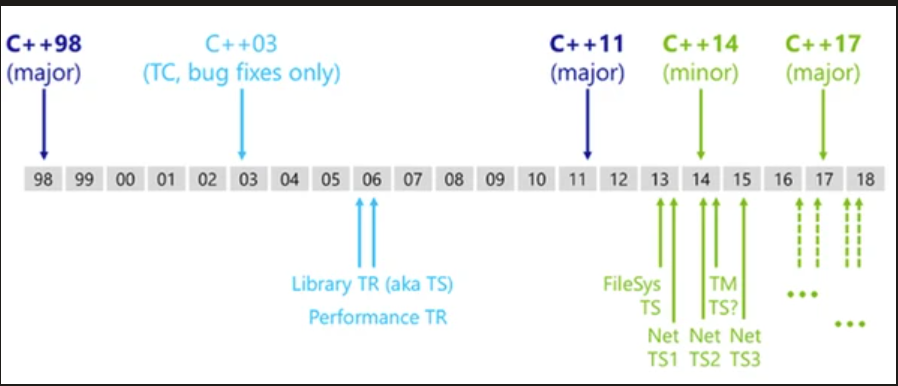
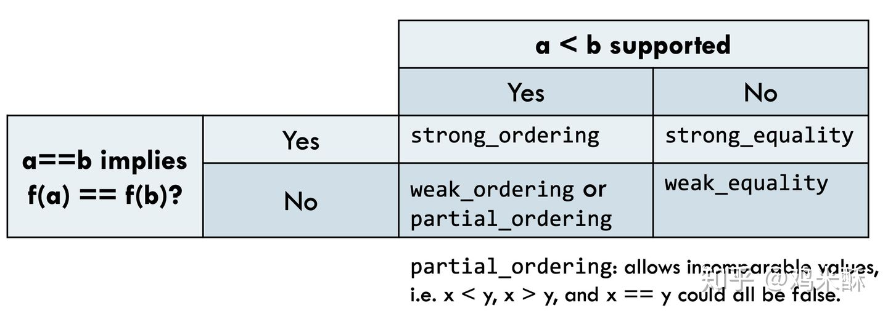
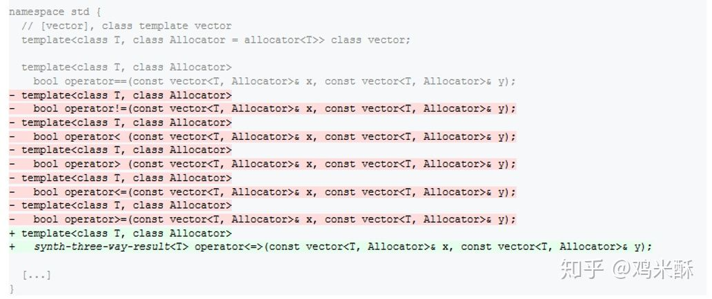

[TOC]


------


# C++11、C++14、C++17、C++20新特性总结

## C++ 11是什么，C++ 11标准的由来

C++ 这门编程语言的历史可以追溯至 1979 年，当时的 Bjarne Stroustrup（C++ 之父，后续简称 Stroustrup）还在使用 Simula 语言进行开发工作。


图 1 C++之父，Bjarne Stroustrup <比雅尼·斯特劳斯特鲁普>

Simula 语言被认为是第一个面向对象的编程语言。Stroustrup 也非常赞赏 Simula 语言的这种特性，但由于实例开发中 Simula 语言的执行效率太低，所以此后不久，Stroustrup 开始从事“带类的C”编程语言的开发工作。

> 注意在开发初期，并没有 C++ 这个称谓。所谓“带类的C”，顾名思义就是在 C 语言的基础上，为其加入面向对象的思想（扩增一些写好的类和对象）。初期的 C++ 除了具备 C 语言的所有功能外，还具有类、基本继承、内联函数、默认函数参数以及强类型检查等简单功能。

不仅如此，Stroustrup 还在 CPre（C语言编译器）的基础上，专门为“带类的C”开发了一个编译器，称为 Cfront，它可以将带有类的 C 代码自动转换为普通 C 语言程序。值得一提的是在 1993 年，Cfront 因难以支持 C++ 异常机制被弃用。

1983 年，“带类的C”正式被称为“C++”，其中“++”就取自 C 语言中的“++”运算符，这也从侧面表明了 Stroustrup 对于 C++ 这门编程语言的定位。 与此同时，C++还增添了很多功能，比如虚函数、函数重载、引用、const 关键字以及 // 注释符号等。

> 在随后的几年时间里，C++ 得到了快速地发展。比如说， C++ 不断地被更新，类中增加了受保护成员（protected）和私有成员（private），并允许使用多继承等；Stroustrup 出版了 《带注释的C++参考手册》一书，其一度被当做 C++ 开发的重要参考；Borland 发布了 Turbo C ++编译器，该编译器包含有大量的第三方 C++ 库，极大便利了 C ++ 的开发，等等。

直到 1998 年，C++ 标准委员会发布了第一版 C++ 标准，并将其命名为 C++ 98 标准。据不知名人士透露，《带注释的C++参考手册》这本书对 C++ 98 标准的制定产生了很大的影响。

经过作者的不断迭代，一本书往往会先后发布很多个版本，其中每个新版本都是对前一个版本的修正和更新。C++ 编程语言的发展也是如此。截止到目前（2020 年），C++ 的发展历经了以下 3 个个标准：

- 2011 年，新的 C++ 11 标准诞生，用于取代 C++ 98 标准。此标准还有一个别名，为“C++ 0x”；
- 2014 年，C++ 14 标准发布，该标准库对 C++ 11 标准库做了更优的修改和更新；
- 2017 年底，C++ 17 标准正式颁布。

> 所谓标准，即明确 C++ 代码的编写规范，所有的 C++ 程序员都应遵守此标准。

值得一提的是在 C++ 11 标准之前，C++ 标准委员会还在 2003 年对 C++ 98 标准做了一次修改（称为 C++ 03 标准），但由于其仅仅修复了一些 C++ 98 标准中存在的漏洞，并未修改核心语法，因此人们习惯将这次修订和 C++ 98 合称为 C++98/03 标准。

以上 3 个标准中，相比对前一个版本的修改和更新程度，C++ 11 标准无疑是颠覆性的，该标准在 C++ 98 的基础上修正了约 600 个 C++ 语言中存在的缺陷，同时添加了约 140 个新特性，这些更新使得 C++ 语言焕然一新。读者可以这样理解 C++ 11 标准，它在 C++ 98/03 标准的基础上孕育出了全新的 C++ 编程语言，造就了 C++ 新的开始。

那么，C++ 11 标准到底包含哪些新特性呢？别急，接下来会分篇给大家做详细地讲解。

## C++ auto类型推导完全攻略

在 C++11 之前的版本（C++98 和 C++ 03）中，定义变量或者声明变量之前都必须指明它的类型，比如 int、char 等；但是在一些比较灵活的语言中，比如 C#、JavaScript、PHP、Python 等，程序员在定义变量时可以不指明具体的类型，而是让编译器（或者解释器）自己去推导，这就让代码的编写更加方便。

C++11 为了顺应这种趋势也开始支持自动类型推导了！C++11 使用 auto 关键字来支持自动类型推导。

## auto 类型推导的语法和规则

在之前的 C++ 版本中，auto 关键字用来指明变量的存储类型，它和 static 关键字是相对的。auto 表示变量是自动存储的，这也是编译器的默认规则，所以写不写都一样，一般我们也不写，这使得 auto 关键字的存在变得非常鸡肋。

C++11 赋予 auto 关键字新的含义，使用它来做自动类型推导。也就是说，使用了 auto 关键字以后，编译器会在编译期间自动推导出变量的类型，这样我们就不用手动指明变量的数据类型了。

auto 关键字基本的使用语法如下：

auto name = value;

name 是变量的名字，value 是变量的初始值。

注意：auto 仅仅是一个占位符，在编译器期间它会被真正的类型所替代。或者说，C++ 中的变量必须是有明确类型的，只是这个类型是由编译器自己推导出来的。

auto 类型推导的简单例子：

auto n = 10;
auto f = 12.8;
auto p = &n;
auto url = “http://c.biancheng.net/cplus/”;

下面我们来解释一下：

- 第 1 行中，10 是一个整数，默认是 int 类型，所以推导出变量 n 的类型是 int。

- 第 2 行中，12.8 是一个小数，默认是 double 类型，所以推导出变量 f 的类型是 double。
- 第 3 行中，&n 的结果是一个 int* 类型的指针，所以推导出变量 p 的类型是 int*。
- 第 4 行中，由双引号""包围起来的字符串是 const char* 类型，所以推导出变量 url 的类型是 const char*，也即一个常量指针。

我们也可以连续定义多个变量：

int n = 20;
auto *p = &n, m = 99;

先看前面的第一个子表达式，&n 的类型是 int*，编译器会根据 auto *p 推导出 auto 为 int。后面的 m 变量自然也为 int 类型，所以把 99 赋值给它也是正确的。

这里我们要注意，推导的时候不能有二义性。在本例中，编译器根据第一个子表达式已经推导出 auto 为 int 类型，那么后面的 m 也只能是 int 类型，如果写作`m=12.5`就是错误的，因为 12.5 是double 类型，这和 int 是冲突的。

还有一个值得注意的地方是：使用 auto 类型推导的变量必须马上初始化，这个很容易理解，因为 auto 在 C++11 中只是“占位符”，并非如 int 一样的真正的类型声明。

## auto 的高级用法

auto 除了可以独立使用，还可以和某些具体类型混合使用，这样 auto 表示的就是“半个”类型，而不是完整的类型。请看下面的代码：

```c++
int  x = 0;
auto *p1 = &x;   //p1 为 int *，auto 推导为 int
auto  p2 = &x;   //p2 为 int*，auto 推导为 int*
auto &r1  = x;   //r1 为 int&，auto 推导为 int
auto r2 = r1;    //r2 为  int，auto 推导为 int
```


下面我们来解释一下：

- 第 2 行代码中，p1 为 int* 类型，也即 auto * 为 int *，所以 auto 被推导成了 int 类型。

- 第 3 行代码中，auto 被推导为 int* 类型，前边的例子也已经演示过了。
- 第 4 行代码中，r1 为 int & 类型，auto 被推导为 int 类型。
- 第 5 行代码是需要重点说明的，r1 本来是 int& 类型，但是 auto 却被推导为 int 类型，这表明当=右边的表达式是一个引用类型时，auto 会把引用抛弃，直接推导出它的原始类型。

接下来，我们再来看一下 auto 和 const 的结合：

```c++
int  x = 0;
const  auto n = x;  //n 为 const int ，auto 被推导为 int
auto f = n;      //f 为 const int，auto 被推导为 int（const 属性被抛弃）
const auto &r1 = x;  //r1 为 const int& 类型，auto 被推导为 int
auto &r2 = r1;  //r1 为 const int& 类型，auto 被推导为 const int 类型`在这里插入代码片`
```


下面我们来解释一下：

- 第 2 行代码中，n 为 const int，auto 被推导为 int。

- 第 3 行代码中，n 为 const int 类型，但是 auto 却被推导为 int 类型，这说明当=右边的表达式带有 const 属性时， auto 不会使用 const 属性，而是直接推导出 non-const 类型。
- 第 4 行代码中，auto 被推导为 int 类型，这个很容易理解，不再赘述。
- 第 5 行代码中，r1 是 const int & 类型，auto 也被推导为 const int 类型，这说明当 const 和引用结合时，auto 的推导将保留表达式的 const 类型。

最后我们来简单总结一下 auto 与 const 结合的用法：

- 当类型不为引用时，auto 的推导结果将不保留表达式的 const 属性；

- 当类型为引用时，auto 的推导结果将保留表达式的 const 属性。

## auto 的限制

前面介绍推导规则的时候我们说过，使用 auto 的时候必须对变量进行初始化，这是 auto 的限制之一。那么，除此以外，auto 还有哪些其它的限制呢？

1. auto 不能在函数的参数中使用。
   这个应该很容易理解，我们在定义函数的时候只是对参数进行了声明，指明了参数的类型，但并没有给它赋值，只有在实际调用函数的时候才会给参数赋值；而 auto 要求必须对变量进行初始化，所以这是矛盾的。

2. auto 不能作用于类的非静态成员变量（也就是没有 static 关键字修饰的成员变量）中。

3. auto 关键字不能定义数组，比如下面的例子就是错误的：

   char url[] = “http://c.biancheng.net/”;
   auto str[] = url; //arr 为数组，所以不能使用 auto

4. auto 不能作用于模板参数，请看下面的例子：

   ```c++
   template <typename T>
   class A{
       //TODO:
   };
   int  main(){
       A<int> C1;
       A<auto> C2 = C1;  //错误
       return 0;
   }
   ```

   

## auto 的应用

说了那么多 auto 的推导规则和一些注意事项，那么 auto 在实际开发中到底有什么应用呢？下面我们列举两个典型的应用场景。

### 使用 auto 定义迭代器

auto 的一个典型应用场景是用来定义 stl 的迭代器。

我们在使用 stl 容器的时候，需要使用迭代器来遍历容器里面的元素；不同容器的迭代器有不同的类型，在定义迭代器时必须指明。而迭代器的类型有时候比较复杂，书写起来很麻烦，请看下面的例子：

```c++
#include <vector>
using namespace std;
int main(){
    vector< vector<int> > v;
    vector< vector<int> >::iterator i = v.begin();
    return 0;
}
```


可以看出来，定义迭代器 i 的时候，类型书写比较冗长，容易出错。然而有了 auto 类型推导，我们大可不必这样，只写一个 auto 即可。

修改上面的代码，使之变得更加简洁：

```c++
#include <vector>
using namespace std;
int main(){
    vector< vector<int> > v;
    auto i = v.begin();  //使用 auto 代替具体的类型
    return 0;
}
```


auto 可以根据表达式 v.begin() 的类型（begin() 函数的返回值类型）来推导出变量 i 的类型。

### auto 用于泛型编程

auto 的另一个应用就是当我们不知道变量是什么类型，或者不希望指明具体类型的时候，比如泛型编程中。我们接着看例子：

```c++
#include <iostream>
using namespace std;
class A{
public:
    static int get(void){
        return 100;
    }
};
class B{
public:
    static const char* get(void){
        return "http://c.biancheng.net/cplus/";
    }
};
template <typename T>
void func(void){
    auto val = T::get();
    cout << val << endl;
}
int main(void){
    func<A>();
    func<B>();
    return 0;
}
```


运行结果：

100
http://c.biancheng.net/cplus/

本例中的模板函数 func() 会调用所有类的静态函数 get()，并对它的返回值做统一处理，但是 get() 的返回值类型并不一样，而且不能自动转换。这种要求在以前的 C++ 版本中实现起来非常的麻烦，需要额外增加一个模板参数，并在调用时手动给该模板参数赋值，用以指明变量 val 的类型。

但是有了 auto 类型自动推导，编译器就根据 get() 的返回值自己推导出 val 变量的类型，就不用再增加一个模板参数了。

下面的代码演示了不使用 auto 的解决办法：

```c++
#include <iostream>
using namespace std;
class A{
public:
    static int get(void){
        return 100;
    }
};
class B{
public:
    static const char* get(void){
        return "http://c.biancheng.net/cplus/";
    }
};
template <typename T1, typename T2>  //额外增加一个模板参数 T2
void func(void){
    T2 val = T1::get();
    cout << val << endl;
}
int main(void){
    //调用时也要手动给模板参数赋值
    func<A, int>();
    func<B, const char*>();
    return 0;
}
```


## C++ decltype类型推导完全攻略

decltype 是 C++11 新增的一个关键字，它和 auto 的功能一样，都用来在编译时期进行自动类型推导。不了解 auto 用法的读者请转到《C++ auto》。

decltype 是“declare type”的缩写，译为“声明类型”。

既然已经有了 auto 关键字，为什么还需要 decltype 关键字呢？因为 auto 并不适用于所有的自动类型推导场景，在某些特殊情况下 auto 用起来非常不方便，甚至压根无法使用，所以 decltype 关键字也被引入到 C++11 中。

auto 和 decltype 关键字都可以自动推导出变量的类型，但它们的用法是有区别的：

auto varname = value;
decltype(exp) varname = value;

其中，varname 表示变量名，value 表示赋给变量的值，exp 表示一个表达式。

auto 根据=右边的初始值 value 推导出变量的类型，而 decltype 根据 exp 表达式推导出变量的类型，跟=右边的 value 没有关系。

另外，auto 要求变量必须初始化，而 decltype 不要求。这很容易理解，auto 是根据变量的初始值来推导出变量类型的，如果不初始化，变量的类型也就无法推导了。decltype 可以写成下面的形式：

decltype(exp) varname;

### exp 注意事项

原则上讲，exp 就是一个普通的表达式，它可以是任意复杂的形式，但是我们必须要保证 exp 的结果是有类型的，不能是 void；例如，当 exp 调用一个返回值类型为 void 的函数时，exp 的结果也是 void 类型，此时就会导致编译错误。

C++ decltype 用法举例：

```c++
int a = 0;
decltype(a) b = 1;  //b 被推导成了 int
decltype(10.8) x = 5.5;  //x 被推导成了 double
decltype(x + 100) y;  //y 被推导成了 double
```


可以看到，decltype 能够根据变量、字面量、带有运算符的表达式推导出变量的类型。读者请留意第 4 行，y 没有被初始化。

### decltype 推导规则

上面的例子让我们初步感受了一下 decltype 的用法，但你不要认为 decltype 就这么简单，它的玩法实际上可以非常复杂。当程序员使用 decltype(exp) 获取类型时，编译器将根据以下三条规则得出结果：

1. 如果 exp 是一个不被括号( )包围的表达式，或者是一个类成员访问表达式，或者是一个单独的变量，那么 decltype(exp) 的类型就和 exp 一致，这是最普遍最常见的情况。

2. 如果 exp 是函数调用，那么 decltype(exp) 的类型就和函数返回值的类型一致。
3. 如果 exp 是一个左值，或者被括号( )包围，那么 decltype(exp) 的类型就是 exp 的引用；假设 exp 的类型为 T，那么 decltype(exp) 的类型就是 T&。

为了更好地理解 decltype 的推导规则，下面来看几个实际的例子。

【实例1】exp 是一个普通表达式：

```c++
#include <string>
using namespace std;
class Student{
public:
    static int total;
    string name;
    int age;
    float scores;
};
int Student::total = 0;
int  main(){
    int n = 0;
    const int &r = n;
    Student stu;
    decltype(n) a = n;  //n 为 int 类型，a 被推导为 int 类型
    decltype(r) b = n;     //r 为 const int& 类型, b 被推导为 const int& 类型
    decltype(Student::total) c = 0;  //total 为类 Student 的一个 int 类型的成员变量，c 被推导为 int 类型
    decltype(stu.name) url = "http://c.biancheng.net/cplus/";  //total 为类 Student 的一个 string 类型的成员变量， url 被推导为 string 类型
    return 0;
}
```


这段代码很简单，按照推导规则 1，对于一般的表达式，decltype 的推导结果就和这个表达式的类型一致。

【实例2】exp 为函数调用：

```c++
//函数声明
int& func_int_r(int, char);  //返回值为 int&
int&& func_int_rr(void);  //返回值为 int&&
int func_int(double);  //返回值为 int
const int& fun_cint_r(int, int, int);  //返回值为 const int&
const int&& func_cint_rr(void);  //返回值为 const int&&
//decltype类型推导
int n = 100;
decltype(func_int_r(100, 'A')) a = n;  //a 的类型为 int&
decltype(func_int_rr()) b = 0;  //b 的类型为 int&&
decltype(func_int(10.5)) c = 0;   //c 的类型为 int
decltype(fun_cint_r(1,2,3))  x = n;    //x 的类型为 const int &
decltype(func_cint_rr()) y = 0;  // y 的类型为 const int&&
```


需要注意的是，exp 中调用函数时需要带上括号和参数，但这仅仅是形式，并不会真的去执行函数代码。

【实例3】exp 是左值，或者被( )包围：

```c++
using namespace std;
class Base{
public:
    int x;
};
int main(){
    const Base obj;
    //带有括号的表达式
    decltype(obj.x) a = 0;  //obj.x 为类的成员访问表达式，符合推导规则一，a 的类型为 int
    decltype((obj.x)) b = a;  //obj.x 带有括号，符合推导规则三，b 的类型为 int&。
    //加法表达式
    int n = 0, m = 0;
    decltype(n + m) c = 0;  //n+m 得到一个右值，符合推导规则一，所以推导结果为 int
    decltype(n = n + m) d = c;  //n=n+m 得到一个左值，符号推导规则三，所以推导结果为 int&
    return 0;
}
```


这里我们需要重点说一下左值和右值：左值是指那些在表达式执行结束后依然存在的数据，也就是持久性的数据；右值是指那些在表达式执行结束后不再存在的数据，也就是临时性的数据。有一种很简单的方法来区分左值和右值，对表达式取地址，如果编译器不报错就为左值，否则为右值。

### decltype 的实际应用

auto 的语法格式比 decltype 简单，所以在一般的类型推导中，使用 auto 比使用 decltype 更加方便，你可以转到《C++ auto》查看很多类似的例子，本节仅演示只能使用 decltype 的情形。

我们知道，auto 只能用于类的静态成员，不能用于类的非静态成员（普通成员），如果我们想推导非静态成员的类型，这个时候就必须使用 decltype 了。下面是一个模板的定义：

```c++
#include <vector>
using namespace std;
template <typename T>
class Base {
public:
    void func(T& container) {
        m_it = container.begin();
    }
private:
    typename T::iterator m_it;  //注意这里
};
int main()
{
    const vector<int> v;
    Base<const vector<int>> obj;
    obj.func(v);
    return 0;
}	
```


单独看 Base 类中 m_it 成员的定义，很难看出会有什么错误，但在使用 Base 类的时候，如果传入一个 const 类型的容器，编译器马上就会弹出一大堆错误信息。原因就在于，T::iterator并不能包括所有的迭代器类型，当 T 是一个 const 容器时，应当使用 const_iterator。

要想解决这个问题，在之前的 C++98/03 版本下只能想办法把 const 类型的容器用模板特化单独处理，增加了不少工作量，看起来也非常晦涩。但是有了 C++11 的 decltype 关键字，就可以直接这样写：

```c++
template <typename T>
class Base {
public:
    void func(T& container) {
        m_it = container.begin();
    }
private:
    decltype(T().begin()) m_it;  //注意这里
};
```


看起来是不是很清爽？

注意，有些低版本的编译器不支持T().begin()这种写法，以上代码我在 VS2019 下测试通过，在 VS2015 下测试失败。

## 汇总auto和decltype的区别

通过《C++ auto》和《C++ decltype》两节的学习，相信大家已经掌握了 auto 和 decltype 的语法规则以及使用场景，这节我们将 auto 和 decltype 放在一起，综合对比一下它们的区别，并告诉大家该如何选择。

### 语法格式的区别

auto 和 decltype 都是 C++11 新增的关键字，都用于自动类型推导，但是它们的语法格式是有区别的，如下所示：

auto varname = value; //auto的语法格式
decltype(exp) varname [= value]; //decltype的语法格式

其中，varname 表示变量名，value 表示赋给变量的值，exp 表示一个表达式，方括号[ ]表示可有可无。

auto 和 decltype 都会自动推导出变量 varname 的类型：

1. auto 根据=右边的初始值 value 推导出变量的类型；

2. decltype 根据 exp 表达式推导出变量的类型，跟=右边的 value 没有关系。

另外，auto 要求变量必须初始化，也就是在定义变量的同时必须给它赋值；而 decltype 不要求，初始化与否都不影响变量的类型。这很容易理解，因为 auto 是根据变量的初始值来推导出变量类型的，如果不初始化，变量的类型也就无法推导了。

auto 将变量的类型和初始值绑定在一起，而 decltype 将变量的类型和初始值分开；虽然 auto 的书写更加简洁，但 decltype 的使用更加灵活。

请看下面的例子：

```c++
auto n1 = 10;
decltype(10) n2 = 99;
auto url1 = "http://c.biancheng.net/cplus/";
decltype(url1) url2 = "http://c.biancheng.net/java/";
auto f1 = 2.5;
decltype(n1*6.7) f2;
```


这些用法在前面的两节中已经进行了分析，此处就不再赘述了。

### 对 cv 限定符的处理

「cv 限定符」是 const 和 volatile 关键字的统称：

- const 关键字用来表示数据是只读的，也就是不能被修改；

- volatile 和 const 是相反的，它用来表示数据是可变的、易变的，目的是不让 CPU 将数据缓存到寄存器，而是从原始的内存中读取。

在推导变量类型时，auto 和 decltype 对 cv 限制符的处理是不一样的。decltype 会保留 cv 限定符，而 auto 有可能会去掉 cv 限定符。

以下是 auto 关键字对 cv 限定符的推导规则：

- 如果表达式的类型不是指针或者引用，auto 会把 cv 限定符直接抛弃，推导成 non-const 或者 non-volatile 类型。

- 如果表达式的类型是指针或者引用，auto 将保留 cv 限定符。

下面的例子演示了对 const 限定符的推导：

```c++
//非指针非引用类型
const int n1 = 0;
auto n2 = 10;
n2 = 99;  //赋值不报错
decltype(n1) n3 = 20;
n3 = 5;  //赋值报错
//指针类型
const int *p1 = &n1;
auto p2 = p1;
*p2 = 66;  //赋值报错
decltype(p1) p3 = p1;
*p3 = 19;  //赋值报错
```


在 C++ 中无法将一个变量的完整类型输出，我们通过对变量赋值来判断它是否被 const 修饰；如果被 const 修饰那么赋值失败，如果不被 const 修饰那么赋值成功。虽然这种方案不太直观，但也是能达到目的的。

n2 赋值成功，说明不带 const，也就是 const 被 auto 抛弃了，这验证了 auto 的第一条推导规则。p2 赋值失败，说明是带 const 的，也就是 const 没有被 auto 抛弃，这验证了 auto 的第二条推导规则。

n3 和 p3 都赋值失败，说明 decltype 不会去掉表达式的 const 属性。

### 对引用的处理

当表达式的类型为引用时，auto 和 decltype 的推导规则也不一样；decltype 会保留引用类型，而 auto 会抛弃引用类型，直接推导出它的原始类型。请看下面的例子：

```c++
#include <iostream>
using namespace std;
int main() {
    int n = 10;
    int &r1 = n;
    //auto推导
    auto r2 = r1;
    r2 = 20;
    cout << n << ", " << r1 << ", " << r2 << endl;
    //decltype推导
    decltype(r1) r3 = n;
    r3 = 99;
    cout << n << ", " << r1 << ", " << r3 << endl;
    return 0;
}
```


运行结果：
10, 10, 20
99, 99, 99

从运行结果可以发现，给 r2 赋值并没有改变 n 的值，这说明 r2 没有指向 n，而是自立门户，单独拥有了一块内存，这就证明 r 不再是引用类型，它的引用类型被 auto 抛弃了。

给 r3 赋值，n 的值也跟着改变了，这说明 r3 仍然指向 n，它的引用类型被 decltype 保留了。

### 总结

auto 虽然在书写格式上比 decltype 简单，但是它的推导规则复杂，有时候会改变表达式的原始类型；而 decltype 比较纯粹，它一般会坚持保留原始表达式的任何类型，让推导的结果更加原汁原味。

从代码是否健壮的角度考虑，我推荐使用 decltype，它没有那么多是非；但是 decltype 总是显得比较麻烦，尤其是当表达式比较复杂时，例如：

vector nums;
decltype(nums.begin()) it = nums.begin();

而如果使用 auto 就会清爽很多：

vector nums;
auto it = nums.begin();

在实际开发中人们仍然喜欢使用 auto 关键字（我也这么干），因为它用起来简单直观，更符合人们的审美。如果你的表达式类型不复杂，我还是推荐使用 auto 关键字，优雅的代码总是叫人赏心悦目，沉浸其中。

## C++返回值类型后置（跟踪返回值类型）

在泛型编程中，可能需要通过参数的运算来得到返回值的类型。考虑下面这个场景：

```c++
template <typename R, typename T, typename U>
R add(T t, U u)
{
    return t+u;
}
int a = 1; float b = 2.0;
auto c = add<decltype(a + b)>(a, b);
```


我们并不关心 a+b 的类型是什么，因此，只需要通过 decltype(a+b) 直接得到返回值类型即可。但是像上面这样使用十分不方便，因为外部其实并不知道参数之间应该如何运算，只有 add 函数才知道返回值应当如何推导。

那么，在 add 函数的定义上能不能直接通过 decltype 拿到返回值呢？

```c++
template <typename T, typename U>
decltype(t + u) add(T t, U u)  // error: t、u尚未定义
{
    return t + u;
}
```


当然，直接像上面这样写是编译不过的。因为 t、u 在参数列表中，而 C++ 的返回值是前置语法，在返回值定义的时候参数变量还不存在。

可行的写法如下：

```c++
template <typename T, typename U>
decltype(T() + U()) add(T t, U u)
{
    return t + u;
}
```


考虑到 T、U 可能是没有无参构造函数的类，正确的写法应该是这样：

```c++
template <typename T, typename U>
decltype((*(T*)0) + (*(U*)0)) add(T t, U u)
{
    return t + u;
}
```


虽然成功地使用 decltype 完成了返回值的推导，但写法过于晦涩，会大大增加 decltype 在返回值类型推导上的使用难度并降低代码的可读性。

因此，在 C++11 中增加了**返回类型后置（trailing-return-type，又称跟踪返回类型）**语法，将 decltype 和 auto 结合起来完成返回值类型的推导。

返回类型后置语法是通过 auto 和 decltype 结合起来使用的。上面的 add 函数，使用新的语法可以写成：

```c++
template <typename T, typename U>
auto add(T t, U u) -> decltype(t + u)
{
    return t + u;
}
```


为了进一步说明这个语法，再看另一个例子：

```c++
int& foo(int& i);
float foo(float& f);
template <typename T>
auto func(T& val) -> decltype(foo(val))
{
    return foo(val);
}
```


如果说前一个例子中的 add 使用 C++98/03 的返回值写法还勉强可以完成，那么这个例子对于 C++ 而言就是不可能完成的任务了。

在这个例子中，使用 decltype 结合返回值后置语法很容易推导出了 foo(val) 可能出现的返回值类型，并将其用到了 func 上。

返回值类型后置语法，是为了解决函数返回值类型依赖于参数而导致难以确定返回值类型的问题。有了这种语法以后，对返回值类型的推导就可以用清晰的方式（直接通过参数做运算）描述出来，而不需要像 C++98/03 那样使用晦涩难懂的写法。

## C++11对模板实例化中连续右尖括号>>的改进

在 C++98/03 的泛型编程中，模板实例化有一个很烦琐的地方，那就是连续两个右尖括号（>>）会被编译器解释成右移操作符，而不是模板参数表的结束。

【实例】C++98/03 中不支持连续两个右尖括号的示例。

```c++
template <typename T>
struct Foo
{
      typedef T type;
};
template <typename T>
class A
{
    // ...
};
int main(void)
{
    Foo<A<int>>::type xx;  //编译出错
    return 0;
}
```


使用 gcc 编译时，会得到如下错误提示：

> error: ‘>>’ should be ‘>>’ within a nested template argument list Foo<A>::type xx;

意思就是，Foo<A<int>>这种写法是不被支持的，要写成这样Foo<A<int> >（注意两个右尖括号之间的空格）。

这种限制无疑是很没有必要的。在 C++ 的各种成对括号中，目前只有右尖括号连续写两个会出现这种二义性。static_cast、reinterpret_cast 等 C++ 标准转换运算符，都是使用<>来获得待转换类型（type-id）的。若这个 type-id 本身是一个模板，用起来会很不方便。

现在在 C++11 中，这种限制终于被取消了。在 C++11 标准中，要求编译器对模板的右尖括号做单独处理，使编译器能够正确判断出>>是一个右移操作符还是模板参数表的结束标记（delimiter，界定符）。

不过这种自动化的处理在某些时候会与老标准不兼容，比如下面这个例子：

```c++
template <int N>
struct Foo
{
    // ...
};
int main(void)
{
    Foo<100 >> 2> xx;
    return 0;
}
```


在 C++98/03 的编译器中编译是没问题的，但 C++11 的编译器会显示：

> error: expected unqualif?ied-id before ‘>’ token Foo<100 >> 2> xx;

解决的方法是这样写：

> Foo<(100 >> 2)> xx; // 注意括号

这种加括号的写法其实也是一个良好的编程习惯，使得在书写时倾向于写出无二义性的代码。

### 扩展阅读

各种 C++98/03 编译器除了支持标准（ISO/IEC 14882：2003 及其之前的标准）之外，还自行做了不少的拓展。这些拓展中的一部分，后来经过了 C++ 委员会的斟酌和完善，进入了 C++11。

所以有一部分 C++11 的新特征，在一些 C++98/03 的老编译器下也是可以支持的，只是由于没有标准化，无法保证各种平台/编译器下的兼容性。比如像 Microsoft Visual C++2005 这种不支持 C++11 的编译器，在对模板右尖括号的处理上和现在的 C++11 是一致的。

## C++11使用using定义别名（替代typedef）

大家都知道，在 C++ 中可以通过 typedef 重定义一个类型：

> typedef unsigned int uint_t;

被重定义的类型并不是一个新的类型，仅仅只是原有的类型取了一个新的名字。因此，下面这样将不是合法的函数重载：

> void func(unsigned int);
> void func(uint_t); // error: redefinition

使用 typedef 重定义类型是很方便的，但它也有一些限制，比如，无法重定义一个模板。

想象下面这个场景：

> typedef std::map<std::string, int> map_int_t;
> // …
> typedef std::map<std::string, std::string> map_str_t;
> // …

我们需要的其实是一个固定以 std::string 为 key 的 map，它可以映射到 int 或另一个 std::string。然而这个简单的需求仅通过 typedef 却很难办到。

因此，在 C++98/03 中往往不得不这样写：

```c++
template <typename Val>
struct str_map
{
    typedef std::map<std::string, Val> type;
};
// ...
str_map<int>::type map1;
// ...
```


一个虽然简单但却略显烦琐的 str_map 外敷类是必要的。这明显让我们在复用某些泛型代码时非常难受。

现在，在 C++11 中终于出现了可以重定义一个模板的语法。请看下面的示例：

```c++
template <typename Val>
using str_map_t = std::map<std::string, Val>;
// ...
str_map_t<int> map1;
```


这里使用新的 using 别名语法定义了 std::map 的模板别名 str_map_t。比起前面使用外敷模板加 typedef 构建的 str_map，它完全就像是一个新的 map 类模板，因此，简洁了很多。

实际上，using 的别名语法覆盖了 typedef 的全部功能。先来看看对普通类型的重定义示例，将这两种语法对比一下：

```c++
// 重定义unsigned int
typedef unsigned int uint_t;
using uint_t = unsigned int;
// 重定义std::map
typedef std::map<std::string, int> map_int_t;
using map_int_t = std::map<std::string, int>;
```


可以看到，在重定义普通类型上，两种使用方法的效果是等价的，唯一不同的是定义语法。

typedef 的定义方法和变量的声明类似：像声明一个变量一样，声明一个重定义类型，之后在声明之前加上 typedef 即可。这种写法凸显了 C/C++ 中的语法一致性，但有时却会增加代码的阅读难度。比如重定义一个函数指针时：

> typedef void (*func_t)(int, int);

与之相比，using 后面总是立即跟随新标识符（Identifier），之后使用类似赋值的语法，把现有的类型（type-id）赋给新类型：

> using func_t = void (*)(int, int);

从上面的对比中可以发现，C++11 的 using 别名语法比 typedef 更加清晰。因为 typedef 的别名语法本质上类似一种解方程的思路。而 using 语法通过赋值来定义别名，和我们平时的思考方式一致。

下面再通过一个对比示例，看看新的 using 语法是如何定义模板别名的。

```c++
/* C++98/03 */
template <typename T>
struct func_t
{
    typedef void (*type)(T, T);
};
// 使用 func_t 模板
func_t<int>::type xx_1;
/* C++11 */
template <typename T>
using func_t = void (*)(T, T);
// 使用 func_t 模板
func_t<int> xx_2;
```


从示例中可以看出，通过 using 定义模板别名的语法，只是在普通类型别名语法的基础上增加 template 的参数列表。使用 using 可以轻松地创建一个新的模板别名，而不需要像 C++98/03 那样使用烦琐的外敷模板。

需要注意的是，using 语法和 typedef 一样，并不会创造新的类型。也就是说，上面示例中 C++11 的 using 写法只是 typedef 的等价物。虽然 using 重定义的 func_t 是一个模板，但 func_t 定义的 xx_2 并不是一个由类模板实例化后的类，而是 void(*)(int, int) 的别名。

因此，下面这样写：

> void foo(void (*func_call)(int, int));
> void foo(func_t func_call); // error: redefinition

同样是无法实现重载的，func_t 只是 void(*)(int, int) 类型的等价物。

细心的读者可以发现，using 重定义的 func_t 是一个模板，但它既不是类模板也不是函数模板（函数模板实例化后是一个函数），而是一种新的模板形式：模板别名（alias template）。

其实，通过 using 可以轻松定义任意类型的模板表达方式。比如下面这样：

> template
> using type_t = T;
> // …
> type_t i;

type_t 实例化后的类型和它的模板参数类型等价。这里，type_t 将等价于 int。

## C++11支持函数模板的默认模板参数

在 C++98/03 标准中，类模板可以有默认的模板参数，如下：

```c++
template <typename T, typename U = int, U N = 0>
struct Foo
{
    // ...
};
```


但是却不支持函数的默认模板参数：

```c++
template <typename T = int>  // error in C++98/03: default template arguments
void func()
{
    // ...
}
```


现在这一限制在 C++11 中被解除了。上面的 func 函数在 C++11 中可以直接使用，代码如下：

```c++
int main(void)
{
    func();   //T = int
    return 0;
}
```


此时模板参数 T 的类型就为默认值 int。从上面的例子中可以看出，当所有模板参数都有默认参数时，函数模板的调用如同一个普通函数。但对于类模板而言，哪怕所有参数都有默认参数，在使用时也必须在模板名后跟随<>来实例化。

除了上面提到的部分之外，函数模板的默认模板参数在使用规则上和其他的默认参数也有一些不同，它没有必须写在参数表最后的限制。甚至于，根据实际场景中函数模板被调用的情形，编译器还可以自行推导出部分模板参数的类型。

这意味着，当默认模板参数和编译器自行推导出模板参数类型的能力一起结合使用时，代码的书写将变得异常灵活。我们可以指定函数中的一部分模板参数采用默认参数，而另一部分使用自动推导，比如下面的例子：

```c++
template <typename R = int, typename U>
R func(U val)
{
    return val;
}
int main()
{
    func(97);               // R=int, U=int
    func<char>(97);         // R=char, U=int
    func<double, int>(97);  // R=double, U=int
    return 0;
}
```


C++11 标准中，我们可以像 func(97) 这样调用模板函数，因为编译器可以根据实参 97 自行推导出模板参数 U 的类型为 int，并且根据返回值 val=97 推导出 R 的类型也为 int；而 func(97) 手动指定了模板参数 R 的类型为 char（默认模板参数将无效），并通过实参 97 推导出了 U = int；最后 func<double,int>(97) 手动指定的 R 和 U 的类型值，因此无需编译器自行推导。

再次强调，当默认模板参数和自行推导的模板参数同时使用时，若无法推导出函数模板参数的类型，编译器会选择使用默认模板参数；如果模板参数即无法推导出来，又未设置其默认值，则编译器直接报错。例如：

```c++
template <typename T, typename U = double>
void func(T val1 = 0, U val2 = 0)
{
    //...
}
int main()
{
    func('c'); //T=char, U=double
    func();    //编译报错
    return 0;
}
```


其中，func(‘c’) 的这种调用方式，编译器通过实参 ‘c’ 可以推导出 T=char，但由于未传递第 2 个实参，因此模板参数 U 使用的是默认参数 double；但 func() 的调用方式是不行的，虽然 val1 设置有默认值，但编译器无法通过该默认值推导出模板参数 T 的类型。由此不难看出，编译器的自动推导能力并没有想象的那么强大。

总的来说，C++11 支持为函数模板中的参数设置默认值，在实际使用过程中，我们可以选择使用默认值，也可以尝试由编译器自行推导得到，还可以亲自指定各个模板参数的类型。

## C++11在函数模板和类模板中使用可变参数

所谓可变参数，指的是参数的个数和类型都可以是任意的。提到参数，大家会第一时间想到函数参数，除此之外 C++ 的模板（包括函数模板和类模板）也会用到参数。

对于函数参数而言，C++ 一直都支持为函数设置可变参数，最典型的代表就是 printf() 函数，它的语法格式为：

```c++
int printf ( const char * format, ... );
```


...就表示的是可变参数，即 printf() 函数可以接收任意个参数，且各个参数的类型可以不同，例如：

```c++
printf("%d", 10);printf("%d %c",10, 'A');printf("%d %c %f",10, 'A', 1.23);
```


我们通常将容纳多个参数的可变参数称为参数包。借助 format 字符串，printf() 函数可以轻松判断出参数包中的参数个数和类型。

下面的程序中，自定义了一个简单的可变参数函数：

```c++
#include <iostream>
#include <cstdarg>
//可变参数的函数
void vair_fun(int count, ...)
{
    va_list args;
    va_start(args, count);
    for (int i = 0; i < count; ++i)
    {
        int arg = va_arg(args, int);
        std::cout << arg << " ";
    }
    va_end(args);
}
int main(){
    //可变参数有 4 个，分别为 10、20、30、40
    vair_fun(4, 10, 20, 30,40);
    return 0;
}
```


程序中的 vair_fun() 函数有 2 个参数，一个是 count，另一个就是 … 可变参数。我们可以很容易在函数内部使用 count 参数，但要想使用参数包中的参数，需要借助<cstdarg>头文件中的 va_start、va_arg 以及 va_end 这 3 个带参数的宏：

- va_start(args, count)：args 是 va_list 类型的变量，我们可以简单的将其视为 char * 类型。借助 count 参数，找到可变参数的起始位置并赋值给 args；

- va_arg(args, int)：调用 va_start 找到可变参数起始位置的前提下，通过指明参数类型为 int，va_arg 就可以将可变参数中的第一个参数返回；
- va_end(args)：不再使用 args 变量后，应及时调用 va_end 宏清理 args 变量。

> 注意，借助 va_arg 获取参数包中的参数时，va_arg 不具备自行终止的能力，所以程序中借助 count 参数控制 va_arg 的执行次数，继而将所有的参数读取出来。控制 va_arg 执行次数还有其他方法，比如读取到指定数据时终止。

使用 … 可变参数的过程中，需注意以下几点：

1. … 可变参数必须作为函数的最后一个参数，且一个函数最多只能拥有 1 个可变参数。

2. 可变参数的前面至少要有 1 个有名参数（例如上面例子中的 count 参数）；
3. 当可变参数中包含 char 类型的参数时，va_arg 宏要以 int 类型的方式读取；当可变参数中包含 short 类型的参数时，va_arg 宏要以 double 类型的方式读取。

需要注意的是，… 可变参数的方法仅适用于函数参数，并不适用于模板参数。C++11 标准中，提供了一种实现可变模板参数的方法。

### 可变参数模板

C++ 11 标准发布之前，函数模板和类模板只能设定固定数量的模板参数。C++11 标准对模板的功能进行了扩展，允许模板中包含任意数量的模板参数，这样的模板又称可变参数模板。

1. #### 可变参数函数模板

  先讲解函数模板，如下定义了一个可变参数的函数模板：

```c++
template<typename... T>
void vair_fun(T...args) {
    //函数体
}
```


模板参数中， typename（或者 class）后跟 … 就表明 T 是一个可变模板参数，它可以接收多种数据类型，又称模板参数包。vair_fun() 函数中，args 参数的类型用 T… 表示，表示 args 参数可以接收任意个参数，又称函数参数包。

这也就意味着，此函数模板最终实例化出的 vair_fun() 函数可以指定任意类型、任意数量的参数。例如，我们可以这样使用这个函数模板：

```c++
vair_fun();
vair_fun(1, "abc");
vair_fun(1, "abc", 1.23);
```


使用可变参数模板的难点在于，如何在模板函数内部“解开”参数包（使用包内的数据），这里给大家介绍两种简单的方法。

【递归方式解包】
先看一个实例：

```c++
#include <iostream>
using namespace std;
//模板函数递归的出口
void vir_fun() {
}
template <typename T, typename... args>
void vir_fun(T argc, args... argv)
{
    cout << argc << endl;
    //开始递归，将第一个参数外的 argv 参数包重新传递给 vir_fun
    vir_fun(argv...);
}
int main()
{
    vir_fun(1, "http://www.biancheng.net", 2.34);
    return 0;
}
```


执行结果为：

1
http://www.biancheng.net
2.34

分析一个程序的执行流程：

- 首先，main() 函数调用 vir_fun() 模板函数时，根据所传实参的值，可以很轻易地判断出模板参数 T 的类型为 int，函数参数 argc 的值为 1，剩余的模板参数和函数参数都分别位于 args 和 argv 中；

- vir_fun() 函数中，首先输出了 argc 的值（为 1），然后重复调用自身，同时将函数参数包 argv 中的数据作为实参传递给形参 argc 和 argv；
- 再次执行 vir_fun() 函数，此时模板参数 T 的类型为 char*，输出 argc 的值为 “http:www.biancheng.net”。再次调用自身，继续将 argv 包中的数据作为实参；
- 再次执行 vir_fun() 函数，此时模板参数 T 的类型为 double，输出 argc 的值为 2.34。再次调用自身，将空的 argv 包作为实参；
- 由于 argv 包没有数据，此时会调用无任何形参、函数体为空的 vir_fun() 函数，最终执行结束。

> 以递归方式解包，一定要设置递归结束的出口。例如本例中，无形参、函数体为空的 vir_fun() 函数就是递归结束的出口。

【非递归方法解包】
借助逗号表达式和初始化列表，也可以解开参数包。

以 vir_fun() 函数为例，下面程序演示了非递归方法解包的过程：

```c++
#include <iostream>
using namespace std;
template <typename T>
void dispaly(T t) {
    cout << t << endl;
}
template <typename... args>
void vir_fun(args... argv)
{
    //逗号表达式+初始化列表
    int arr[] = { (dispaly(argv),0)... };
}
int main()
{
    vir_fun(1, "http://www.biancheng.net", 2.34);
    return 0;
}
```


这里重点分析一下第 13 行代码，我们以{ }初始化列表的方式对数组 arr 进行了初始化， (display(argv),0)… 会依次展开为 (display(1),0)、(display(“http://www.biancheng.net”),0) 和 (display(2.34),0)。也就是说，第 13 行代码和如下代码是等价的：

 

```c++
int arr[] = {
    (dispaly(1),0), (dispaly("http://www.biancheng.net"),0), (dispaly(2.34),0)
};
```


可以看到，每个元素都是一个逗号表达式，以 (display(1), 0) 为例，它会先计算 display(1)，然后将 0 作为整个表达式的值返回给数组，因此 arr 数组最终存储的都是 0。arr 数组纯粹是为了将参数包展开，没有发挥其它作用。

2. #### 可变参数类模板

  C++11 标准中，类模板中的模板参数也可以是一个可变参数。C++ 11 标准提供的 typle 元组类就是一个典型的可变参数模板类，它的定义如下：

```c++
template <typename... Types>
class tuple;
```


和固定模板参数的类不同，typle 模板类实例化时，可以接收任意数量、任意类型的模板参数，例如：

```c++
std:tuple<> tp0;
std::tuple<int> tp1 = std::make_tuple(1);
std::tuple<int, double> tp2 = std::make_tuple(1, 2.34);
std::tuple<int, double, string> tp3 = std::make_tuple(1, 2.34, "http://www.biancheng.net");
```


如下代码展示了一个支持可变参数的类模板：

```c++
#include <iostream>
//声明模板类demo
template<typename... Values> class demo;
//继承式递归的出口
template<> class demo<> {};
//以继承的方式解包
template<typename Head, typename... Tail>
class demo<Head, Tail...>
    : private demo<Tail...>
{
public:
    demo(Head v, Tail... vtail) : m_head(v), demo<Tail...>(vtail...) {
        dis_head();
    }
    void dis_head() { std::cout << m_head << std::endl; }
protected:
    Head m_head;
};
int main() {
    demo<int, float, std::string> t(1, 2.34, "http://www.biancheng.net");
    return 0;
}
```


程序中，demo 模板参数中的 Tail 就是一个参数包，解包的方式是以“递归+继承”的方式实现的。具体来讲，demo<Head, Tail…> 类实例化时，由于其继承自 demo<Tail…> 类，因此父类也会实例化，一直递归至 Tail 参数包为空，此时会调用模板参数列表为空的 demo 模板类。

程序的输出结果为：

http://www.biancheng.net
2.34
1

可变参数模板类还有其它的解包方法，这里不再一一赘述，感兴趣的读者可以自行做深入的研究。

## C++11 tuple元组详解

C++11 标准新引入了一种类模板，命名为 tuple（中文可直译为元组）。tuple 最大的特点是：实例化的对象可以存储任意数量、任意类型的数据。

tuple 的应用场景很广泛，例如当需要存储多个不同类型的元素时，可以使用 tuple；当函数需要返回多个数据时，可以将这些数据存储在 tuple 中，函数只需返回一个 tuple 对象即可。

本节，我们将给大家详细地讲解 tuple 的用法。

### tuple对象的创建

tuple 本质是一个以可变模板参数定义的类模板，它定义在 头文件并位于 std 命名空间中。因此要想使用 tuple 类模板，程序中需要首先引入以下代码：

```c++
#include <tuple>
using std::tuple;
```

实例化 tuple 模板类对象常用的方法有两种，一种是借助该类的构造函数，另一种是借助 make_tuple() 函数。

  1) #### 类的构造函数
     
     tuple 模板类提供有很多构造函数，包括：

```c++
  
  2) 默认构造函数
     constexpr tuple();
  3) 拷贝构造函数
     tuple (const tuple& tpl);
  4) 移动构造函数
     tuple (tuple&& tpl);
  5) 隐式类型转换构造函数
     template <class... UTypes>
      tuple (const tuple<UTypes...>& tpl); //左值方式
     template <class... UTypes>
      tuple (tuple<UTypes...>&& tpl);      //右值方式
  6) 支持初始化列表的构造函数
     explicit tuple (const Types&... elems);  //左值方式
     template <class... UTypes>
      explicit tuple (UTypes&&... elems);  //右值方式
  7) 将pair对象转换为tuple对象
     template <class U1, class U2>
      tuple (const pair<U1,U2>& pr);       //左值方式
     template <class U1, class U2>
      tuple (pair<U1,U2>&& pr);            //右值方式
```


  举个例子：

```c++
#include <iostream>     // std::cout
#include <tuple>        // std::tuple
using std::tuple;
int main()
{
    std::tuple<int, char> first;                             // 1)   first{}
    std::tuple<int, char> second(first);                     // 2)   second{}
    std::tuple<int, char> third(std::make_tuple(20, 'b'));   // 3)   third{20,'b'}
    std::tuple<long, char> fourth(third);                    // 4)的左值方式, fourth{20,'b'}
    std::tuple<int, char> fifth(10, 'a');                    // 5)的右值方式, fifth{10.'a'}
    std::tuple<int, char> sixth(std::make_pair(30, 'c'));    // 6)的右值方式, sixth{30,''c}
    return 0;
}
```

2. #### make_tuple()函数

  上面程序中，我们已经用到了 make_tuple() 函数，它以模板的形式定义在 头文件中，功能是创建一个 tuple 右值对象（或者临时对象）。

对于 make_tuple() 函数创建了 tuple 对象，我们可以上面程序中那样作为移动构造函数的参数，也可以这样用：

```c++
auto first = std::make_tuple (10,'a');   // tuple < int, char >
const int a = 0; int b[3];
auto second = std::make_tuple (a,b);     // tuple < int, int* >
```


程序中分别创建了 first 和 second 两个 tuple 对象，它们的类型可以直接用 auto 表示。

### tuple常用函数

为了方便您在实际开发中使用 tuple 对象，tupe 模板类提供了一个功能实用的成员函数， 头文件中也提供了一些和操作 tuple 对象相关的函数模板和类模板，如表 1 所示。


| 函数或类模板                     | 描 述                                                        |
| -------------------------------- | ------------------------------------------------------------ |
| tup1.swap(tup2) swap(tup1, tup2) | tup1 和 tup2 表示类型相同的两个 tuple 对象，tuple 模板类中定义有一个 swap() 成员函数， 头文件还提供了一个同名的 swap() 全局函数。 swap() 函数的功能是交换两个 tuple 对象存储的内容。 |
| get(tup)                         | tup 表示某个 tuple 对象，num 是一个整数，get() 是 头文件提供的全局函数，功能是返回 tup 对象中第 num+1 个元素。 |
| tuple_size::value                | tuple_size 是定义在 头文件的类模板，它只有一个成员变量 value，功能是获取某个 tuple 对象中元素的个数，type 为该tuple 对象的类型。 |
| tuple_element<I, type>::type     | tuple_element 是定义在 头文件的类模板，它只有一个成员变量 type，功能是获取某个 tuple 对象第 I+1 个元素的类型。 |
| forward_as_tuple<args…>          | args… 表示 tuple 对象存储的多个元素，该函数的功能是创建一个 tuple 对象，内部存储的 args… 元素都是右值引用形式的。 |
| tie(args…) = tup                 | tup 表示某个 tuple 对象，tie() 是 头文件提供的，功能是将 tup 内存储的元素逐一赋值给 args… 指定的左值变量。 |
| tuple_cat(args…)                 | args… 表示多个 tuple 对象，该函数是 头文件提供的，功能是创建一个 tuple 对象，此对象包含 args… 指定的所有 tuple 对象内的元素。 |

> tuple 模板类对赋值运算符 = 进行了重载，使得同类型的 tuple 对象可以直接赋值。此外，tuple 模板类还重载了 ==、!=、<、>、>=、<= 这几个比较运算符，同类型的 tuple 对象可以相互比较（逐个比较各个元素）。

下面的程序给您演示了表 1 中一部分函数模板和类模板的功能：

```c++
#include <iostream>
#include <tuple>
int main()
{
    int size;
    //创建一个 tuple 对象存储 10 和 'x'
    std::tuple<int, char> mytuple(10, 'x');
    //计算 mytuple 存储元素的个数
    size = std::tuple_size<decltype(mytuple)>::value;
    //输出 mytuple 中存储的元素
    std::cout << std::get<0>(mytuple) << " " << std::get<1>(mytuple) << std::endl;
    //修改指定的元素
    std::get<0>(mytuple) = 100;
    std::cout << std::get<0>(mytuple) << std::endl;
    //使用 makde_tuple() 创建一个 tuple 对象
    auto bar = std::make_tuple("test", 3.1, 14);
    //拆解 bar 对象，分别赋值给 mystr、mydou、myint
    const char* mystr = nullptr;
    double mydou;
    int myint;
    //使用 tie() 时，如果不想接受某个元素的值，实参可以用 std::ignore 代替
    std::tie(mystr, mydou, myint) = bar;
    //std::tie(std::ignore, std::ignore, myint) = bar;  //只接收第 3 个整形值
    //将 mytuple 和 bar 中的元素整合到 1 个 tuple 对象中
    auto mycat = std::tuple_cat(mytuple, bar);
    size = std::tuple_size<decltype(mycat)>::value;
    std::cout << size << std::endl;
    return 0;
}
```


程序执行结果为：

10 x
100
5

## C++11列表初始化（统一了初始化方式）

我们知道，在 C++98/03 中的对象初始化方法有很多种，请看下面的代码：

```c++
//初始化列表
int i_arr[3] = { 1, 2, 3 };  //普通数组
struct A
{
    int x;
    struct B
    {
        int i;
        int j;
    } b;
} a = { 1, { 2, 3 } };  //POD类型
//拷贝初始化（copy-initialization）
int i = 0;
class Foo
{
    public:
    Foo(int) {}
} foo = 123;  //需要拷贝构造函数
//直接初始化（direct-initialization）
int j(0);
Foo bar(123);
```


这些不同的初始化方法，都有各自的适用范围和作用。最关键的是，这些种类繁多的初始化方法，没有一种可以通用所有情况。

为了统一初始化方式，并且让初始化行为具有确定的效果，C++11 中提出了列表初始化（List-initialization）的概念。

POD 类型即 plain old data 类型，简单来说，是可以直接使用 memcpy 复制的对象。

### 统一的初始化

在上面我们已经看到了，对于普通数组和 POD 类型，C++98/03 可以使用初始化列表（initializer list）进行初始化：

```c++
int i_arr[3] = { 1, 2, 3 };
long l_arr[] = { 1, 3, 2, 4 };
struct A
{
    int x;
    int y;
} a = { 1, 2 };
```


但是这种初始化方式的适用性非常狭窄，只有上面提到的这两种数据类型可以使用初始化列表。

在 C++11 中，初始化列表的适用性被大大增加了。它现在可以用于任何类型对象的初始化，请看下面的代码。

【实例】通过初始化列表初始化对象。

```c++
class Foo
{
public:
    Foo(int) {}
private:
    Foo(const Foo &);
};
int main(void)
{
    Foo a1(123);
    Foo a2 = 123;  //error: 'Foo::Foo(const Foo &)' is private
    Foo a3 = { 123 };
    Foo a4 { 123 };
    int a5 = { 3 };
    int a6 { 3 };
    return 0;
}
```


在上例中，a3、a4 使用了新的初始化方式来初始化对象，效果如同 a1 的直接初始化。

a5、a6 则是基本数据类型的列表初始化方式。可以看到，它们的形式都是统一的。

这里需要注意的是，a3 虽然使用了等于号，但它仍然是列表初始化，因此，私有的拷贝构造并不会影响到它。

a4 和 a6 的写法，是 C++98/03 所不具备的。在 C++11 中，可以直接在变量名后面跟上初始化列表，来进行对象的初始化。

这种变量名后面跟上初始化列表方法同样适用于普通数组和 POD 类型的初始化：

```c++
int i_arr[3] { 1, 2, 3 };  //普通数组
struct A
{
    int x;
    struct B
    {
        int i;
        int j;
    } b;
} a { 1, { 2, 3 } };  //POD类型
```


在初始化时，{}前面的等于号是否书写对初始化行为没有影响。

另外，如同读者所想的那样，new 操作符等可以用圆括号进行初始化的地方，也可以使用初始化列表：

int* a = new int { 123 };
double b = double { 12.12 };
int* arr = new int[3] { 1, 2, 3 };

指针 a 指向了一个 new 操作符返回的内存，通过初始化列表方式在内存初始化时指定了值为 123。

b 则是对匿名对象使用列表初始化后，再进行拷贝初始化。

这里让人眼前一亮的是 arr 的初始化方式。堆上动态分配的数组终于也可以使用初始化列表进行初始化了。

除了上面所述的内容之外，列表初始化还可以直接使用在函数的返回值上：

```c++
struct Foo
{
    Foo(int, double) {}
};
Foo func(void)
{
    return { 123, 321.0 };
}
```


这里的 return 语句就如同返回了一个 Foo(123, 321.0)。

由上面的这些例子可以看到，在 C++11 中使用初始化列表是非常便利的。它不仅统一了各种对象的初始化方式，而且还使代码的书写更加简单清晰。

## C++11 lambda匿名函数用法详解

lambda 源自希腊字母表中第 11 位的 λ，在计算机科学领域，它则是被用来表示一种匿名函数。所谓匿名函数，简单地理解就是没有名称的函数，又常被称为 lambda 函数或者 lambda 表达式。

继 Python、Java、C#、PHP 等众多高级编程语言都支持 lambda 匿名函数后，C++11 标准终于引入了 lambda，本节将带领大家系统地学习 lambda 表达式的具体用法。

### lambda匿名函数的定义

定义一个 lambda 匿名函数很简单，可以套用如下的语法格式：

[外部变量访问方式说明符] (参数) mutable noexcept/throw() -> 返回值类型
{
函数体;
};

其中各部分的含义分别为：

1. [外部变量方位方式说明符]
   [ ] 方括号用于向编译器表明当前是一个 lambda 表达式，其不能被省略。在方括号内部，可以注明当前 lambda 函数的函数体中可以使用哪些“外部变量”。
   所谓外部变量，指的是和当前 lambda 表达式位于同一作用域内的所有局部变量。

2. (参数)
   和普通函数的定义一样，lambda 匿名函数也可以接收外部传递的多个参数。和普通函数不同的是，如果不需要传递参数，可以连同 () 小括号一起省略；

3. mutable
   此关键字可以省略，如果使用则之前的 () 小括号将不能省略（参数个数可以为 0）。默认情况下，对于以值传递方式引入的外部变量，不允许在 lambda 表达式内部修改它们的值（可以理解为这部分变量都是 const 常量）。而如果想修改它们，就必须使用 mutable 关键字。

   注意，对于以值传递方式引入的外部变量，lambda 表达式修改的是拷贝的那一份，并不会修改真正的外部变量；

4. noexcept/throw()
   可以省略，如果使用，在之前的 () 小括号将不能省略（参数个数可以为 0）。默认情况下，lambda 函数的函数体中可以抛出任何类型的异常。而标注 noexcept 关键字，则表示函数体内不会抛出任何异常；使用 throw() 可以指定 lambda 函数内部可以抛出的异常类型。
   值得一提的是，如果 lambda 函数标有 noexcept 而函数体内抛出了异常，又或者使用 throw() 限定了异常类型而函数体内抛出了非指定类型的异常，这些异常无法使用 try-catch 捕获，会导致程序执行失败（本节后续会给出实例）。

5. -> 返回值类型
   指明 lambda 匿名函数的返回值类型。值得一提的是，如果 lambda 函数体内只有一个 return 语句，或者该函数返回 void，则编译器可以自行推断出返回值类型，此情况下可以直接省略-> 返回值类型。

6. 函数体
   和普通函数一样，lambda 匿名函数包含的内部代码都放置在函数体中。该函数体内除了可以使用指定传递进来的参数之外，还可以使用指定的外部变量以及全局范围内的所有全局变量。

需要注意的是，外部变量会受到以值传递还是以引用传递方式引入的影响，而全局变量则不会。换句话说，在 lambda 表达式内可以使用任意一个全局变量，必要时还可以直接修改它们的值。

其中，红色标识的参数是定义 lambda 表达式时必须写的，而绿色标识的参数可以省略。

比如，如下就定义了一个最简单的 lambda 匿名函数：

[]{}

显然，此 lambda 匿名函数未引入任何外部变量（[] 内为空），也没有传递任何参数，没有指定 mutable、noexcept 等关键字，没有返回值和函数体。所以，这是一个没有任何功能的 lambda 匿名函数。

### lambda匿名函数中的[外部变量]

对于 lambda 匿名函数的使用，令多数初学者感到困惑的就是 [外部变量] 的使用。其实很简单，无非表 1 所示的这几种编写格式。

| 外部变量格式    | 功能                                                         |
| --------------- | ------------------------------------------------------------ |
| []              | 空方括号表示当前 lambda 匿名函数中不导入任何外部变量。       |
| [=]             | 只有一个 = 等号，表示以值传递的方式导入所有外部变量；        |
| [&]             | 只有一个 & 符号，表示以引用传递的方式导入所有外部变量；      |
| [val1,val2,…]   | 表示以值传递的方式导入 val1、val2 等指定的外部变量，同时多个变量之间没有先后次序； |
| [&val1,&val2,…] | 表示以引用传递的方式导入 val1、val2等指定的外部变量，多个变量之间没有前后次序； |
| [val,&val2,…]   | 以上 2 种方式还可以混合使用，变量之间没有前后次序。          |
| [=,&val1,…]     | 表示除 val1 以引用传递的方式导入外，其它外部变量都以值传递的方式导入。 |
| [this]          | 表示以值传递的方式导入当前的 this 指针。                     |


注意，单个外部变量不允许以相同的传递方式导入多次。例如 [=，val1] 中，val1 先后被以值传递的方式导入了 2 次，这是非法的。

【例 1】lambda 匿名函数的定义和使用。

```c++
#include <iostream>
#include <algorithm>
using namespace std;
int main()
{
    int num[4] = {4, 2, 3, 1};
    //对 a 数组中的元素进行排序
    sort(num, num+4, [=](int x, int y) -> bool{ return x < y; } );
    for(int n : num){
        cout << n << " ";
    }
    return 0;
}
```


程序执行结果为：

1 2 3 4

程序第 9 行通过调用 sort() 函数实现了对 num 数组中元素的升序排序，其中就用到了 lambda 匿名函数。而如果使用普通函数，需以如下代码实现：

```c++
#include <iostream>
#include <algorithm>
using namespace std;
//自定义的升序排序规则
bool sort_up(int x,int y){
return  x < y;
}
int main()
{
    int num[4] = {4, 2, 3, 1};
    //对 a 数组中的元素进行排序
    sort(num, num+4, sort_up);
    for(int n : num){
        cout << n << " ";
    }
    return 0;
}
```


此程序中 sort_up() 函数的功能和上一个程序中的 lambda 匿名函数完全相同。显然在类似的场景中，使用 lambda 匿名函数更有优势。

除此之外，虽然 lambda 匿名函数没有函数名称，但我们仍可以为其手动设置一个名称，比如：

```c++
#include <iostream>
using namespace std;
int main()
{
    //display 即为 lambda 匿名函数的函数名
    auto display = [](int a,int b) -> void{cout << a << " " << b;};
    //调用 lambda 函数
    display(10,20);
    return 0;
}
```


程序执行结果为：

10 20

可以看到，程序中使用 auto 关键字为 lambda 匿名函数设定了一个函数名，由此我们即可在作用域内调用该函数。

【例 2】值传递和引用传递的区别

```c++
#include <iostream>
using namespace std;
//全局变量
int all_num = 0;
int main()
{
    //局部变量
    int num_1 = 1;
    int num_2 = 2;
    int num_3 = 3;
    cout << "lambda1:\n";
    auto lambda1 = [=]{
        //全局变量可以访问甚至修改
        all_num = 10;
        //函数体内只能使用外部变量，而无法对它们进行修改
        cout << num_1 << " "
             << num_2 << " "
             << num_3 << endl;
    };
    lambda1();
    cout << all_num <<endl;
    cout << "lambda2:\n";
    auto lambda2 = [&]{
        all_num = 100;
        num_1 = 10;
        num_2 = 20;
        num_3 = 30;
        cout << num_1 << " "
             << num_2 << " "
             << num_3 << endl;
    };
    lambda2();
    cout << all_num << endl;
    return 0;
}
```


程序执行结果为：

lambda1:
1 2 3
10
lambda2:
10 20 30
100

可以看到，在创建 lambda1 和 lambda2 匿名函数的作用域中，有 num_1、num_2 和 num_3 这 3 个局部变量，另外还有 all_num 全局变量。

其中，lambda1 匿名函数是以 [=] 值传递的方式导入的局部变量，这意味着默认情况下，此函数内部无法修改这 3 个局部变量的值，但全局变量 all_num 除外。相对地，lambda2 匿名函数以 [&] 引用传递的方式导入这 3 个局部变量，因此在该函数的内部不就可以访问这 3 个局部变量，还可以任意修改它们。同样，也可以访问甚至修改全局变量。

> 感兴趣的读者，可自行尝试在 lambda1 匿名函数中修改 num_1、num_2 或者 num_3 的值，观察编译器的报错信息。

当然，如果我们想在 lambda1 匿名函数的基础上修改外部变量的值，可以借助 mutable 关键字，例如：

```c++
auto lambda1 = [=]() mutable{
    num_1 = 10;
    num_2 = 20;
    num_3 = 30;
    //函数体内只能使用外部变量，而无法对它们进行修改
    cout << num_1 << " "
         << num_2 << " "
         << num_3 << endl;
};
```


由此，就可以在 lambda1 匿名函数中修改外部变量的值。但需要注意的是，这里修改的仅是 num_1、num_2、num_3 拷贝的那一份的值，真正外部变量的值并不会发生改变。

【例 3】执行抛出异常类型

```c++
#include <iostream>
using namespace std;
int main()
{
    auto except = []()throw(int) {
        throw 10;
    };
    try {
        except();
    }
    catch (int) {
        cout << "捕获到了整形异常";
    }
    return 0;
}
```


程序执行结果为：

捕获到了整形异常

可以看到，except 匿名数组中指定函数体中可以抛出整形异常，因此当函数体中真正发生整形异常时，可以借助 try-catch 块成功捕获并处理。

在此基础上，在看一下反例：

```c++
#include <iostream>
using namespace std;
int main()
{
    auto except1 = []()noexcept{
        throw 100;
    };
    auto except2 = []()throw(char){
        throw 10;
    };
    try{
        except1();
        except2();
    }catch(int){
        cout << "捕获到了整形异常"<< endl;
    }
    return 0;
}
```


此程序运行会直接崩溃，原因很简单，except1 匿名函数指定了函数体中不发生任何异常，但函数体中却发生了整形异常；except2 匿名函数指定函数体可能会发生字符异常，但函数体中却发生了整形异常。由于指定异常类型和真正发生的异常类型不匹配，导致 try-catch 无法捕获，最终程序运行崩溃。

> 如果不使用 noexcept 或者 throw()，则 lambda 匿名函数的函数体中允许发生任何类型的异常。

## C++11非受限联合体（union）

在 C/C++ 中，联合体（Union）是一种构造数据类型。在一个联合体内，我们可以定义多个不同类型的成员，这些成员将会共享同一块内存空间。老版本的 C++ 为了和C语言保持兼容，对联合体的数据成员的类型进行了很大程度的限制，这些限制在今天看来并没有必要，因此 C++11 取消了这些限制。

C++11 标准规定，任何非引用类型都可以成为联合体的数据成员，这种联合体也被称为非受限联合体。例如：

```c++
class Student{
public:
    Student(bool g, int a): gender(g), age(a) {}
private:
    bool gender;
    int age;
};
union T{
    Student s;  // 含有非POD类型的成员，gcc-5.1.0  版本报错
    char name[10];
};
int main(){
    return 0;
}
```


上面的代码中，因为 Student 类带有自定义的构造函数，所以是一个非 POD 类型的，这导致编译器报错。这种规定只是 C++ 为了兼容C语言而制定，然而在长期的编程实践中发现，这种规定是没有必要的。

关于 POD 类型稍后我们会讲解，大家先不要着急。

接下来，我们具体看一下 C++11 对 C++98 的改进。

### C++11 允许非 POD 类型

C++98 不允许联合体的成员是非 POD 类型，但是 C++1 1 取消了这种限制。

POD 是 C++ 中一个比较重要的概念，在这里我们做一个简单介绍。POD 是英文 Plain Old Data 的缩写，用来描述一个类型的属性。

POD 类型一般具有以下几种特征（包括 class、union 和 struct等）：

1. 没有用户自定义的构造函数、析构函数、拷贝构造函数和移动构造函数。

2. 不能包含虚函数和虚基类。

3. 非静态成员必须声明为 public。

4. 类中的第一个非静态成员的类型与其基类不同，例如：

   class B1{};
   class B2 : B1 { B1 b; };

   class B2 的第一个非静态成员 b 是基类类型，所以它不是 POD 类型。

5. 在类或者结构体继承时，满足以下两种情况之一：
   派生类中有非静态成员，且只有一个仅包含静态成员的基类；
   基类有非静态成员，而派生类没有非静态成员。
   我们来看具体的例子：

   class B1 { static int n; };
   class B2 : B1 { int n1; };
   class B3 : B2 { static int n2; };

   对于 B2，派生类 B2 中有非静态成员，且只有一个仅包含静态成员的基类 B1，所以它是 POD 类型。对于 B3，基类 B2 有非静态成员，而派生类 B3 没有非静态成员，所以它也是 POD 类型。

6. 所有非静态数据成员均和其基类也符合上述规则（递归定义），也就是说 POD 类型不能包含非 POD 类型的数据。

7. 此外，所有兼容C语言的数据类型都是 POD 类型（struct、union 等不能违背上述规则）。


### C++11 允许联合体有静态成员

C++11 删除了联合体不允许拥有静态成员的限制。例如：

```c++
union U {
    static int func() {
        int n = 3;
        return n;
    }
};
```


需要注意的是，静态成员变量只能在联合体内定义，却不能在联合体外使用，这使得该规则很没用。

### 非受限联合体的赋值注意事项

C++11 规定，如果非受限联合体内有一个非 POD 的成员，而该成员拥有自定义的构造函数，那么这个非受限联合体的默认构造函数将被编译器删除；其他的特殊成员函数，例如默认拷贝构造函数、拷贝赋值操作符以及析构函数等，也将被删除。

这条规则可能导致对象构造失败，请看下面的例子：

```c++
#include <string>
using namespace std;
union U {
    string s;
    int n;
};
int main() {
    U u;   // 构造失败，因为 U 的构造函数被删除
    return 0;
}
```


在上面的例子中，因为 string 类拥有自定义的构造函数，所以 U 的构造函数被删除；定义 U 的类型变量 u 需要调用默认构造函数，所以 u 也就无法定义成功。

解决上面问题的一般需要用到 placement new（稍后会讲解这个概念），代码如下：

```c++
#include <string>
using namespace std;
union U {
    string s;
    int n;
public:
    U() { new(&s) string; }
    ~U() { s.~string(); }
};
int main() {
    U u;
    return 0;
}
```


构造时，采用 placement new 将 s 构造在其地址 &s 上，这里 placement new 的唯一作用只是调用了一下 string 类的构造函数。注意，在析构时还需要调用 string 类的析构函数。

### placement new 是什么？(定位new)

placement new 是 new 关键字的一种进阶用法，既可以在栈（stack）上生成对象，也可以在堆（heap）上生成对象。相对应地，我们把常见的 new 的用法称为 operator new，它只能在 heap 上生成对象。

placement new 的语法格式如下：

new(address) ClassConstruct(…)

address 表示已有内存的地址，该内存可以在栈上，也可以在堆上；ClassConstruct(…) 表示调用类的构造函数，如果构造函数没有参数，也可以省略括号。

placement new 利用已经申请好的内存来生成对象，它不再为对象分配新的内存，而是将对象数据放在 address 指定的内存中。在本例中，placement new 使用的是 s 的内存空间。

### 非受限联合体的匿名声明和“枚举式类”

匿名联合体是指不具名的联合体（也即没有名字的联合体），一般定义如下：

union U{
union { int x; }; //此联合体为匿名联合体
};

可以看到，联合体 U 内定义了一个不具名的联合体，该联合体包含一个 int 类型的成员变量，我们称这个联合体为匿名联合体。

同样的，非受限联合体也可以匿名，而当非受限的匿名联合体运用于类的声明时，这样的类被称为“枚举式类”。示例如下：

```c++
#include <cstring>
using namespace std;
class Student{
public:
    Student(bool g, int a): gender(g), age(a){}
    bool gender;
    int age;
};
class Singer {
public:
    enum Type { STUDENT, NATIVE, FOREIGENR };
    Singer(bool g, int a) : s(g, a) { t = STUDENT; }
    Singer(int i) : id(i) { t = NATIVE; }
    Singer(const char* n, int s) {
        int size = (s > 9) ? 9 : s;
        memcpy(name , n, size);
        name[s] = '\0';
        t = FOREIGENR;
    }
    ~Singer(){}
private:
    Type t;
    union {
        Student s;
        int id;
        char name[10];
    };
};
int main() {
    Singer(true, 13);
    Singer(310217);
    Singer("J Michael", 9);
    return 0;
}
```


上面的代码中使用了一个匿名非受限联合体，它作为类 Singer 的“变长成员”来使用，这样的变长成员给类的编写带来了更大的灵活性，这是 C++98 标准中无法达到的（编译器会报member 'Student Singer::<anonymous union>::s' with constructor not allowed in union错误）。

## C++11 for循环（基于范围的循环）详解

C++ 11标准之前（C++ 98/03 标准），如果要用 for 循环语句遍历一个数组或者容器，只能套用如下结构：

for(表达式 1; 表达式 2; 表达式 3){
//循环体
}

例如，下面程序演示了用上述结构遍历数组和容器的具体实现过程（实例一）：

```c++
#include <iostream>
#include <vector>
#include <string.h>
using namespace std;
int main() {
    char arc[] = "http://c.biancheng.net/cplus/11/";
    int i;
    //for循环遍历普通数组
    for (i = 0; i < strlen(arc); i++) {
        cout << arc[i];
    }
    cout << endl;
    vector<char>myvector(arc,arc+23);
    vector<char>::iterator iter;
    //for循环遍历 vector 容器
    for (iter = myvector.begin(); iter != myvector.end(); ++iter) {
        cout << *iter;
    }
    return 0;
}
```


程序执行结果为：

http://c.biancheng.net/cplus/11/
http://c.biancheng.net/

> 此示例中，vector 为 STL 标准库提供的序列式容器，关于该容器的具体用法，可阅读《C++ STL vector容器详解》一节，这里不再做重复赘述。

而 C++ 11 标准中，除了可以沿用前面介绍的用法外，还为 for 循环添加了一种全新的语法格式，如下所示：

for (declaration : expression){
//循环体
}

其中，两个参数各自的含义如下：

- declaration：表示此处要定义一个变量，该变量的类型为要遍历序列中存储元素的类型。需要注意的是，C++ 11 标准中，declaration参数处定义的变量类型可以用 auto 关键字表示，该关键字可以使编译器自行推导该变量的数据类型。

- expression：表示要遍历的序列，常见的可以为事先定义好的普通数组或者容器，还可以是用 {} 大括号初始化的序列。

可以看到，同 C++ 98/03 中 for 循环的语法格式相比较，此格式并没有明确限定 for 循环的遍历范围，这是它们最大的区别，即旧格式的 for 循环可以指定循环的范围，而 C++11 标准增加的 for 循环，只会逐个遍历 expression 参数处指定序列中的每个元素。

下面程序演示了如何用 C++ 11 标准中的 for 循环遍历实例一定义的 arc 数组和 myvector 容器：

```c++
#include <iostream>
#include <vector>
using namespace std;
int main() {
    char arc[] = "http://c.biancheng.net/cplus/11/";
    //for循环遍历普通数组
    for (char ch : arc) {
        cout << ch;
    }
    cout << '!' << endl;
    vector<char>myvector(arc, arc + 23);
    //for循环遍历 vector 容器
    for (auto ch : myvector) {
        cout << ch;
    }
    cout << '!';
    return 0;
}
```


程序执行结果为：

http://c.biancheng.net/cplus/11/ !
http://c.biancheng.net/!

这里有以下 2 点需要说明：

1. 程序中在遍历 myvector 容器时，定义了 auto 类型的 ch 变量，当编译器编译程序时，会通过 myvector 容器中存储的元素类型自动推导出 ch 为 char 类型。注意，这里的 ch 不是迭代器类型，而表示的是 myvector 容器中存储的每个元素。

2. 仔细观察程序的输出结果，其中第一行输出的字符串和 “!” 之间还输出有一个空格，这是因为新格式的 for 循环在遍历字符串序列时，不只是遍历到最后一个字符，还会遍历位于该字符串末尾的 ‘\0’（字符串的结束标志）。之所以第二行输出的字符串和 “!” 之间没有空格，是因为 myvector 容器中没有存储 ‘\0’。


除此之外，新语法格式的 for 循环还支持遍历用{ }大括号初始化的列表，比如：

```c++
#include <iostream>
using namespace std;
int main() {
    for (int num : {1, 2, 3, 4, 5}) {
        cout << num << " ";
    }
    return 0;
}
```


程序执行结果为：

1 2 3 4 5

另外值得一提的是，在使用新语法格式的 for 循环遍历某个序列时，如果需要遍历的同时修改序列中元素的值，实现方案是在 declaration 参数处定义引用形式的变量。举个例子：

```c++
#include <iostream>
#include <vector>
using namespace std;
int main() {
    char arc[] = "abcde";
    vector<char>myvector(arc, arc + 5);
    //for循环遍历并修改容器中各个字符的值
    for (auto &ch : myvector) {
        ch++;
    }
    //for循环遍历输出容器中各个字符
    for (auto ch : myvector) {
        cout << ch;
    }
    return 0;
}
```


程序执行结果为：

bcdef

此程序中先后使用了 2 个新语法格式的 for 循环，其中前者用于修改 myvector 容器中各个元素的值，后者用于输出修改后的 myvector 容器中的各个元素。

有读者可能会问，declaration 参数既可以定义普通形式的变量，也可以定义引用形式的变量，应该如何选择呢？其实很简单，如果需要在遍历序列的过程中修改器内部元素的值，就必须定义引用形式的变量；反之，建议定义const &（常引用）形式的变量（避免了底层复制变量的过程，效率更高），也可以定义普通变量。

### C++11 for循环使用注意事项

《C++11 for循环》一节已经详细介绍了 C++11 标准中 for 循环的基本用法。在此基础上，本节将介绍一些 for 循环的使用注意事项，帮助读者更准确高效地使用基于范围的 for 循环。

首先需要明确的一点是，当使用 for 循环遍历某个序列时，无论该序列是普通数组、容器还是用{ }大括号包裹的初始化列表，遍历序列的变量都表示的是当前序列中的各个元素。
举个例子：

```c++
#include <iostream>
#include <vector>
using namespace std;
int main() {
    //for循环遍历初始化列表
    for (int ch : {1,2,3,4,5}) {
        cout << ch;
    }
    cout << endl;
    //for循环遍历普通数组
    char arc[] = "http://c.biancheng.net/cplus/11/";
    for (char ch : arc) {
        cout << ch;
    }
    cout << endl;
    //for循环遍历 vector 容器
    vector<char>myvector(arc, arc + 23);
    for (auto ch : myvector) {
        cout << ch;
    }
    return 0;
}
```


程序执行结果为：

12345
http://c.biancheng.net/cplus/11/
http://c.biancheng.net/

上面程序演示了用 for 循环遍历 3 种序列的过程，其中前两种情况很容易理解，但对于用基于范围的 for 循环遍历容器中的元素，很多读者会将 ch 误认为指向各个元素的迭代器，其实不然，它表示的仍是容器中的各个元素。

为了加深读者对遍历容器的理解，下面程序以 map 容器为例，再举一个例子：

```c++
#include <iostream>
#include <map>
#include <string>
using namespace std;
int main() {
    map<string, string>mymap{ {"C++11","http://c.biancheng.net/cplus/11/"},
                              {"Python","http://c.biancheng.net/python/"},
                              {"Java","http://c.biancheng.net/java/"} };
    for (pair<string,string> ch : mymap) {
        cout << ch.first << " " << ch.second << endl;
    }
    return 0;
}
```


程序执行结果为：

C++11 http://c.biancheng.net/cplus/11/
Java http://c.biancheng.net/java/
Python http://c.biancheng.net/python/

要知道，map 容器中存储的不再是普通数据类型的数据，而是 pair 类型的数据，因此程序中在使用基于范围的 for 循环遍历 map 容器时，定义的是 pair 类型的变量。

值得初学者注意的一点是，基于范围的 for 循环也可以直接遍历某个字符串，比如：

```c++
for (char ch : "http://c.biancheng.net/cplus/11/") {
    cout << ch;
}
```


前面提到，普通数组可以作为被遍历的序列。拿此程序中的字符串来说，其数据类型为const char[33]，即在编译器看来字符串就是一个普通数组，因此完全可以直接作为被遍历的序列。

> 当然，基于范围的 for 循环也可以遍历 string 类型的字符串，这种情况下冒号前定义 char 类型的变量即可。

总的来说，基于范围的 for 循环可以遍历普通数组、string字符串、容器以及初始化列表。除此之外，for 循环冒号后还可以放置返回 string 字符串以及容器对象的函数，比如：

```c++
#include <iostream>
#include <vector>
#include <string>
using namespace std;
string str = "http://c.biancheng.net/cplus/11/";
vector<int> myvector = { 1,2,3,4,5 };
string retStr() {
    return str;
}
vector<int> retVector() {
    return myvector;
}
int main() {
    //遍历函数返回的 string 字符串
    for (char ch : retStr()) {
        cout << ch;
    }
    cout << endl;
    //遍历函数返回的 vector 容器
    for (int num : retVector()) {
        cout << num << " ";
    }
    return 0;
}
```


程序执行结果为：

http://c.biancheng.net/cplus/11/
1 2 3 4 5

注意，基于范围的 for 循环不支持遍历函数返回的以指针形式表示的数组，比如：

```c++
//错误示例
#include <iostream>
using namespace std;
char str[] = "http://c.biancheng.net/cplus/11/";
char* retStr() {
    return str;
}
int main() {
    for (char ch : retStr()) //直接报错
    {
        cout << ch;
    }
    return 0;
}
```


原因很简单，此格式的 for 循环只能遍历有明确范围的一组数据，上面程序中 retStr() 函数返回的是指针变量，遍历范围并未明确指明，所以编译失败。

值得一提的是，当基于范围的 for 循环遍历的是某函数返回的 string 对象或者容器时，整个遍历过程中，函数只会执行一次。
举个例子：

```c++
#include <iostream>
#include <string>
using namespace std;
string str= "http://c.biancheng.net/cplus/11/";
string retStr() {
    cout << "retStr:" << endl;
    return str;
}
int main() {
    //遍历函数返回的 string 字符串
    for (char ch : retStr()) {
        cout << ch;
    }
    return 0;
}
```


程序执行结果为：

retStr:
http://c.biancheng.net/cplus/11/

借助执行结果不难分析出，整个 for 循环遍历 str 字符串对象的过程中，retStr() 函数仅在遍历开始前执行了 1 次。

系统学过 STL 标准库的读者应该知道，基于关联式容器（包括哈希容器）底层存储机制的限制：

1. 不允许修改 map、unordered_map、multimap 以及 unordered_multimap 容器存储的键的值；
2. 不允许修改 set、unordered_set、multiset 以及 unordered_multiset 容器中存储的元素的值。

> 关于以上各个容器的具体用法，读者可猛击《C++ STL教程》进行系统学习。

因此，当使用基于范围的 for 循环遍历此类型容器时，切勿修改容器中不允许被修改的数据部分，否则会导致程序的执行出现各种 Bug。

另外，基于范围的 for 循环完成对容器的遍历，其底层也是借助容器的迭代器实现的。举个例子：

```c++
#include <iostream>
#include <vector>
int main(void)
{
    std::vector<int>arr = { 1, 2, 3, 4, 5 };
    for (auto val : arr)
    {
        std::cout << val << std::endl;
        arr.push_back(10); //向容器中添加元素
    }
    return 0;
}
```


程序执行结果可能为（输出结果不唯一）：

1
-572662307
-572662307
4
5

可以看到，程序的执行结果并不是我们想要的。就是因为在 for 循环遍历 arr 容器的同时向该容器尾部添加了新的元素（对 arr 容器进行了扩增），致使遍历容器所使用的迭代器失效，整个遍历过程出现错误。

> 如果读者想要彻底搞清楚程序执行失败的原因，读了解 vector 容器的底层存储机制，可阅读《C++ vector容器底层实现机制》一文。

因此，在使用基于范围的 for 循环遍历容器时，应避免在循环体中修改容器存储元素的个数。

## C++11 constexpr：验证是否为常量表达式（长篇神文）

constexpr 是 C++ 11 标准新引入的关键字，不过在讲解其具体用法和功能之前，读者需要先搞清楚 C++ 常量表达式的含义。

所谓常量表达式，指的就是由多个（≥1）常量组成的表达式。换句话说，如果表达式中的成员都是常量，那么该表达式就是一个常量表达式。这也意味着，常量表达式一旦确定，其值将无法修改。

实际开发中，我们经常会用到常量表达式。以定义数组为例，数组的长度就必须是一个常量表达式：

```c++
// 1)
int url[10];//正确
// 2)
int url[6 + 4];//正确
// 3)
int length = 6;
int url[length];//错误，length是变量
```


上述代码演示了 3 种定义 url 数组的方式，其中第 1、2 种定义 url 数组时，长度分别为 10 和 6+4，显然它们都是常量表达式，可以用于表示数组的长度；第 3 种 url 数组的长度为 length，它是变量而非常量，因此不是一个常量表达式，无法用于表示数组的长度。

> 常量表达式的应用场景还有很多，比如匿名枚举、switch-case 结构中的 case 表达式等，感兴趣的读者可自行编码测试，这里不再过多举例。

我们知道，C++ 程序的执行过程大致要经历编译、链接、运行这 3 个阶段。值得一提的是，常量表达式和非常量表达式的计算时机不同，非常量表达式只能在程序运行阶段计算出结果；而常量表达式的计算往往发生在程序的编译阶段，这可以极大提高程序的执行效率，因为表达式只需要在编译阶段计算一次，节省了每次程序运行时都需要计算一次的时间。

对于用 C++ 编写的程序，性能往往是永恒的追求。那么在实际开发中，如何才能判定一个表达式是否为常量表达式，进而获得在编译阶段即可执行的“特权”呢？除了人为判定外，C++11 标准还提供有 constexpr 关键字。

constexpr 关键字的功能是使指定的常量表达式获得在程序编译阶段计算出结果的能力，而不必等到程序运行阶段。C++ 11 标准中，constexpr 可用于修饰普通变量、函数（包括模板函数）以及类的构造函数。

> 注意，获得在编译阶段计算出结果的能力，并不代表 constexpr 修饰的表达式一定会在程序编译阶段被执行，具体的计算时机还是编译器说了算。

### constexpr修饰普通变量

C++11 标准中，定义变量时可以用 constexpr 修饰，从而使该变量获得在编译阶段即可计算出结果的能力。

值得一提的是，使用 constexpr 修改普通变量时，变量必须经过初始化且初始值必须是一个常量表达式。举个例子：

```c++
#include <iostream>
using namespace std;
int main()
{
    constexpr int num = 1 + 2 + 3;
    int url[num] = {1,2,3,4,5,6};
    couts<< url[1] << endl;
    return 0;
}
```


程序执行结果为：

2

读者可尝试将 constexpr 删除，此时编译器会提示“url[num] 定义中 num 不可用作常量”。

可以看到，程序第 6 行使用 constexpr 修饰 num 变量，同时将 “1+2+3” 这个常量表达式赋值给 num。由此，编译器就可以在编译时期对 num 这个表达式进行计算，因为 num 可以作为定义数组时的长度。

有读者可能发现，将此示例程序中的 constexpr 用 const 关键字替换也可以正常执行，这是因为 num 的定义同时满足“num 是 const 常量且使用常量表达式为其初始化”这 2 个条件，由此编译器会认定 num 是一个常量表达式。

> 注意，const 和 constexpr 并不相同，关于它们的区别，我们会在下一节做详细讲解。

另外需要重点提出的是，当常量表达式中包含浮点数时，考虑到程序编译和运行所在的系统环境可能不同，常量表达式在编译阶段和运行阶段计算出的结果精度很可能会受到影响，因此 C++11 标准规定，浮点常量表达式在编译阶段计算的精度要至少等于（或者高于）运行阶段计算出的精度。

### constexpr修饰函数

constexpr 还可以用于修饰函数的返回值，这样的函数又称为“常量表达式函数”。

注意，constexpr 并非可以修改任意函数的返回值。换句话说，一个函数要想成为常量表达式函数，必须满足如下 4 个条件。

整个函数的函数体中，除了可以包含 using 指令、typedef 语句以及 static_assert 断言外，只能包含一条 return 返回语句。
举个例子：

```c++
constexpr int display(int x) {
    int ret = 1 + 2 + x;
    return ret;
}
```


注意，这个函数是无法通过编译的，因为该函数的返回值用 constexpr 修饰，但函数内部包含多条语句。

如下是正确的定义 display() 常量表达式函数的写法：

```c++
constexpr int display(int x) {
    //可以添加 using 执行、typedef 语句以及 static_assert 断言
    return 1 + 2 + x;
}
```


可以看到，display() 函数的返回值是用 constexpr 修饰的 int 类型值，且该函数的函数体中只包含一个 return 语句。

该函数必须有返回值，即函数的返回值类型不能是 void。
举个例子：

```c++
constexpr void display() {
    //函数体
}
```


像上面这样定义的返回值类型为 void 的函数，不属于常量表达式函数。原因很简单，因为通过类似的函数根本无法获得一个常量。

函数在使用之前，必须有对应的定义语句。我们知道，函数的使用分为“声明”和“定义”两部分，普通的函数调用只需要提前写好该函数的声明部分即可（函数的定义部分可以放在调用位置之后甚至其它文件中），但常量表达式函数在使用前，必须要有该函数的定义。
举个例子：

```c++
#include <iostream>
using namespace std;
//普通函数的声明
int noconst_dis(int x);
//常量表达式函数的声明
constexpr int display(int x);
//常量表达式函数的定义
constexpr int display(int x){
    return 1 + 2 + x;
}
int main()
{
    //调用常量表达式函数
    int a[display(3)] = { 1,2,3,4 };
    cout << a[2] << endl;
    //调用普通函数
    cout << noconst_dis(3) << endl;
    return 0;
}
//普通函数的定义
int noconst_dis(int x) {
    return 1 + 2 + x;
}
```


程序执行结果为：

3
6

> 读者可自行将 display() 常量表达式函数的定义调整到 main() 函数之后，查看编译器的报错信息。

可以看到，普通函数在调用时，只需要保证调用位置之前有相应的声明即可；而常量表达式函数则不同，调用位置之前必须要有该函数的定义，否则会导致程序编译失败。

return 返回的表达式必须是常量表达式，举个例子：

```c++
#include <iostream>
using namespace std;
int num = 3;
constexpr int display(int x){
    return num + x;
}
int main()
{
    //调用常量表达式函数
    int a[display(3)] = { 1,2,3,4 };
    return 0;
}
```


该程序无法通过编译，编译器报“display(3) 的结果不是常量”的异常。

常量表达式函数的返回值必须是常量表达式的原因很简单，如果想在程序编译阶段获得某个函数返回的常量，则该函数的 return 语句中就不能包含程序运行阶段才能确定值的变量。

> 注意，在常量表达式函数的 return 语句中，不能包含赋值的操作（例如 return x=1 在常量表达式函数中不允许的）。另外，用 constexpr 修改函数时，函数本身也是支持递归的，感兴趣的读者可自行尝试编码测试。

### constexpr修饰类的构造函数

对于 C++ 内置类型的数据，可以直接用 constexpr 修饰，但如果是自定义的数据类型（用 struct 或者 class 实现），直接用 constexpr 修饰是不行的。

举个例子：

```c++
#include <iostream>
using namespace std;
//自定义类型的定义
constexpr struct myType {
    const char* name;
    int age;
    //其它结构体成员
};
int main()
{
    constexpr struct myType mt { "zhangsan", 10 };
    cout << mt.name << " " << mt.age << endl;
    return 0;
}
```


此程序是无法通过编译的，编译器会抛出“constexpr不能修饰自定义类型”的异常。

当我们想自定义一个可产生常量的类型时，正确的做法是在该类型的内部添加一个常量构造函数。例如，修改上面的错误示例如下：

```c++
#include <iostream>
using namespace std;
//自定义类型的定义
struct myType {
    constexpr myType(char *name,int age):name(name),age(age){};
    const char* name;
    int age;
    //其它结构体成员
};
int main()
{
    constexpr struct myType mt { "zhangsan", 10 };
    cout << mt.name << " " << mt.age << endl;
    return 0;
}
```


程序执行结果为：

zhangsan 10

可以看到，在 myType 结构体中自定义有一个构造函数，借助此函数，用 constexpr 修饰的 myType 类型的 my 常量即可通过编译。

注意，constexpr 修饰类的构造函数时，要求该构造函数的函数体必须为空，且采用初始化列表的方式为各个成员赋值时，必须使用常量表达式。

前面提到，constexpr 可用于修饰函数，而类中的成员方法完全可以看做是“位于类这个命名空间中的函数”，所以 constexpr 也可以修饰类中的成员函数，只不过此函数必须满足前面提到的 4 个条件。

举个例子：

```c++
#include <iostream>
using namespace std;
//自定义类型的定义
class myType {
public:
    constexpr myType(const char *name,int age):name(name),age(age){};
    constexpr const char * getname(){
        return name;
    }
    constexpr int getage(){
        return age;
    }
private:
    const char* name;
    int age;
    //其它结构体成员
};
int main()
{
    constexpr struct myType mt { "zhangsan", 10 };
    constexpr const char * name = mt.getname();
    constexpr int age = mt.getage();
    cout << name << " " << age << endl;
    return 0;
}
```


程序执行结果为：

zhangsan 10

> 注意，C++11 标准中，不支持用 constexpr 修饰带有 virtual 的成员方法。

### constexpr修饰模板函数

C++11 语法中，constexpr 可以修饰模板函数，但由于模板中类型的不确定性，因此模板函数实例化后的函数是否符合常量表达式函数的要求也是不确定的。

针对这种情况下，C++11 标准规定，如果 constexpr 修饰的模板函数实例化结果不满足常量表达式函数的要求，则 constexpr 会被自动忽略，即该函数就等同于一个普通函数。

举个例子：

```c++
#include <iostream>
using namespace std;
//自定义类型的定义
struct myType {
    const char* name;
    int age;
    //其它结构体成员
};
//模板函数
template<typename T>
constexpr T dispaly(T t){
    return t;
}
int main()
{
    struct myType stu{"zhangsan",10};
    //普通函数
    struct myType ret = dispaly(stu);
    cout << ret.name << " " << ret.age << endl;
    //常量表达式函数
    constexpr int ret1 = dispaly(10);
    cout << ret1 << endl;
    return 0;
}
```


程序执行结果为：

zhangsan 10
10

可以看到，示例程序中定义了一个模板函数 display()，但由于其返回值类型未定，因此在实例化之前无法判断其是否符合常量表达式函数的要求：

1. 第 20 行代码处，当模板函数中以自定义结构体 myType 类型进行实例化时，由于该结构体中没有定义常量表达式构造函数，所以实例化后的函数不是常量表达式函数，此时 constexpr 是无效的；

2. 第 23 行代码处，模板函数的类型 T 为 int 类型，实例化后的函数符合常量表达式函数的要求，所以该函数的返回值就是一个常量表达式。

### C++11 constexpr和const的区别

《C++11 constexpr》一节中，详细讲解了 constexpr 关键字的功能和用法。一些读者在学习过程中，经常会把 const 和 constexpr 搞混，不知道什么时候用 const，什么时候用 constexpr。本节就带领大家对 const 和 constexpr 做系统地区分。

我们知道，constexpr 是 C++ 11 标准新添加的关键字，在此之前（C++ 98/03标准）只有 const 关键字，其在实际使用中经常会表现出两种不同的语义。举个例子：

```c++
#include <iostream>
#include <array>
using namespace std;
void dis_1(const int x){
    //错误，x是只读的变量
    array <int,x> myarr{1,2,3,4,5};
    cout << myarr[1] << endl;
}
void dis_2(){
    const int x = 5;
    array <int,x> myarr{1,2,3,4,5};
    cout << myarr[1] << endl;
}
int main()
{
   dis_1(5);
   dis_2();
}
```


可以看到，dis_1() 和 dis_2() 函数中都包含一个 const int x，但 dis_1() 函数中的 x 无法完成初始化 array 容器的任务，而 dis_2() 函数中的 x 却可以。

这是因为，dis_1() 函数中的“const int x”只是想强调 x 是一个只读的变量，其本质仍为变量，无法用来初始化 array 容器；而 dis_2() 函数中的“const int x”，表明 x 是一个只读变量的同时，x 还是一个值为 5 的常量，所以可以用来初始化 array 容器。

C++ 11标准中，为了解决 const 关键字的双重语义问题，保留了 const 表示“只读”的语义，而将“常量”的语义划分给了新添加的 constexpr 关键字。因此 C++11 标准中，建议将 const 和 constexpr 的功能区分开，即凡是表达“只读”语义的场景都使用 const，表达“常量”语义的场景都使用 constexpr。

> 在上面的实例程序中，dis_2() 函数中使用 const int x 是不规范的，应使用 constexpr 关键字。

有读者可能会问，“只读”不就意味着其不能被修改吗？答案是否定的，“只读”和“不允许被修改”之间并没有必然的联系，举个例子：

```c++
#include <iostream>
using namespace std;
int main()
{
    int a = 10;
    const int & con_b = a;
    cout << con_b << endl;
    a = 20;
    cout << con_b << endl;
}
```


程序执行结果为：

10
20

可以看到，程序中用 const 修饰了 con_b 变量，表示该变量“只读”，即无法通过变量自身去修改自己的值。但这并不意味着 con_b 的值不能借助其它变量间接改变，通过改变 a 的值就可以使 con_b 的值发生变化。

在大部分实际场景中，const 和 constexpr 是可以混用的，例如：

```c++
const int a = 5 + 4;
constexpr int a = 5 + 4;
```


它们是完全等价的，都可以在程序的编译阶段计算出结果。但在某些场景中，必须明确使用 constexpr，例如：

```c++
#include <iostream>
#include <array>
using namespace std;
constexpr int sqr1(int arg){
    return arg*arg;
}
const int sqr2(int arg){
    return arg*arg;
}
int main()
{
    array<int,sqr1(10)> mylist1;//可以，因为sqr1时constexpr函数
    array<int,sqr2(10)> mylist1;//不可以，因为sqr2不是constexpr函数
    return 0;
}
```


其中，因为 sqr2() 函数的返回值仅有 const 修饰，而没有用更明确的 constexpr 修饰，导致其无法用于初始化 array 容器（只有常量才能初始化 array 容器）。

总的来说在 C++ 11 标准中，const 用于为修饰的变量添加“只读”属性；而 constexpr 关键字则用于指明其后是一个常量（或者常量表达式），编译器在编译程序时可以顺带将其结果计算出来，而无需等到程序运行阶段，这样的优化极大地提高了程序的执行效率。

## C++11 long long超长整形详解

C++ 11 标准中，基于整数大小的考虑，共提供了如表 1 所示的这些数据类型。与此同时，标准中还明确限定了各个数据类型最少占用的位数。

| **整数类型**                    | **等价类型**                             | **C++11标准规定占用最少位数** |
| ------------------------------- | ---------------------------------------- | ----------------------------- |
| short                           | short int（有符号短整型）                | 至少 16 位（2 个字节）        |
| signed short                    |                                          |                               |
| signed short int                |                                          |                               |
| unsigned short                  | unsigned short int（无符号短整型）       |                               |
| unsigned short int              |                                          |                               |
| int                             | int（有符号整形）                        | 至少 16 位（2 个字节）        |
| signed                          |                                          |                               |
| signed int                      |                                          |                               |
| unsigned                        | unsigned int（无符号整形）               |                               |
| unsigned int                    |                                          |                               |
| long                            | long int（有符号长整形）                 | 至少 32 位（4 个字节）        |
| long int                        |                                          |                               |
| signed long                     |                                          |                               |
| signed long int                 |                                          |                               |
| unsigned long                   | unsigned long int（无符号长整形）        |                               |
| unsigned long int               |                                          |                               |
| long long（C++11）              | long long int（有符号超长整形）          | 至少 64 位（8 个字节）        |
| long long int（C++11）          |                                          |                               |
| signed long long（C++11）       |                                          |                               |
| signed long long int（C++11）   |                                          |                               |
| unsigned long long（C++11）     | unsigned long long int（无符号超长整型） |                               |
| unsigned long long int（C++11） |                                          |                               |

> C++11 标准规定，每种整数类型必须同时具备有符号（signed）和无符号（unsigned）两种类型，且每种具体的有符号整形和无符号整形所占用的存储空间（也就是位数）必须相同。注意，C++11 标准中只限定了每种类型最少占用多少存储空间，不同的平台可以占用不同的存储空间。

在表 1 罗列的这些数据类型中，long long 超长整型是 C++ 11 标准新添加的，接下来就对该整数类型做具体的介绍。

说道 C++ 标准委员会将 long long 整形写入 C++ 11 标准中，其实早在 1995 年，就有人提议将 long long 整形写入 C++ 98 标准，但被委员会拒绝了。而后 long long 整形被 C99 标准（C语言标准之一）采纳，并逐渐被很多编译器支持，于是 C++ 标准委员会重新决定将 long long 整形写入 C++ 11 标准中。

如同 long 类型整数需明确标注 “L” 或者 “l” 后缀一样，要使用 long long 类型的整数，也必须标注对应的后缀：

- 对于有符号 long long 整形，后缀用 “LL” 或者 “ll” 标识。例如，“10LL” 就表示有符号超长整数 10；

- 对于无符号 long long 整形，后缀用 “ULL”、“ull”、“Ull” 或者 “uLL” 标识。例如，“10ULL” 就表示无符号超长整数 10；

> 如果不添加任何标识，则所有的整数都会默认为 int 类型。

对于任意一种数据类型，读者可能更关心的是此类型的取值范围。对于 long long 类型来说，如果想了解当前平台上 long long 整形的取值范围，可以使用<climits>头文件中与 long long 整形相关的 3 个宏，分别为 LLONG_MIN、LLONG_MAX 和 ULLONG_MIN：

1. LLONG_MIN：代表当前平台上最小的 long long 类型整数；

2. LLONG_MAX：代表当前平台上最大的 long long 类型整数；
3. ULLONG_MIN：代表当前平台上最大的 unsigned long long 类型整数（无符号超长整型的最小值为 0）；

举个例子：

```c++
#include <iostream>
#include <iomanip>
#include <climits>
using namespace std;
int main()
{
    cout <<"long long最大值：" << LLONG_MIN <<" "<< hex << LLONG_MIN <<"\n";
    cout << dec <<"long long最小值：" << LLONG_MAX << " " << hex << LLONG_MAX << "\n";
    cout << dec << "unsigned long long最大值：" << ULLONG_MAX << " " << hex << ULLONG_MAX;
    return 0;
}
```


程序执行结果为（不唯一）：

long long最大值：-9223372036854775808 8000000000000000
long long最小值：9223372036854775807 7fffffffffffffff
unsigned long long最大值：18446744073709551615 ffffffffffffffff

> 关于整形在内存中到底是如何存储的，读者可阅读《整数在内存中是如何存储的，为什么它堪称天才般的设计》一节。

此程序中，输出了各最大值和最小值对应的十六进制，显然在当前平台（Windows10 64位操作系统）上，long long 超长整型占用 64 位（也就是 16 个字节）的存储空间。读者可自行在自己的机器上运行此段代码，即可轻松得知 long long 类型在自己机器上所占用的字节数。

## C++11右值引用（一看即懂）

《C++11是什么》一节中提到，在 C++98/03 标准的基础上，C++11 标准对 C++ 语言增添了约 140 个新特性。本节要讲的右值引用就是众多新特性中的一个，同时也是最重要的特性之一。

很多初学者都感觉右值引用晦涩难懂，其实不然。右值引用只不过是一种新的 C++ 语法，真正理解起来有难度的是基于右值引用引申出的 2 种 C++ 编程技巧，分别为移动语义和完美转发。本节先给读者讲解什么是右值引用以及它的基本用法，至于移动语义和完美转发则放到后续章节讲解。

### C++左值和右值

右值引用可以从字面意思上理解，指的是以引用传递（而非值传递）的方式使用 C++ 右值。关于 C++ 引用，已经在《C++引用》专题给大家做了详细的讲解，这里不再重复赘述。接下来重点给大家介绍什么是 C++ 右值。

在 C++ 或者 C 语言中，一个表达式（可以是字面量、变量、对象、函数的返回值等）根据其使用场景不同，分为左值表达式和右值表达式。确切的说 C++ 中左值和右值的概念是从 C 语言继承过来的。

> 值得一提的是，左值的英文简写为“lvalue”，右值的英文简写为“rvalue”。很多人认为它们分别是"left value"、“right value” 的缩写，其实不然。lvalue 是“loactor value”的缩写，可意为存储在内存中、有明确存储地址（可寻址）的数据，而 rvalue 译为 “read value”，指的是那些可以提供数据值的数据（不一定可以寻址，例如存储于寄存器中的数据）。

通常情况下，判断某个表达式是左值还是右值，最常用的有以下 2 种方法。

可位于赋值号（=）左侧的表达式就是左值；反之，只能位于赋值号右侧的表达式就是右值。举个例子：
int a = 5;
5 = a; //错误，5 不能为左值

其中，变量 a 就是一个左值，而字面量 5 就是一个右值。值得一提的是，C++ 中的左值也可以当做右值使用，例如：

int b = 10; // b 是一个左值
a = b; // a、b 都是左值，只不过将 b 可以当做右值使用

有名称的、可以获取到存储地址的表达式即为左值；反之则是右值。
以上面定义的变量 a、b 为例，a 和 b 是变量名，且通过 &a 和 &b 可以获得他们的存储地址，因此 a 和 b 都是左值；反之，字面量 5、10，它们既没有名称，也无法获取其存储地址（字面量通常存储在寄存器中，或者和代码存储在一起），因此 5、10 都是右值。

> 注意，以上 2 种判定方法只适用于大部分场景。由于本节主要讲解右值引用，因此这里适可而止，不再对 C++ 左值和右值做深度剖析，感兴趣的读者可自行研究。

### C++右值引用

前面提到，其实 C++98/03 标准中就有引用，使用 “&” 表示。但此种引用方式有一个缺陷，即正常情况下只能操作 C++ 中的左值，无法对右值添加引用。举个例子：

```c++
int num = 10;
int &b = num; //正确
int &c = 10; //错误
```


如上所示，编译器允许我们为 num 左值建立一个引用，但不可以为 10 这个右值建立引用。因此，C++98/03 标准中的引用又称为左值引用。

注意，虽然 C++98/03 标准不支持为右值建立非常量左值引用，但允许使用常量左值引用操作右值。也就是说，常量左值引用既可以操作左值，也可以操作右值，例如：

```cc
int num = 10;
const int &b = num;
const int &c = 10;
```


我们知道，右值往往是没有名称的，因此要使用它只能借助引用的方式。这就产生一个问题，实际开发中我们可能需要对右值进行修改（实现移动语义时就需要），显然左值引用的方式是行不通的。

为此，C++11 标准新引入了另一种引用方式，称为右值引用，用 “&&” 表示。

> 话说，C++标准委员会在选定右值引用符号时，既希望能选用现有 C++ 内部已有的符号，还不能与 C++ 98 /03 标准产生冲突，最终选定了 2 个 ‘&’ 表示右值引用。

需要注意的，和声明左值引用一样，右值引用也必须立即进行初始化操作，且只能使用右值进行初始化，比如：

```c++
int num = 10;
const int &b = num;
const int &c = 10;
```


和常量左值引用不同的是，右值引用还可以对右值进行修改。例如：

```c++
int num = 10;
//int && a = num;  //右值引用不能初始化为左值
int && a = 10;
```


程序输出结果为 100。

另外值得一提的是，C++ 语法上是支持定义常量右值引用的，例如：

```c++
int && a = 10;
a = 100;
cout << a << endl;
```


但这种定义出来的右值引用并无实际用处。一方面，右值引用主要用于移动语义和完美转发，其中前者需要有修改右值的权限；其次，常量右值引用的作用就是引用一个不可修改的右值，这项工作完全可以交给常量左值引用完成。

学到这里，一些读者可能无法记清楚左值引用和右值引用各自可以引用左值还是右值，这里给大家一张表格，方便大家记忆：

| **引用类型**   | **可以引用的值类型** | 使用场景   |          |      |                            |
| -------------- | -------------------- | ---------- | -------- | ---- | -------------------------- |
| 非常量左值     | 常量左值             | 非常量右值 | 常量右值 |      |                            |
| 非常量左值引用 | Y                    | N          | N        | N    | 无                         |
| 常量左值引用   | Y                    | Y          | Y        | Y    | 常用于类中构建拷贝构造函数 |
| 非常量右值引用 | N                    | N          | Y        | N    | 移动语义、完美转发         |
| 常量右值引用   | N                    | N          | Y        | Y    | 无实际用途                 |

表中，Y 表示支持，N 表示不支持。

> 其实，C++11 标准中对右值做了更细致的划分，分别称为纯右值（Pure value，简称 pvalue）和将亡值（eXpiring value，简称 xvalue ）。其中纯右值就是 C++98/03 标准中的右值（本节中已经做了大篇幅的讲解），而将亡值则指的是和右值引用相关的表达式（比如某函数返回的 T && 类型的表达式）。对于纯右值和将亡值，都属于右值，读者知道即可，不必深究。

## C++11移动构造函数的功能和用法

《C++11右值引用》一节中，给读者详细介绍了 C++ 右值引用的含义和用法，同时还提到“右值引用主要用于实现移动（move）语义和完美转发”。有关完美转发，后续章节会做详细介绍，本节主要讲解移动语义的含义以及实现它的方式。

### C++11移动语义是什么

在 C++ 11 标准之前（C++ 98/03 标准中），如果想用其它对象初始化一个同类的新对象，只能借助类中的复制（拷贝）构造函数。通过《C++拷贝构造函数》一节的学习我们知道，拷贝构造函数的实现原理很简单，就是为新对象复制一份和其它对象一模一样的数据。

> 需要注意的是，当类中拥有指针类型的成员变量时，拷贝构造函数中需要以深拷贝（而非浅拷贝）的方式复制该指针成员。有关深拷贝和浅拷贝以及它们的区别，读者可阅读《C++深拷贝和浅拷贝》一文做详细了解。

举个例子：

```c++
#include <iostream>
using namespace std;
class demo{
public:
   demo():num(new int(0)){
      cout<<"construct!"<<endl;
   }
   //拷贝构造函数
   demo(const demo &d):num(new int(*d.num)){
      cout<<"copy construct!"<<endl;
   }
   ~demo(){
      cout<<"class destruct!"<<endl;
   }
private:
   int *num;
};
demo get_demo(){
    return demo();
}
int main(){
    demo a = get_demo();
    return 0;
}
```


> 如上所示，我们为 demo 类自定义了一个拷贝构造函数。该函数在拷贝 d.num 指针成员时，必须采用深拷贝的方式，即拷贝该指针成员本身的同时，还要拷贝指针指向的内存资源。否则一旦多个对象中的指针成员指向同一块堆空间，这些对象析构时就会对该空间释放多次，这是不允许的。

可以看到，程序中定义了一个可返回 demo 对象的 get_demo() 函数，用于在 main() 主函数中初始化 a 对象，其整个初始化的流程包含以下几个阶段：

1. 执行 get_demo() 函数内部的 demo() 语句，即调用 demo 类的默认构造函数生成一个匿名对象；
2. 执行 return demo() 语句，会调用拷贝构造函数复制一份之前生成的匿名对象，并将其作为 get_demo() 函数的返回值（函数体执行完毕之前，匿名对象会被析构销毁）；
3. 执行 a = get_demo() 语句，再调用一次拷贝构造函数，将之前拷贝得到的临时对象复制给 a（此行代码执行完毕，get_demo() 函数返回的对象会被析构）；
4. 程序执行结束前，会自行调用 demo 类的析构函数销毁 a。

注意，目前多数编译器都会对程序中发生的拷贝操作进行优化，因此如果我们使用 VS 2017、codeblocks 等这些编译器运行此程序时，看到的往往是优化后的输出结果：

construct!
class destruct!

而同样的程序，如果在 Linux 上使用g++ demo.cpp -fno-elide-constructors命令运行（其中 demo.cpp 是程序文件的名称），就可以看到完整的输出结果：

construct! <-- 执行 demo()
copy construct! <-- 执行 return demo()
class destruct! <-- 销毁 demo() 产生的匿名对象
copy construct! <-- 执行 a = get_demo()
class destruct! <-- 销毁 get_demo() 返回的临时对象
class destruct! <-- 销毁 a

如上所示，利用拷贝构造函数实现对 a 对象的初始化，底层实际上进行了 2 次拷贝（而且是深拷贝）操作。当然，对于仅申请少量堆空间的临时对象来说，深拷贝的执行效率依旧可以接受，但如果临时对象中的指针成员申请了大量的堆空间，那么 2 次深拷贝操作势必会影响 a 对象初始化的执行效率。

> 事实上，此问题一直存留在以 C++ 98/03 标准编写的 C++ 程序中。由于临时变量的产生、销毁以及发生的拷贝操作本身就是很隐晦的（编译器对这些过程做了专门的优化），且并不会影响程序的正确性，因此很少进入程序员的视野。

那么当类中包含指针类型的成员变量，使用其它对象来初始化同类对象时，怎样才能避免深拷贝导致的效率问题呢？C++11 标准引入了解决方案，该标准中引入了右值引用的语法，借助它可以实现移动语义。

### C++移动构造函数（移动语义的具体实现）

所谓移动语义，指的就是以移动而非深拷贝的方式初始化含有指针成员的类对象。简单的理解，移动语义指的就是将其他对象（通常是临时对象）拥有的内存资源“移为已用”。

以前面程序中的 demo 类为例，该类的成员都包含一个整形的指针成员，其默认指向的是容纳一个整形变量的堆空间。当使用 get_demo() 函数返回的临时对象初始化 a 时，我们只需要将临时对象的 num 指针直接浅拷贝给 a.num，然后修改该临时对象中 num 指针的指向（通常另其指向 NULL），这样就完成了 a.num 的初始化。

> 事实上，对于程序执行过程中产生的临时对象，往往只用于传递数据（没有其它的用处），并且会很快会被销毁。因此在使用临时对象初始化新对象时，我们可以将其包含的指针成员指向的内存资源直接移给新对象所有，无需再新拷贝一份，这大大提高了初始化的执行效率。

例如，下面程序对 demo 类进行了修改：

```c++
#include <iostream>
using namespace std;
class demo{
public:
    demo():num(new int(0)){
        cout<<"construct!"<<endl;
    }
    demo(const demo &d):num(new int(*d.num)){
        cout<<"copy construct!"<<endl;
    }
    //添加移动构造函数
    demo(demo &&d):num(d.num){
        d.num = NULL;
        cout<<"move construct!"<<endl;
    }
    ~demo(){
        cout<<"class destruct!"<<endl;
    }
private:
    int *num;
};
demo get_demo(){
    return demo();
}
int main(){
    demo a = get_demo();
    return 0;
}
```


可以看到，在之前 demo 类的基础上，我们又手动为其添加了一个构造函数。和其它构造函数不同，此构造函数使用右值引用形式的参数，又称为移动构造函数。并且在此构造函数中，num 指针变量采用的是浅拷贝的复制方式，同时在函数内部重置了 d.num，有效避免了“同一块对空间被释放多次”情况的发生。

在 Linux 系统中使用`g++ demo.cpp -o demo.exe -std=c++0x -fno-elide-constructors`命令执行此程序，输出结果为：

construct!
move construct!
class destruct!
move construct!
class destruct!
class destruct!

通过执行结果我们不难得知，当为 demo 类添加移动构造函数之后，使用临时对象初始化 a 对象过程中产生的 2 次拷贝操作，都转由移动构造函数完成。

我们知道，非 const 右值引用只能操作右值，程序执行结果中产生的临时对象（例如函数返回值、lambda 表达式等）既无名称也无法获取其存储地址，所以属于右值。当类中同时包含拷贝构造函数和移动构造函数时，如果使用临时对象初始化当前类的对象，编译器会优先调用移动构造函数来完成此操作。只有当类中没有合适的移动构造函数时，编译器才会退而求其次，调用拷贝构造函数。

> 在实际开发中，通常在类中自定义移动构造函数的同时，会再为其自定义一个适当的拷贝构造函数，由此当用户利用右值初始化类对象时，会调用移动构造函数；使用左值（非右值）初始化类对象时，会调用拷贝构造函数。

读者可能会问，如果使用左值初始化同类对象，但也想调用移动构造函数完成，有没有办法可以实现呢？

默认情况下，左值初始化同类对象只能通过拷贝构造函数完成，如果想调用移动构造函数，则必须使用右值进行初始化。C++11 标准中为了满足用户使用左值初始化同类对象时也通过移动构造函数完成的需求，新引入了 std::move() 函数，它可以将左值强制转换成对应的右值，由此便可以使用移动构造函数。

> 有关 std::move() 函数的用法，后续章节会做详细讲解。

## C++11 move()函数：将左值强制转换为右值

通过学习 《C++11移动构造函数》一节我们知道，C++11 标准中借助右值引用可以为指定类添加移动构造函数，这样当使用该类的右值对象（可以理解为临时对象）初始化同类对象时，编译器会优先选择移动构造函数。

注意，移动构造函数的调用时机是：用同类的右值对象初始化新对象。那么，用当前类的左值对象（有名称，能获取其存储地址的实例对象）初始化同类对象时，是否就无法调用移动构造函数了呢？当然不是，C++11 标准中已经给出了解决方案，即调用 move() 函数。

move 本意为 “移动”，但该函数并不能移动任何数据，它的功能很简单，就是将某个左值强制转化为右值。

> 基于 move() 函数特殊的功能，其常用于实现移动语义。

move() 函数的用法也很简单，其语法格式如下：

move( arg )

其中，arg 表示指定的左值对象。该函数会返回 arg 对象的右值形式。

【例 1】move() 函数的基础应用。

```c++
#include <iostream>
using namespace std;
class movedemo{
public:
    movedemo():num(new int(0)){
        cout<<"construct!"<<endl;
    }
    //拷贝构造函数
    movedemo(const movedemo &d):num(new int(*d.num)){
        cout<<"copy construct!"<<endl;
    }
    //移动构造函数
    movedemo(movedemo &&d):num(d.num){
        d.num = NULL;
        cout<<"move construct!"<<endl;
    }
public:     //这里应该是 private，使用 public 是为了更方便说明问题
    int *num;
};
int main(){
    movedemo demo;
    cout << "demo2:\n";
    movedemo demo2 = demo;
    //cout << *demo2.num << endl;   //可以执行
    cout << "demo3:\n";
    movedemo demo3 = std::move(demo);
    //此时 demo.num = NULL，因此下面代码会报运行时错误
    //cout << *demo.num << endl;
    return 0;
}
```


程序执行结果为：

construct!
demo2:
copy construct!
demo3:
move construct!

通过观察程序的输出结果，以及对比 demo2 和 demo3 初始化操作不难得知，demo 对象作为左值，直接用于初始化 demo2 对象，其底层调用的是拷贝构造函数；而通过调用 move() 函数可以得到 demo 对象的右值形式，用其初始化 demo3 对象，编译器会优先调用移动构造函数。

> 注意，调用拷贝构造函数，并不影响 demo 对象，但如果调用移动构造函数，由于函数内部会重置 demo.num 指针的指向为 NULL，所以程序中第 30 行代码会导致程序运行时发生错误。

【例 2】灵活使用 move() 函数。

```c++
#include <iostream>
using namespace std;
class first {
public:
    first() :num(new int(0)) {
        cout << "construct!" << endl;
    }
    //移动构造函数
    first(first &&d) :num(d.num) {
        d.num = NULL;
        cout << "first move construct!" << endl;
    }
public:    //这里应该是 private，使用 public 是为了更方便说明问题
    int *num;
};
class second {
public:
    second() :fir() {}
    //用 first 类的移动构造函数初始化 fir
    second(second && sec) :fir(move(sec.fir)) {
        cout << "second move construct" << endl;
    }
public:    //这里也应该是 private，使用 public 是为了更方便说明问题
    first fir;
};
int main() {
    second oth;
    second oth2 = move(oth);
    //cout << *oth.fir.num << endl;   //程序报运行时错误
    return 0;
}
```


程序执行结果为：

construct!
first move construct!
second move construct

程序中分别构建了 first 和 second 这 2 个类，其中 second 类中包含一个 first 类对象。如果读者仔细观察不难发现，程序中使用了 2 此 move() 函数：

- 程序第 31 行：由于 oth 为左值，如果想调用移动构造函数为 oth2 初始化，需先利用 move() 函数生成一个 oth 的右值版本；

- 程序第 22 行：oth 对象内部还包含一个 first 类对象，对于 oth.fir 来说，其也是一个左值，所以在初始化 oth.fir 时，还需要再调用一次 move() 函数。

## C++11引用限定符的用法

在《C++右值引用》一节中，我们给您介绍了左值和右值。值得一提的是，左值和右值的区分也同样适用于类对象，本节中将左值的类对象称为左值对象，将右值的类对象称为右值对象。

默认情况下，对于类中用 public 修饰的成员函数，既可以被左值对象调用，也可以被右值对象调用。举个例子：

```c++
#include <iostream>
using namespace std;
class demo {
public:
    demo(int num):num(num){}
    int get_num(){
        return this->num;
    }
private:
    int num;
};
int main() {
    demo a(10);
    cout << a.get_num() << endl;
    cout << move(a).get_num() << endl;
    return 0;
}
```


可以看到，demo 类中的 get_num() 成员函数既可以被 a 左值对象调用，也可以被 move(a) 生成的右值 demo 对象调用，运行程序会输出两个 10。

某些场景中，我们可能需要限制调用成员函数的对象的类型（左值还是右值），为此 C++11 新添加了引用限定符。所谓引用限定符，就是在成员函数的后面添加 “&” 或者 “&&”，从而限制调用者的类型（左值还是右值）。

修改上面程序：

```c++
#include <iostream>
using namespace std;
class demo {
public:
    demo(int num):num(num){}
    int get_num()&{
        return this->num;
    }
private:
    int num;
};
int main() {
    demo a(10);
    cout << a.get_num() << endl;          // 正确
    //cout << move(a).get_num() << endl;  // 错误
    return 0;
}
```


和之前的程序相比，我们仅在 get_num() 成员函数的后面添加了 “&”，它可以限定调用该函数的对象必须是左值对象。因此第 16 行代码中，move(a) 生成的右值对象是不允许调用 get_num() 函数的。

同理，我们再次修改程序：

```c++
#include <iostream>
using namespace std;
class demo {
public:
    demo(int num):num(num){}
    int get_num()&&{
        return this->num;
    }
private:
    int num;
};
int main() {
    demo a(10);
    //cout << a.get_num() << endl;      // 错误
    cout << move(a).get_num() << endl;  // 正确
    return 0;
}
```


和先前程序不同的是，get_num() 函数后根有 “&&” 限定符，它可以限定调用该函数的对象必须是一个右值对象。

> 注意，引用限定符不适用于静态成员函数和友元函数。

### const和引用限定符

我们知道，const 也可以用于修饰类的成员函数，我们习惯称为常成员函数，例如：

```c++
class demo{
public:
    int get_num() const;
}
```


这里的 get_num() 就是一个常成员函数。

const 和引用限定符修饰类的成员函数时，都位于函数的末尾。C++11 标准规定，当引用限定符和 const 修饰同一个类的成员函数时，const 必须位于引用限定符前面。

需要注意的一点是，当 const && 修饰类的成员函数时，调用它的对象只能是右值对象；当 const & 修饰类的成员函数时，调用它的对象既可以是左值对象，也可以是右值对象。无论是 const && 还是 const & 限定的成员函数，内部都不允许对当前对象做修改操作。

举个例子：

```c++
#include <iostream>
using namespace std;
class demo {
public:
    demo(int num,int num2) :num(num),num2(num2) {}
    //左值和右值对象都可以调用
    int get_num() const &{
        return this->num;
    }
    //仅供右值对象调用
    int get_num2() const && {
        return this->num2;
    }
private:
    int num;
    int num2;
};
int main() {
    demo a(10,20);
    cout << a.get_num() << endl;        // 正确
    cout << move(a).get_num() << endl;  // 正确

	//cout << a.get_num2() << endl;     // 错误 
	cout << move(a).get_num2() << endl; // 正确
	return 0;

}
```


## C++11完美转发及其实现

C++11 标准为 C++ 引入右值引用语法的同时，还解决了一个 C++ 98/03 标准长期存在的短板，即使用简单的方式即可在函数模板中实现参数的完美转发。那么，什么是完美转发？它为什么是 C++98/03 标准存在的一个短板？C++11 标准又是如何为 C++ 弥补这一短板的？别急，本节将就这些问题给读者做一一讲解。

首先解释一下什么是完美转发，它指的是函数模板可以将自己的参数“完美”地转发给内部调用的其它函数。所谓完美，即不仅能准确地转发参数的值，还能保证被转发参数的左、右值属性不变。

> 在 C++ 中，一个表达式不是左值就是右值。有关如何判断一个表达式是左值还是右值，可阅读《C++右值引用》一文做详细了解。

举个例子：

```c++
template<typename T>
void function(T t) {
    otherdef(t);
}
```


如上所示，function() 函数模板中调用了 otherdef() 函数。在此基础上，完美转发指的是：如果 function() 函数接收到的参数 t 为左值，那么该函数传递给 otherdef() 的参数 t 也是左值；反之如果 function() 函数接收到的参数 t 为右值，那么传递给 otherdef() 函数的参数 t 也必须为右值。

显然，function() 函数模板并没有实现完美转发。一方面，参数 t 为非引用类型，这意味着在调用 function() 函数时，实参将值传递给形参的过程就需要额外进行一次拷贝操作；另一方面，无论调用 function() 函数模板时传递给参数 t 的是左值还是右值，对于函数内部的参数 t 来说，它有自己的名称，也可以获取它的存储地址，因此它永远都是左值，也就是说，传递给 otherdef() 函数的参数 t 永远都是左值。总之，无论从那个角度看，function() 函数的定义都不“完美”。

> 读者可能会问，完美转发这样严苛的参数传递机制，很常用吗？C++98/03 标准中几乎不会用到，但 C++11 标准为 C++ 引入了右值引用和移动语义，因此很多场景中是否实现完美转发，直接决定了该参数的传递过程使用的是拷贝语义（调用拷贝构造函数）还是移动语义（调用移动构造函数）。

事实上，C++98/03 标准下的 C++ 也可以实现完美转发，只是实现方式比较笨拙。通过前面的学习我们知道，C++ 98/03 标准中只有左值引用，并且可以细分为非 const 引用和 const 引用。其中，使用非 const 引用作为函数模板参数时，只能接收左值，无法接收右值；而 const 左值引用既可以接收左值，也可以接收右值，但考虑到其 const 属性，除非被调用函数的参数也是 const 属性，否则将无法直接传递。

这也就意味着，单独使用任何一种引用形式，可以实现转发，但无法保证完美。因此如果使用 C++ 98/03 标准下的 C++ 语言，我们可以采用函数模板重载的方式实现完美转发，例如：

```c++
#include <iostream>
using namespace std;
//重载被调用函数，查看完美转发的效果
void otherdef(int & t) {
    cout << "lvalue\n";
}
void otherdef(const int & t) {
    cout << "rvalue\n";
}
//重载函数模板，分别接收左值和右值
//接收右值参数
template <typename T>
void function(const T& t) {
    otherdef(t);
}
//接收左值参数
template <typename T>
void function(T& t) {
    otherdef(t);
}
int main()
{
    function(5);//5 是右值
    int  x = 1;
    function(x);//x 是左值
    return 0;
}
```


程序执行结果为：

rvalue
lvalue

从输出结果中可以看到，对于右值 5 来说，它实际调用的参数类型为 const T& 的函数模板，由于 t 为 const 类型，所以 otherdef() 函数实际调用的也是参数用 const 修饰的函数，所以输出“rvalue”；对于左值 x 来说，2 个重载模板函数都适用，C++编译器会选择最适合的参数类型为 T& 的函数模板，进而 therdef() 函数实际调用的是参数类型为非 const 的函数，输出“lvalue”。

显然，使用重载的模板函数实现完美转发也是有弊端的，此实现方式仅适用于模板函数仅有少量参数的情况，否则就需要编写大量的重载函数模板，造成代码的冗余。为了方便用户更快速地实现完美转发，C++ 11 标准中允许在函数模板中使用右值引用来实现完美转发。

C++11 标准中规定，通常情况下右值引用形式的参数只能接收右值，不能接收左值。但对于函数模板中使用右值引用语法定义的参数来说，它不再遵守这一规定，既可以接收右值，也可以接收左值（此时的右值引用又被称为“万能引用”）。

仍以 function() 函数为例，在 C++11 标准中实现完美转发，只需要编写如下一个模板函数即可：

```c++
template <typename T>
void function(T&& t) {
    otherdef(t);
}
```


此模板函数的参数 t 既可以接收左值，也可以接收右值。但仅仅使用右值引用作为函数模板的参数是远远不够的，还有一个问题继续解决，即如果调用 function() 函数时为其传递一个左值引用或者右值引用的实参，如下所示：

```c++
int n = 10;
int & num = n;
function(num); // T 为 int&
int && num2 = 11;
function(num2); // T 为 int &&
```


其中，由 function(num) 实例化的函数底层就变成了 function(int & & t)，同样由 function(num2) 实例化的函数底层则变成了 function(int && && t)。要知道，C++98/03 标准是不支持这种用法的，而 C++ 11标准为了更好地实现完美转发，特意为其指定了新的类型匹配规则，又称为引用折叠规则（假设用 A 表示实际传递参数的类型）：

- 当实参为左值或者左值引用（A&）时，函数模板中 T&& 将转变为 A&（A& && = A&）；

- 当实参为右值或者右值引用（A&&）时，函数模板中 T&& 将转变为 A&&（A&& && = A&&）。

> 读者只需要知道，在实现完美转发时，只要函数模板的参数类型为 T&&，则 C++ 可以自行准确地判定出实际传入的实参是左值还是右值。

通过将函数模板的形参类型设置为 T&&，我们可以很好地解决接收左、右值的问题。但除此之外，还需要解决一个问题，即无论传入的形参是左值还是右值，对于函数模板内部来说，形参既有名称又能寻址，因此它都是左值。那么如何才能将函数模板接收到的形参连同其左、右值属性，一起传递给被调用的函数呢？

C++11 标准的开发者已经帮我们想好的解决方案，该新标准还引入了一个模板函数 forword()，我们只需要调用该函数，就可以很方便地解决此问题。仍以 function 模板函数为例，如下演示了该函数模板的用法：

```c++
#include <iostream>
using namespace std;
//重载被调用函数，查看完美转发的效果
void otherdef(int & t) {
    cout << "lvalue\n";
}
void otherdef(const int & t) {
    cout << "rvalue\n";
}
//实现完美转发的函数模板
template <typename T>
void function(T&& t) {
    otherdef(forward<T>(t));
}
int main()
{
    function(5);
    int  x = 1;
    function(x);
    return 0;
}
```


程序执行结果为：

rvalue
lvalue

注意程序中第 12~16 行，此 function() 模板函数才是实现完美转发的最终版本。可以看到，forword() 函数模板用于修饰被调用函数中需要维持参数左、右值属性的参数。

总的来说，在定义模板函数时，我们采用右值引用的语法格式定义参数类型，由此该函数既可以接收外界传入的左值，也可以接收右值；其次，还需要使用 C++11 标准库提供的 forword() 模板函数修饰被调用函数中需要维持左、右值属性的参数。由此即可轻松实现函数模板中参数的完美转发。

## C++11 nullptr：初始化空指针

实际开发中，避免产生“野指针”最有效的方法，就是在定义指针的同时完成初始化操作，即便该指针的指向尚未明确，也要将其初始化为空指针。

> 所谓“野指针”，又称“悬挂指针”，指的是没有明确指向的指针。野指针往往指向的是那些不可用的内存区域，这就意味着像操作普通指针那样使用野指针（例如 &p），极可能导致程序发生异常。

C++98/03 标准中，将一个指针初始化为空指针的方式有 2 种：

int *p = 0;
int *p = NULL; //推荐使用
1
2
可以看到，我们可以将指针明确指向 0（0x0000 0000）这个内存空间。一方面，明确指针的指向可以避免其成为野指针；另一方面，大多数操作系统都不允许用户对地址为 0 的内存空间执行写操作，若用户在程序中尝试修改其内容，则程序运行会直接报错。

相比第一种方式，我们更习惯将指针初始化为 NULL。值得一提的是，NULL 并不是 C++ 的关键字，它是 C++ 为我们事先定义好的一个宏，并且它的值往往就是字面量 0（#define NULL 0）。

C++ 中将 NULL 定义为字面常量 0，虽然能满足大部分场景的需要，但个别情况下，它会导致程序的运行和我们的预期不符。例如：

```c++
#include <iostream>
using namespace std;
void isnull(void *c){
    cout << "void*c" << endl;
}
void isnull(int n){
    cout << "int n" << endl;
}
int main() {
    isnull(0);
    isnull(NULL);
    return 0;
}
```


程序执行结果为：

int n
int n

对于 isnull(0) 来说，显然它真正调用的是参数为整形的 isnull() 函数；而对于 isnull(NULL)，我们期望它实际调用的是参数为 void*c 的 isnull() 函数，但观察程序的执行结果不难看出，并不符合我们的预期。

C++ 98/03 标准中，如果我们想令 isnull(NULL) 实际调用的是 isnull(void* c)，就需要对 NULL（或者 0）进行强制类型转换：

```c++
isnull( (void*)NULL );
isnull( (void*)0 );
```


如此，才会成功调用我们预期的函数（读者可自行执行此代码，观察输出结果）。

由于 C++ 98 标准使用期间，NULL 已经得到了广泛的应用，出于兼容性的考虑，C++11 标准并没有对 NULL 的宏定义做任何修改。为了修正 C++ 存在的这一 BUG，C++ 标准委员会最终决定另其炉灶，在 C++11 标准中引入一个新关键字，即 nullptr。

在使用 nullptr 之前，读者需保证自己使用的编译器支持该关键字。以 Visual Studio 和 codeblocks 为例，前者早在 2010 版本就对 C++ 11 标准中的部分特性提供了支持，其中就包括 nullptr；如果使用后者，读者需将其 G++ 编译器版本至少升级至 4.6.1（同时开启 -std=c++0x 编译选项）。

nullptr 是 nullptr_t 类型的右值常量，专用于初始化空类型指针。nullptr_t 是 C++11 新增加的数据类型，可称为“指针空值类型”。也就是说，nullpter 仅是该类型的一个实例对象（已经定义好，可以直接使用），如果需要我们完全定义出多个同 nullptr 完全一样的实例对象。

值得一提的是，nullptr 可以被隐式转换成任意的指针类型。举个例子：

```c++
int * a1 = nullptr;
char * a2 = nullptr;
double * a3 = nullptr;
```


显然，不同类型的指针变量都可以使用 nullptr 来初始化，编译器分别将 nullptr 隐式转换成 int*、char* 以及 double* 指针类型。

另外，通过将指针初始化为 nullptr，可以很好地解决 NULL 遗留的问题，比如：

```c++
#include <iostream>
using namespace std;
void isnull(void *c){
    cout << "void*c" << endl;
}
void isnull(int n){
    cout << "int n" << endl;
}
int main() {
    isnull(NULL);
    isnull(nullptr);
    return 0;
}
```


程序执行结果为：

int n
void*c

借助执行结果不难看出，由于 nullptr 无法隐式转换为整形，而可以隐式匹配指针类型，因此执行结果和我们的预期相符。

> 总之在 C++11 标准下，相比 NULL 和 0，使用 nullptr 初始化空指针可以令我们编写的程序更加健壮。

## C++11 shared_ptr智能指针（超级详细）

在实际的 C++ 开发中，我们经常会遇到诸如程序运行中突然崩溃、程序运行所用内存越来越多最终不得不重启等问题，这些问题往往都是内存资源管理不当造成的。比如：

- 有些内存资源已经被释放，但指向它的指针并没有改变指向（成为了野指针），并且后续还在使用；

- 有些内存资源已经被释放，后期又试图再释放一次（重复释放同一块内存会导致程序运行崩溃）；
- 没有及时释放不再使用的内存资源，造成内存泄漏，程序占用的内存资源越来越多。

针对以上这些情况，很多程序员认为 C++ 语言应该提供更友好的内存管理机制，这样就可以将精力集中于开发项目的各个功能上。

事实上，显示内存管理的替代方案很早就有了，早在 1959 年前后，就有人提出了“垃圾自动回收”机制。所谓垃圾，指的是那些不再使用或者没有任何指针指向的内存空间，而“回收”则指的是将这些“垃圾”收集起来以便再次利用。

如今，垃圾回收机制已经大行其道，得到了诸多编程语言的支持，例如 Java、Python、C#、PHP 等。而 C++ 虽然从来没有公开得支持过垃圾回收机制，但 C++98/03 标准中，支持使用 auto_ptr 智能指针来实现堆内存的自动回收；C++11 新标准在废弃 auto_ptr 的同时，增添了 unique_ptr、shared_ptr 以及 weak_ptr 这 3 个智能指针来实现堆内存的自动回收。

所谓智能指针，可以从字面上理解为“智能”的指针。具体来讲，智能指针和普通指针的用法是相似的，不同之处在于，智能指针可以在适当时机自动释放分配的内存。也就是说，使用智能指针可以很好地避免“忘记释放内存而导致内存泄漏”问题出现。由此可见，C++ 也逐渐开始支持垃圾回收机制了，尽管目前支持程度还有限。

> C++ 智能指针底层是采用引用计数的方式实现的。简单的理解，智能指针在申请堆内存空间的同时，会为其配备一个整形值（初始值为 1），每当有新对象使用此堆内存时，该整形值 +1；反之，每当使用此堆内存的对象被释放时，该整形值减 1。当堆空间对应的整形值为 0 时，即表明不再有对象使用它，该堆空间就会被释放掉。

接下来，我们将分别对 shared_ptr、unique_ptr 以及 weak_ptr 这 3 个智能指针的特性和用法做详细的讲解，本节先介绍 shared_ptr 智能指针。

### C++11 shared_ptr智能指针

实际上，每种智能指针都是以类模板的方式实现的，shared_ptr 也不例外。shared_ptr（其中 T 表示指针指向的具体数据类型）的定义位于<memory>头文件，并位于 std 命名空间中，因此在使用该类型指针时，程序中应包含如下 2 行代码：

```c++
#include <memory>
using namespace std;
```


注意，第 2 行代码并不是必须的，也可以不添加，则后续在使用 shared_ptr 智能指针时，就需要明确指明std::。

值得一提的是，和 unique_ptr、weak_ptr 不同之处在于，多个 shared_ptr 智能指针可以共同使用同一块堆内存。并且，由于该类型智能指针在实现上采用的是引用计数机制，即便有一个 shared_ptr 指针放弃了堆内存的“使用权”（引用计数减 1），也不会影响其他指向同一堆内存的 shared_ptr 指针（只有引用计数为 0 时，堆内存才会被自动释放）。

### 1、shared_ptr智能指针的创建

shared_ptr 类模板中，提供了多种实用的构造函数，这里给读者列举了几个常用的构造函数（以构建指向 int 类型数据的智能指针为例）。

通过如下 2 种方式，可以构造出 shared_ptr 类型的空智能指针：

```c++
std::shared_ptr<int> p1;             //不传入任何实参std::shared_ptr<int> p2(nullptr);    //传入空指针 nullptr
```


注意，空的 shared_ptr 指针，其初始引用计数为 0，而不是 1。

在构建 shared_ptr 智能指针，也可以明确其指向。例如：

```c++
std::shared_ptr<int> p3(new int(10));
```


由此，我们就成功构建了一个 shared_ptr 智能指针，其指向一块存有 10 这个 int 类型数据的堆内存空间。

同时，C++11 标准中还提供了 std::make_shared 模板函数，其可以用于初始化 shared_ptr 智能指针，例如：

```c++
std::shared_ptr<int> p3 = std::make_shared<int>(10);
```


以上 2 种方式创建的 p3 是完全相同。

除此之外，shared_ptr 模板还提供有相应的拷贝构造函数和移动构造函数，例如：

```c++
//调用拷贝构造函数
std::shared_ptr<int> p4(p3);//或者 std::shared_ptr<int> p4 = p3;
//调用移动构造函数
std::shared_ptr<int> p5(std::move(p4)); //或者 std::shared_ptr<int> p5 = std::move(p4);
```


> 有关拷贝构造函数，读者可阅读《C++拷贝构造函数》一节做系统了解；有关移动构造函数，读者可阅读《C++移动构造函数》做详细了解；有关 move() 函数的功能和用法，读者可阅读《C++11 move()》一节。

如上所示，p3 和 p4 都是 shared_ptr 类型的智能指针，因此可以用 p3 来初始化 p4，由于 p3 是左值，因此会调用拷贝构造函数。需要注意的是，如果 p3 为空智能指针，则 p4 也为空智能指针，其引用计数初始值为 0；反之，则表明 p4 和 p3 指向同一块堆内存，同时该堆空间的引用计数会加 1。

而对于 std::move(p4) 来说，该函数会强制将 p4 转换成对应的右值，因此初始化 p5 调用的是移动构造函数。另外和调用拷贝构造函数不同，用 std::move(p4) 初始化 p5，会使得 p5 拥有了 p4 的堆内存，而 p4 则变成了空智能指针。

注意，同一普通指针不能同时为多个 shared_ptr 对象赋值，否则会导致程序发生异常。例如：

```c++
int* ptr = new int;
std::shared_ptr<int> p1(ptr);
std::shared_ptr<int> p2(ptr);//错误
```


在初始化 shared_ptr 智能指针时，还可以自定义所指堆内存的释放规则，这样当堆内存的引用计数为 0 时，会优先调用我们自定义的释放规则。
在某些场景中，自定义释放规则是很有必要的。比如，对于申请的动态数组来说，shared_ptr 指针默认的释放规则是不支持释放数组的，只能自定义对应的释放规则，才能正确地释放申请的堆内存。

对于申请的动态数组，释放规则可以使用 C++11 标准中提供的 default_delete 模板类，我们也可以自定义释放规则：

```c++
//指定 default_delete 作为释放规则
std::shared_ptr<int> p6(new int[10], std::default_delete<int[]>());
//自定义释放规则
void deleteInt(int*p) {
    delete []p;
}
//初始化智能指针，并自定义释放规则
std::shared_ptr<int> p7(new int[10], deleteInt);
```


实际上借助 lambda 表达式，我们还可以像如下这样初始化 p7，它们是完全相同的：

```c++
std::shared_ptr<int> p7(new int[10], [](int* p) {delete[]p; });
```


shared_ptr 模板类还提供有其它一些初始化智能指针的方法，感兴趣的读者可前往讲解 shared_ptr 的官网做系统了解。

### 2、shared_ptr模板类提供的成员方法

为了方便用户使用 shared_ptr 智能指针，shared_ptr 模板类还提供有一些实用的成员方法，它们各自的功能如表 1 所示。

| **成员方法名**  | **功 能**                                                    |
| --------------- | ------------------------------------------------------------ |
| operator=()     | 重载赋值号，使得同一类型的 shared_ptr 智能指针可以相互赋值。 |
| operator*()     | 重载 * 号，获取当前 shared_ptr 智能指针对象指向的数据。      |
| operator->()    | 重载 -> 号，当智能指针指向的数据类型为自定义的结构体时，通过 -> 运算符可以获取其内部的指定成员。 |
| swap()          | 交换 2 个相同类型 shared_ptr 智能指针的内容。                |
| reset()         | 当函数没有实参时，该函数会使当前 shared_ptr 所指堆内存的引用计数减 1，同时将当前对象重置为一个空指针；当为函数传递一个新申请的堆内存时，则调用该函数的 shared_ptr 对象会获得该存储空间的所有权，并且引用计数的初始值为 1。 |
| get()           | 获得 shared_ptr 对象内部包含的普通指针。                     |
| use_count()     | 返回同当前 shared_ptr 对象（包括它）指向相同的所有 shared_ptr 对象的数量。 |
| unique()        | 判断当前 shared_ptr 对象指向的堆内存，是否不再有其它 shared_ptr 对象再指向它。 |
| operator bool() | 判断当前 shared_ptr 对象是否为空智能指针，如果是空指针，返回 false；反之，返回 true。 |

> 除此之外，C++11 标准还支持同一类型的 shared_ptr 对象，或者 shared_ptr 和 nullptr 之间，进行 ==，!=，<，<=，>，>= 运算。

下面程序给大家演示了 shared_ptr 智能指针的基本用法，以及该模板类提供了一些成员方法的用法：

```c++
#include <iostream>
#include <memory>
using namespace std;
int main()
{
    //构建 2 个智能指针
    std::shared_ptr<int> p1(new int(10));
    std::shared_ptr<int> p2(p1);
    //输出 p2 指向的数据
    cout << *p2 << endl;
    p1.reset();//引用计数减 1,p1为空指针
    if (p1) {
        cout << "p1 不为空" << endl;
    }
    else {
        cout << "p1 为空" << endl;
    }
    //以上操作，并不会影响 p2
    cout << *p2 << endl;
    //判断当前和 p2 同指向的智能指针有多少个
    cout << p2.use_count() << endl;
    return 0;
}
```


程序执行结果为：

10
p1 为空
10
1

## C++11 unique_ptr智能指针

在《C++11 shared_ptr智能指针》的基础上，本节继续讲解 C++11 标准提供的另一种智能指针，即 unique_ptr 智能指针。

作为智能指针的一种，unique_ptr 指针自然也具备“在适当时机自动释放堆内存空间”的能力。和 shared_ptr 指针最大的不同之处在于，unique_ptr 指针指向的堆内存无法同其它 unique_ptr 共享，也就是说，每个 unique_ptr 指针都独自拥有对其所指堆内存空间的所有权。

> 这也就意味着，每个 unique_ptr 指针指向的堆内存空间的引用计数，都只能为 1，一旦该 unique_ptr 指针放弃对所指堆内存空间的所有权，则该空间会被立即释放回收。

unique_ptr 智能指针是以模板类的形式提供的，unique_ptr（T 为指针所指数据的类型）定义在<memory>头文件，并位于 std 命名空间中。因此，要想使用 unique_ptr 类型指针，程序中应首先包含如下 2 条语句：

```c++
#include <memory>
using namespace std;
```


> 第 2 句并不是必须的，可以不添加，则后续在使用 unique_ptr 指针时，必须标注std::。

### unique_ptr智能指针的创建

考虑到不同实际场景的需要，unique_ptr 模板类提供了多个实用的构造函数，这里给读者列举了几种常用的构造 unique_ptr 智能指针的方式。

通过以下 2 种方式，可以创建出空的 unique_ptr 指针：

```c++
std::unique_ptr<int> p1();
std::unique_ptr<int> p2(nullptr);
```


创建 unique_ptr 指针的同时，也可以明确其指向。例如：

```c++
std::unique_ptr<int> p3(new int);
```


由此就创建出了一个 p3 智能指针，其指向的是可容纳 1 个整数的堆存储空间。

> 和可以用 make_shared() 模板函数初始化 shared_ptr 指针不同，C++11 标准中并没有为 unique_ptr 类型指针添加类似的模板函数。

基于 unique_ptr 类型指针不共享各自拥有的堆内存，因此 C++11 标准中的 unique_ptr 模板类没有提供拷贝构造函数，只提供了移动构造函数。例如：

```c++
std::unique_ptr<int> p4(new int);
std::unique_ptr<int> p5(p4);//错误，堆内存不共享
std::unique_ptr<int> p5(std::move(p4));//正确，调用移动构造函数
```


值得一提的是，对于调用移动构造函数的 p4 和 p5 来说，p5 将获取 p4 所指堆空间的所有权，而 p4 将变成空指针（nullptr）。

默认情况下，unique_ptr 指针采用 std::default_delete 方法释放堆内存。当然，我们也可以自定义符合实际场景的释放规则。值得一提的是，和 shared_ptr 指针不同，为 unique_ptr 自定义释放规则，只能采用函数对象的方式。例如：

```c++
//自定义的释放规则
struct myDel
{
    void operator()(int *p) {
        delete p;
    }
};
std::unique_ptr<int, myDel> p6(new int);
//std::unique_ptr<int, myDel> p6(new int, myDel());
```


### unique_ptr模板类提供的成员方法

为了方便用户使用 unique_ptr 智能指针，unique_ptr 模板类还提供有一些实用的成员方法，它们各自的功能如表 1 所示。

| **成员函数名**  | **功 能**                                                    |
| --------------- | ------------------------------------------------------------ |
| operator*()     | 获取当前 unique_ptr 指针指向的数据。                         |
| operator->()    | 重载 -> 号，当智能指针指向的数据类型为自定义的结构体时，通过 -> 运算符可以获取其内部的指定成员。 |
| operator =()    | 重载了 = 赋值号，从而可以将 nullptr 或者一个右值 unique_ptr 指针直接赋值给当前同类型的 unique_ptr 指针。 |
| operator        | 重载了 [] 运算符，当 unique_ptr 指针指向一个数组时，可以直接通过 [] 获取指定下标位置处的数据。 |
| get()           | 获取当前 unique_ptr 指针内部包含的普通指针。                 |
| get_deleter()   | 获取当前 unique_ptr 指针释放堆内存空间所用的规则。           |
| operator bool() | unique_ptr 指针可直接作为 if 语句的判断条件，以判断该指针是否为空，如果为空，则为 false；反之为 true。 |
| release()       | 释放当前 unique_ptr 指针对所指堆内存的所有权，但该存储空间并不会被销毁。 |
| reset§          | 其中 p 表示一个普通指针，如果 p 为 nullptr，则当前 unique_ptr 也变成空指针；反之，则该函数会释放当前 unique_ptr 指针指向的堆内存（如果有），然后获取 p 所指堆内存的所有权（p 为 nullptr）。 |
| swap(x)         | 交换当前 unique_ptr 指针和同类型的 x 指针。                  |

> 除此之外，C++11标准还支持同类型的 unique_ptr 指针之间，以及 unique_ptr 和 nullptr 之间，做 ==，!=，<，<=，>，>= 运算。

下面程序给大家演示了 unique_ptr 智能指针的基本用法，以及该模板类提供了一些成员方法的用法：

```c++
#include <iostream>
#include <memory>
using namespace std;
int main()
{
    std::unique_ptr<int> p5(new int);
    *p5 = 10;
    // p 接收 p5 释放的堆内存
    int * p = p5.release();
    cout << *p << endl;
    //判断 p5 是否为空指针
    if (p5) {
        cout << "p5 is not nullptr" << endl;
    }
    else {
        cout << "p5 is nullptr" << endl;
    }
    std::unique_ptr<int> p6;
    //p6 获取 p 的所有权
    p6.reset(p);
    cout << *p6 << endl;;
    return 0;
}
```


程序执行结果为：

10
p5 is nullptr
10

## C++11 weak_ptr智能指针

在 C++98/03 的基础上，C++11 标准新引入了 shared_ptr、unique_ptr 以及 weak_ptr 这 3 个智能指针。其中，shared_ptr 和 unique_ptr 已经在前面章节做了详细地介绍，本节重点讲解 weak_ptr 智能指针的特性和用法。

> 注意学习 weak_ptr 智能指针之前，读者必须对 shared_ptr 智能指针有一定的了解，可阅读《C++11 shared_ptr智能指针》一节；关于 unique_ptr 指针，读者可阅读《C++11 unique_ptr智能指针》一节做系统学习。

### C++11 weak_ptr智能指针

和 shared_ptr、unique_ptr 类型指针一样，weak_ptr 智能指针也是以模板类的方式实现的。weak_ptr（ T 为指针所指数据的类型）定义在<memory>头文件，并位于 std 命名空间中。因此，要想使用 weak_ptr 类型指针，程序中应首先包含如下 2 条语句：

```c++
#include <memory>
using namespace std;
```


> 第 2 句并不是必须的，可以不添加，则后续在使用 unique_ptr 指针时，必须标注std::。

需要注意的是，C++11标准虽然将 weak_ptr 定位为智能指针的一种，但该类型指针通常不单独使用（没有实际用处），只能和 shared_ptr 类型指针搭配使用。甚至于，我们可以将 weak_ptr 类型指针视为 shared_ptr 指针的一种辅助工具，借助 weak_ptr 类型指针， 我们可以获取 shared_ptr 指针的一些状态信息，比如有多少指向相同的 shared_ptr 指针、shared_ptr 指针指向的堆内存是否已经被释放等等。

需要注意的是，当 weak_ptr 类型指针的指向和某一 shared_ptr 指针相同时，weak_ptr 指针并不会使所指堆内存的引用计数加 1；同样，当 weak_ptr 指针被释放时，之前所指堆内存的引用计数也不会因此而减 1。也就是说，weak_ptr 类型指针并不会影响所指堆内存空间的引用计数。

除此之外，weak_ptr 模板类中没有重载 * 和 -> 运算符，这也就意味着，weak_ptr 类型指针只能访问所指的堆内存，而无法修改它。

#### 1、weak_ptr指针的创建

创建一个 weak_ptr 指针，有以下 3 种方式：

可以创建一个空 weak_ptr 指针，例如：

```c++
std::weak_ptr<int> wp1;
```


凭借已有的 weak_ptr 指针，可以创建一个新的 weak_ptr 指针，例如：

```c++
std::weak_ptr<int> wp2 (wp1);
```


若 wp1 为空指针，则 wp2 也为空指针；反之，如果 wp1 指向某一 shared_ptr 指针拥有的堆内存，则 wp2 也指向该块存储空间（可以访问，但无所有权）。

weak_ptr 指针更常用于指向某一 shared_ptr 指针拥有的堆内存，因为在构建 weak_ptr 指针对象时，可以利用已有的 shared_ptr 指针为其初始化。例如：

```c++
std::shared_ptr<int> sp (new int);
std::weak_ptr<int> wp3 (sp);
```


由此，wp3 指针和 sp 指针有相同的指针。再次强调，weak_ptr 类型指针不会导致堆内存空间的引用计数增加或减少。

2. #### weak_ptr模板类提供的成员方法

  和 shared_ptr、unique_ptr 相比，weak_ptr 模板类提供的成员方法不多，表 1 罗列了常用的成员方法及各自的功能。

| **成员方法** | **功 能**                                                    |
| ------------ | ------------------------------------------------------------ |
| operator=()  | 重载 = 赋值运算符，是的 weak_ptr 指针可以直接被 weak_ptr 或者 shared_ptr 类型指针赋值。 |
| swap(x)      | 其中 x 表示一个同类型的 weak_ptr 类型指针，该函数可以互换 2 个同类型 weak_ptr 指针的内容。 |
| reset()      | 将当前 weak_ptr 指针置为空指针。                             |
| use_count()  | 查看指向和当前 weak_ptr 指针相同的 shared_ptr 指针的数量。   |
| expired()    | 判断当前 weak_ptr 指针为否过期（指针为空，或者指向的堆内存已经被释放）。 |
| lock()       | 如果当前 weak_ptr 已经过期，则该函数会返回一个空的 shared_ptr 指针；反之，该函数返回一个和当前 weak_ptr 指向相同的 shared_ptr 指针。 |

> 再次强调，weak_ptr 模板类没有重载 * 和 -> 运算符，因此 weak_ptr 类型指针只能访问某一 shared_ptr 指针指向的堆内存空间，无法对其进行修改。

下面的样例演示了 weak_ptr 指针以及表 1 中部分成员方法的基本用法：

```c++
#include <iostream>
#include <memory>
using namespace std;
int main()
{
    std::shared_ptr<int> sp1(new int(10));
    std::shared_ptr<int> sp2(sp1);
    std::weak_ptr<int> wp(sp2);
    //输出和 wp 同指向的 shared_ptr 类型指针的数量
    cout << wp.use_count() << endl;
    //释放 sp2
    sp2.reset();
    cout << wp.use_count() << endl;
    //借助 lock() 函数，返回一个和 wp 同指向的 shared_ptr 类型指针，获取其存储的数据
    cout << *(wp.lock()) << endl;
    return 0;
}
```


程序执行结果为：

2
1
10

> 有关表 1 中其它成员函数的用法，感兴趣的读者可直接查看 weak_ptr 官网。

## C++14 新特性总结



函数返回值类型推导
C++14对函数返回类型推导规则做了优化，先看一段代码：

```c++
#include <iostream>

using namespace std;

auto func(int i) {
    return i;
}

int main() {
    cout << func(4) << endl;
    return 0;
}
```


使用C++11编译：

```bash
~/test$ g++ test.cc -std=c++11
test.cc:5:16: error: ‘func’ function uses ‘auto’ type specifier without trailing return type
 auto func(int i) {
                ^
test.cc:5:16: note: deduced return type only available with -std=c++14 or -std=gnu++14
```


上面的代码使用C++11是不能通过编译的，通过编译器输出的信息也可以看见这个特性需要到C++14才被支持。

返回值类型推导也可以用在模板中：

```c++
#include <iostream>
using namespace std;

template<typename T> auto func(T t) { return t; }

int main() {
    cout << func(4) << endl;
    cout << func(3.4) << endl;
    return 0;
}
```


注意：

）函数内如果有多个return语句，它们必须返回相同的类型，否则编译失败。

```c++
auto func(bool flag) {
    if (flag) return 1;
    else return 2.3; // error
}
// inconsistent deduction for auto return type: ‘int’ and then ‘double’
```


）如果return语句返回初始化列表，返回值类型推导也会失败

```c++
auto func() {
    return {1, 2, 3}; // error returning initializer list
}
```


) 如果函数是虚函数，不能使用返回值类型推导

```c++
struct A {
    // error: virtual function cannot have deduced return type
    virtual auto func() { return 1; } 
}
```


） 返回类型推导可以用在前向声明中，但是在使用它们之前，翻译单元中必须能够得到函数定义

```c++
auto f();               // declared, not yet defined
auto f() { return 42; } // defined, return type is int

int main() {
    cout << f() << endl;
}
```


）返回类型推导可以用在递归函数中，但是递归调用必须以至少一个返回语句作为先导，以便编译器推导出返回类型。

```c++
auto sum(int i) {
    if (i == 1)
        return i;              // return int
    else
        return sum(i - 1) + i; // ok
}
```


### lambda参数auto

在C++11中，lambda表达式参数需要使用具体的类型声明：

```c++
auto f = [] (int a) { return a; }
```


在C++14中，对此进行优化，lambda表达式参数可以直接是auto：

```c++
auto f = [] (auto a) { return a; };
cout << f(1) << endl;
cout << f(2.3f) << endl;
```


### 变量模板

C++14支持变量模板：

```c++
template<class T>
constexpr T pi = T(3.1415926535897932385L);

int main() {
    cout << pi<int> << endl; // 3
    cout << pi<double> << endl; // 3.14159
    return 0;
}
```


### 别名模板

C++14也支持别名模板：

```c++
template<typename T, typename U>
struct A {
    T t;
    U u;
};

template<typename T>
using B = A<T, int>;

int main() {
    B<double> b;
    b.t = 10;
    b.u = 20;
    cout << b.t << endl;
    cout << b.u << endl;
    return 0;
}
```


### constexpr的限制

C++14相较于C++11对constexpr减少了一些限制：

）C++11中constexpr函数可以使用递归，在C++14中可以使用局部变量和循环

```c++
constexpr int factorial(int n) { // C++14 和 C++11均可
    return n <= 1 ? 1 : (n * factorial(n - 1));
}
```


在C++14中可以这样做：

```c++
constexpr int factorial(int n) { // C++11中不可，C++14中可以
    int ret = 0;
    for (int i = 0; i < n; ++i) {
        ret += i;
    }
    return ret;
}
```


）C++11中constexpr函数必须必须把所有东西都放在一个单独的return语句中，而constexpr则无此限制：

```c++
constexpr int func(bool flag) { // C++14 和 C++11均可
    return 0;
}
```


在C++14中可以这样：

```c++
constexpr int func(bool flag) { // C++11中不可，C++14中可以
    if (flag) return 1;
    else return 0;
}
```


### [[deprecated]]标记

C++14中增加了deprecated标记，修饰类、变、函数等，当程序中使用到了被其修饰的代码时，编译时被产生警告，用户提示开发者该标记修饰的内容将来可能会被丢弃，尽量不要使用。

```c++
struct [[deprecated]] A { };

int main() {
    A a;
    return 0;
}
```


当编译时，会出现如下警告：

```bash
~/test$ g++ test.cc -std=c++14
test.cc: In function ‘int main()’:
test.cc:11:7: warning: ‘A’ is deprecated [-Wdeprecated-declarations]
     A a;
       ^
test.cc:6:23: note: declared here
 struct [[deprecated]] A {
```


### 二进制字面量与整形字面量分隔符

C++14引入了二进制字面量，也引入了分隔符，防止看起来眼花哈~

```c++
int a = 0b0001'0011'1010;
double b = 3.14'1234'1234'1234;
```


#### std::make_unique

我们都知道C++11中有std::make_shared，却没有std::make_unique，在C++14已经改善。

```c++
struct A {};
std::unique_ptr<A> ptr = std::make_unique<A>();
```


#### std::shared_timed_mutex与std::shared_lock

C++14通过std::shared_timed_mutex和std::shared_lock来实现读写锁，保证多个线程可以同时读，但是写线程必须独立运行，写操作不可以同时和读操作一起进行。

实现方式如下：

```c++
struct ThreadSafe {
    mutable std::shared_timed_mutex mutex_;
    int value_;

	ThreadSafe() {
    	value_ = 0;
	}

	int get() const {
    	std::shared_lock<std::shared_timed_mutex> loc(mutex_);
    	return value_;
	}

	void increase() {
    	std::unique_lock<std::shared_timed_mutex> lock(mutex_);
    	value_ += 1;
	}

};
```


为什么是timed的锁呢，因为可以带超时时间，具体可以自行查询相关资料哈，网上有很多。

```c++
std::integer_sequence
template<typename T, T... ints>
void print_sequence(std::integer_sequence<T, ints...> int_seq)
{
    std::cout << "The sequence of size " << int_seq.size() << ": ";
    ((std::cout << ints << ' '), ...);
    std::cout << '\n';
}

int main() {
    print_sequence(std::integer_sequence<int, 9, 2, 5, 1, 9, 1, 6>{});
    return 0;
}
```

输出：7 9 2 5 1 9 1 6

std::integer_sequence和std::tuple的配合使用：

```c++
template <std::size_t... Is, typename F, typename T>
auto map_filter_tuple(F f, T& t) {
    return std::make_tuple(f(std::get<Is>(t))...);
}

template <std::size_t... Is, typename F, typename T>
auto map_filter_tuple(std::index_sequence<Is...>, F f, T& t) {
    return std::make_tuple(f(std::get<Is>(t))...);
}

template <typename S, typename F, typename T>
auto map_filter_tuple(F&& f, T& t) {
    return map_filter_tuple(S{}, std::forward<F>(f), t);
}
```


#### std::exchange

直接看代码吧：

```c++
int main() {
    std::vector<int> v;
    std::exchange(v, {1,2,3,4});
    cout << v.size() << endl;
    for (int a : v) {
        cout << a << " ";
    }
    return 0;
}
```


看样子貌似和std::swap作用相同，那它俩有什么区别呢？

可以看下exchange的实现：

```c++
template<class T, class U = T>
constexpr T exchange(T& obj, U&& new_value) {
    T old_value = std::move(obj);
    obj = std::forward<U>(new_value);
    return old_value;
}
```


可以看见new_value的值给了obj，而没有对new_value赋值，这里相信您已经知道了它和swap的区别了吧！

#### std::quoted

C++14引入std::quoted用于给字符串添加双引号，直接看代码：

```c++
int main() {
    string str = "hello world";
    cout << str << endl;
    cout << std::quoted(str) << endl;
    return 0;
}
```


编译&输出：

```bash
~/test$ g++ test.cc -std=c++14
~/test$ ./a.out
hello world
"hello world"
```


## C++17新特性总结

主要新特性如下：

- 构造函数模板推导

- 结构化绑定
- if-switch语句初始化
- 内联变量
- 折叠表达式
- constexpr lambda表达式
- namespace嵌套
- __has_include预处理表达式
- 在lambda表达式用*this捕获对象副本
- 新增Attribute
- 字符串转换
- std::variant
- std::optional
- std::any
- std::apply
- std::make_from_tuple
- as_const
- std::string_view
- file_system
- std::shared_mutex

下面程序喵一一介绍：

构造函数模板推导
在C++17前构造一个模板类对象需要指明类型：

```c++
pair<int, double> p(1, 2.2); // before c++17
```


C++17就不需要特殊指定，直接可以推导出类型，代码如下：

```c++
pair p(1, 2.2); // c++17 自动推导
vector v = {1, 2, 3}; // c++17
```


### 结构化绑定

通过结构化绑定，对于tuple、map等类型，获取相应值会方便很多，看代码：

```c++
std::tuple<int, double> func() {
    return std::tuple(1, 2.2);
}

int main() {
    auto[i, d] = func(); //是C++11的tie吗？更高级
    cout << i << endl;
    cout << d << endl;
}

//==========================
void f() {
    map<int, string> m = {
      {0, "a"},
      {1, "b"},  
    };
    for (const auto &[i, s] : m) {
        cout << i << " " << s << endl;
    }
}

// ====================
int main() {
    std::pair a(1, 2.3f);
    auto[i, f] = a;
    cout << i << endl; // 1
    cout << f << endl; // 2.3f
    return 0;
}
```


结构化绑定还可以改变对象的值，使用引用即可：

// 进化，可以通过结构化绑定改变对象的值

```c++
int main() {
    std::pair a(1, 2.3f);
    auto& [i, f] = a;
    i = 2;
    cout << a.first << endl; // 2 
}
```


注意结构化绑定不能应用于constexpr

```c++
constexpr auto[x, y] = std::pair(1, 2.3f); // compile error, C++20可以
```


结构化绑定不止可以绑定pair和tuple，还可以绑定数组和结构体等

```c++
int array[3] = {1, 2, 3};
auto [a, b, c] = array;
cout << a << " " << b << " " << c << endl;
```

// 注意这里的struct的成员一定要是public的

```c++
struct Point {
    int x;
    int y;
};
Point func() {
    return {1, 2};
}
const auto [x, y] = func();
```


这里其实可以实现自定义类的结构化绑定，代码如下：

// 需要实现相关的tuple_size和tuple_element和get<N>方法。

```c++
class Entry {
public:
    void Init() {
        name_ = "name";
        age_ = 10;
    }

std::string GetName() const { return name_; }
int GetAge() const { return age_; }

private:
    std::string name_;
    int age_;
};

template <size_t I>
auto get(const Entry& e) {
    if constexpr (I == 0) return e.GetName();
    else if constexpr (I == 1) return e.GetAge();
}

namespace std {
    template<> struct tuple_size<Entry> : integral_constant<size_t, 2> {};
    template<> struct tuple_element<0, Entry> { using type = std::string; };
    template<> struct tuple_element<1, Entry> { using type = int; };
}

int main() {
    Entry e;
    e.Init();
    auto [name, age] = e;
    cout << name << " " << age << endl; // name 10
    return 0;
}
```

### if-switch语句初始化

C++17前if语句需要这样写代码：

```c++
int a = GetValue();
if (a < 101) {
    cout << a;
}
```


C++17之后可以这样：

```c++
// if (init; condition)

if (int a = GetValue()); a < 101) {
    cout << a;
}

string str = "Hi World";
if (auto [pos, size] = pair(str.find("Hi"), str.size()); pos != string::npos) {
    std::cout << pos << " Hello, size is " << size;
}
```


使用这种方式可以尽可能约束作用域，让代码更简洁，可读性可能略有下降，但是还好

### 内联变量

C++17前只有内联函数，现在有了内联变量，我们印象中C++类的静态成员变量在头文件中是不能初始化的，但是有了内联变量，就可以达到此目的：

```c++
// header file
struct A {
    static const int value;  
};
inline int const A::value = 10;

// ==========或者========
struct A {
    inline static const int value = 10;
}
```


### 折叠表达式

C++17引入了折叠表达式使可变参数模板编程更方便：

```c++
template <typename ... Ts>
auto sum(Ts ... ts) {
    return (ts + ...);
}
int a {sum(1, 2, 3, 4, 5)}; // 15
std::string a{"hello "};
std::string b{"world"};
cout << sum(a, b) << endl; // hello world
```


### constexpr lambda表达式

C++17前lambda表达式只能在运行时使用，C++17引入了constexpr lambda表达式，可以用于在编译期进行计算。

```c++
int main() { // c++17可编译
    constexpr auto lamb = [] (int n) { return n * n; };
    static_assert(lamb(3) == 9, "a");
}
```


注意：constexpr函数有如下限制：

函数体不能包含汇编语句、goto语句、label、try块、静态变量、线程局部存储、没有初始化的普通变量，不能动态分配内存，不能有new delete等，不能虚函数。

### namespace嵌套

```c++
namespace A {
    namespace B {
        namespace C {
            void func();
        }
    }
}

// c++17，更方便更舒适
namespace A::B::C {
    void func();)
}
```


### __has_include预处理表达式

可以判断是否有某个头文件，代码可能会在不同编译器下工作，不同编译器的可用头文件有可能不同，所以可以使用此来判断：

```c++
#if defined __has_include
#if __has_include(<charconv>)
#define has_charconv 1
#include <charconv>
#endif
#endif

std::optional<int> ConvertToInt(const std::string& str) {
    int value{};
#ifdef has_charconv
    const auto last = str.data() + str.size();
    const auto res = std::from_chars(str.data(), last, value);
    if (res.ec == std::errc{} && res.ptr == last) return value;
#else
    // alternative implementation...
    其它方式实现
#endif
    return std::nullopt;
}
```


### 在lambda表达式用*this捕获对象副本

正常情况下，lambda表达式中访问类的对象成员变量需要捕获this，但是这里捕获的是this指针，指向的是对象的引用，正常情况下可能没问题，但是如果多线程情况下，函数的作用域超过了对象的作用域，对象已经被析构了，还访问了成员变量，就会有问题。

```c++
struct A {
    int a;
    void func() {
        auto f = [this] {
            cout << a << endl;
        };
        f();
    }  
};
int main() {
    A a;
    a.func();
    return 0;
}
```


所以C++17增加了新特性，捕获*this，不持有this指针，而是持有对象的拷贝，这样生命周期就与对象的生命周期不相关啦。

```c++
struct A {
    int a;
    void func() {
        auto f = [*this] { // 这里
            cout << a << endl;
        };
        f();
    }  
};
int main() {
    A a;
    a.func();
    return 0;
}
```


### 新增Attribute

我们可能平时在项目中见过__declspec, attribute , #pragma指示符，使用它们来给编译器提供一些额外的信息，来产生一些优化或特定的代码，也可以给其它开发者一些提示信息。

例如：

```c++
struct A { short f[3]; } __attribute__((aligned(8)));

void fatal() __attribute__((noreturn));
```


在C++11和C++14中有更方便的方法：

```c++
[[carries_dependency]] 让编译期跳过不必要的内存栅栏指令
[[noreturn]] 函数不会返回
[[deprecated]] 函数将弃用的警告

[[noreturn]] void terminate() noexcept;
[[deprecated("use new func instead")]] void func() {}
```


C++17又新增了三个：

[[fallthrough]]，用在switch中提示可以直接落下去，不需要break，让编译期忽略警告

```c++
switch (i) {}
    case 1:
        xxx; // warning
    case 2:
        xxx; 
        [[fallthrough]];      // 警告消除
    case 3:
        xxx;
       break;
}
```


使得编译器和其它开发者都可以理解开发者的意图。

[[nodiscard]] ：表示修饰的内容不能被忽略，可用于修饰函数，标明返回值一定要被处理

```c++
[[nodiscard]] int func();
void F() {
    func(); // warning 没有处理函数返回值
}
```


[[maybe_unused]] ：提示编译器修饰的内容可能暂时没有使用，避免产生警告

```c++
void func1() {}
[[maybe_unused]] void func2() {} // 警告消除
void func3() {
    int x = 1;
    [[maybe_unused]] int y = 2; // 警告消除
}
```


### 字符串转换

新增from_chars函数和to_chars函数，直接看代码：

```c++
#include <charconv>

int main() {
    const std::string str{"123456098"};
    int value = 0;
    const auto res = std::from_chars(str.data(), str.data() + 4, value);
    if (res.ec == std::errc()) {
        cout << value << ", distance " << res.ptr - str.data() << endl;
    } else if (res.ec == std::errc::invalid_argument) {
        cout << "invalid" << endl;
    }
    str = std::string("12.34);
    double val = 0;
    const auto format = std::chars_format::general;
    res = std::from_chars(str.data(), str.data() + str.size(), value, format);
    

    str = std::string("xxxxxxxx");
    const int v = 1234;
    res = std::to_chars(str.data(), str.data() + str.size(), v);
    cout << str << ", filled " << res.ptr - str.data() << " characters \n";
    // 1234xxxx, filled 4 characters

}
```


### std::variant

C++17增加std::variant实现类似union的功能，但却比union更高级，举个例子union里面不能有string这种类型，但std::variant却可以，还可以支持更多复杂类型，如map等，看代码：

```c++
int main() { // c++17可编译
    std::variant<int, std::string> var("hello");
    cout << var.index() << endl;
    var = 123;
    cout << var.index() << endl;

    try {
        var = "world";
        std::string str = std::get<std::string>(var); // 通过类型获取值
        var = 3;
        int i = std::get<0>(var); // 通过index获取对应值
        cout << str << endl;
        cout << i << endl;
    } catch(...) {
        // xxx;
    }
    return 0;

}
```


注意：一般情况下variant的第一个类型一般要有对应的构造函数，否则编译失败：

```c++
struct A {
    A(int i){}  
};
int main() {
    std::variant<A, int> var; // 编译失败
}
```


如何避免这种情况呢，可以使用std::monostate来打个桩，模拟一个空状态。

```c++
std::variant<std::monostate, A> var; // 可以编译成功
```


### std::optional

我们有时候可能会有需求，让函数返回一个对象，如下：

```c++
struct A {};
A func() {
    if (flag) return A();
    else {
        // 异常情况下，怎么返回异常值呢，想返回个空呢
    }
}
```


有一种办法是返回对象指针，异常情况下就可以返回nullptr啦，但是这就涉及到了内存管理，也许你会使用智能指针，但这里其实有更方便的办法就是std::optional。

```c++
std::optional<int> StoI(const std::string &s) {
    try {
        return std::stoi(s);
    } catch(...) {
        return std::nullopt;
    }
}

void func() {
    std::string s{"123"};
    std::optional<int> o = StoI(s);
    if (o) {
        cout << *o << endl;
    } else {
        cout << "error" << endl;
    }
}
```


### std::any

C++17引入了any可以存储任何类型的单个值，见代码：

```c++
int main() { // c++17可编译
    std::any a = 1;
    cout << a.type().name() << " " << std::any_cast<int>(a) << endl;
    a = 2.2f;
    cout << a.type().name() << " " << std::any_cast<float>(a) << endl;
    if (a.has_value()) {
        cout << a.type().name();
    }
    a.reset();
    if (a.has_value()) {
        cout << a.type().name();
    }
    a = std::string("a");
    cout << a.type().name() << " " << std::any_cast<std::string>(a) << endl;
    return 0;
}
```


### std::apply

使用std::apply可以将tuple展开作为函数的参数传入，见代码：

```c++
int add(int first, int second) { return first + second; }

auto add_lambda = [](auto first, auto second) { return first + second; };

int main() {
    std::cout << std::apply(add, std::pair(1, 2)) << '\n';
    std::cout << add(std::pair(1, 2)) << "\n"; // error
    std::cout << std::apply(add_lambda, std::tuple(2.0f, 3.0f)) << '\n';
}
```


### std::make_from_tuple

使用make_from_tuple可以将tuple展开作为构造函数参数

```c++
struct Foo {
    Foo(int first, float second, int third) {
        std::cout << first << ", " << second << ", " << third << "\n";
    }
};
int main() {
   auto tuple = std::make_tuple(42, 3.14f, 0);
   std::make_from_tuple<Foo>(std::move(tuple));
}
```


### std::string_view

通常我们传递一个string时会触发对象的拷贝操作，大字符串的拷贝赋值操作会触发堆内存分配，很影响运行效率，有了string_view就可以避免拷贝操作，平时传递过程中传递string_view即可。

```c++
void func(std::string_view stv) { cout << stv << endl; }

int main(void) {
    std::string str = "Hello World";
    std::cout << str << std::endl;

    std::string_view stv(str.c_str(), str.size());
    cout << stv << endl;
    func(stv);
    return 0;

}
```


### as_const

C++17使用as_const可以将左值转成const类型

```c++
std::string str = "str";
const std::string& constStr = std::as_const(str);
```


### file_system

C++17正式将file_system纳入标准中，提供了关于文件的大多数功能，基本上应有尽有，这里简单举几个例子：

```c++
namespace fs = std::filesystem;
fs::create_directory(dir_path);
fs::copy_file(src, dst, fs::copy_options::skip_existing);
fs::exists(filename);
fs::current_path(err_code);
```


### std::shared_mutex

C++17引入了shared_mutex，可以实现读写锁

## C++20 新增特性总结

- 新增关键字(keywords)

- 新增标识符(Identifies)

- 模块(Modules)

- 优点
  创建模块
  引用模块
  import 头文件

- Ranges

  例子

- 协程(Coroutines)

  什么是协程

  例子(VC++)

- Concepts

  如何定义

  使用例子

- Lambda 表达式的更新

  [=, this] 需要显式捕获this变量

  模板形式的 Lambda 表达式

  Lambda 表达式打包捕获(Pack Expansion)

- 常量表达式(constexpr) 的更新

  constexpr string & vector

- 原子(Atomic)智能指针

  例子

- 自动合流(Joining), 可中断(Cancellable) 的线程

- 例子

- C++20 同步(Synchronization)库

  std::atomic_ref

- 其他更新

- 指定初始化(Designated Initializers)
  航天飞机操作符 <=>
  范围 for 循环语句支持初始化
  非类型模板形参支持字符串
  [[likely]], [[unlikely]]
  日历(Calendar)和时区(Timezone)功能
  std::span
  特性测试宏
  consteval 函数
  constinit
  用 using 引用 enum 类型
  格式化库(std::format)
  增加数学常量
  std::source_location
  [[nodiscard(reason)]]
  位运算
  一些小更新

- 参考资料

### 新增关键字(keywords)

- concept
- requires
- constinit
- consteval
- co_await
- co_return
- co_yield
- char8_t

### 新增标识符(Identifies)

- import
- module

### 模块(Modules)

#### 优点

- 没有头文件
- 声明实现仍然可分离, 但非必要
- 可以显式指定那些导出(类, 函数等)
- 不需要头文件重复引入宏 (include guards)
- 模块之间名称可以相同不会冲突
- 模块只处理一次, 编译更快 (头文件每次引入都需要处理)
- 预处理宏只在模块内有效
- 模块引入顺序无关紧要

#### 创建模块

```c++
// cppcon.cpp 
export module cppcon; 
namespace CppCon { 
    auto GetWelcomeHelper() {  return "Welcome to CppCon 2019!";  } 
    export auto GetWelcome() { return GetWelcomeHelper();} 
}
```

#### 引用模块

```c++
// main.cpp 
import cppcon; 
int main(){ 
    std::cout << CppCon::GetWelcome(); 
}
```


#### import 头文件

- import
- 隐式地将 iostream 转换为模块
- 加速构建, 因为 iostream 只会处理一次
- 和预编译头 (PCH) 具有相似的效果

### Ranges

#### Ranges 是什么 ?

- Range 代表一串元素, 或者一串元素中的一段

- 类似 begin/end 对

#### 好处:

简化语法和方便使用

```c++
vector<int> data{11, 22, 33}; 
sort(begin(data), end(data)); 
sort(data); // 使用 Ranges
```

防止 begin/end 不配对
使变换/过滤等串联操作成为可能

#### 相关功能

- 视图(View): 延迟计算, 不持有, 不改写

- Actions: 即时处理(eagerly evaluated), 改写
- Algorithms: 所有接受 begin/end 对的算法都可用
- Views 和 actions 使用管道符|串联

#### 例子

##### 串联视图

```c++
vector<int> data {1, 2, 3, 4, 5, 6, 7, 8, 9, 10}; 
auto result = data | 
              views::remove_if([](int i) { return i % 2 == 1;}) | 
              views::transform([](int i) { return to_string(i);}); 
// result = {"2", "4", "6", "8", "10" };
// 注意 以上操作被延迟, 当你遍历result的时候才触发
```


##### 串联actions

```c++
vector<int> data{4, 3, 4, 1, 8, 0, 8}; 
vector<int> result = data | actions::sort | actions::unique;
```


排序然后去重
操作会原地对data进行更改, 然后返回

##### 过滤和变换

```c++
int total = accumulate (
                        view::ints(1) | 
                        view::transform([](int i) {return i * i;}) | 
                        view::take(10), 
                        0);
```


view::ints(1) 产生一个无限的整型数列
平方
取前10个元素, 然后累加(accumulate)
所有的计算延迟到accumulate累加遍历的时候发生

### 协程(Coroutines)

#### 什么是协程

它是一个函数

具备如下关键字之一:

- co_wait: 挂起协程, 等待其它计算完成

- co_return: 从协程返回 (协程 return 禁止使用)
- co_yield: 同 python yield, 弹出一个值, 挂起协程, 下一次调用继续协程的运行
- for co_await 循环体

```c++
for co_await (for-range-declaration: expression) statement
```


用处

简化如下问题的实现:

- generator

- 异步I/O
- 延迟计算
- 事件驱动的程序

**例子(VC++)**

```c++
experimental::generator<int> GetSequenceGenerator( 
    int startValue, 
    size_t numberOfValues) { 
    for (int i = 0 startValue; i < startValue + numberOfValues; ++i){ 
        time_t t = system_clock::to_time_t(system_clock::now()); 
        cout << std:: ctime(&t); co_yield i; 
    } 
} 
int main() {
    auto gen = GetSequenceGenerator(10, 5); 
    for (const auto& value : gen) { 
        cout << value << "(Press enter for next value)" << endl; 
        cin.ignore(); 
    } 
}
```


### Concepts

- 对模板类和函数的模板形参的约束
- 编译期断言
- 可声明多个

#### 如何定义

```c++
template<typename T> concept Incrementable = requires(T x) {x++; ++x;};
```

#### 使用

```c++
template<Incrementable T> 
void Foo(T t); 

template<typename T> requires Incrementable<T> 
void Foo(T t); 

template<typename T> 
void Foo(T t) requires Incrementable<T>; 

void Foo(Incrementable auto t);
```

#### 例子

具备size() 方法, 且返回size_t

```c++
template <typename T> concept HasSize = requires (T x){ 
    {x.size()} -> std::convertible_to<std::size_t>; 
};
```


组合concept

```c++
template<typename T> 
requires Incrementable<T> && Decrementable<T> 
void Foo(T t); 
// or 
template<typename T> 
concept Incr_Decrementable = Incrementable<T> && Decrementable<T>; 

template<Incr_Decrementable T> 
void Foo(T t);
```


### Lambda 表达式的更新

#### [=, this] 需要显式捕获this变量

- C++20 之前 [=] 隐式捕获this
- C++20 开始 需要显式捕获this: [=, this]

#### 模板形式的 Lambda 表达式

可以在lambda表达式中使用模板语法

```c++
[]template<T>(T x) {/* ... */}; 
[]template<T>(T* p) {/* ... */}; 
[]template<T, int N>(T (&a)[N]) {/* ... */};
```


原因1

C++20之前: 获取 vector 元素类型, 你需要这么写

```c++
auto func = [](auto vec){ 
    using T = typename decltype(vec)::value_type; 
}
```


C++20 你可以:

```c++
auto func = []<typename T>(vector<T> vec){ 
    // ... 
}
```


原因2: 方便获取通用lambda形参类型, 访问静态函数

c++20 以前

```c++
auto func = [](auto const& x){ 
    using T = std::decay_t<decltype(x)>; 
    T copy = x; T::static_function(); 
    using Iterator = typename T::iterator; 
}
```


C++20 开始

```c++
auto func = []<typename T>(const T& x){ 
    T copy = x; T::static_function(); 
    using Iterator = typename T::iterator; 
}
```


原因3: 完美转发

pre C++20:

```c++
auto func = [](auto&& ...args) { 
    return foo(std::forward<decltype(args)>(args)...); 
}
```


since C++20

```c++
auto func = []<typename …T>(T&& …args){ 
    return foo(std::forward(args)...); 
}
```


### Lambda 表达式捕获支持打包展开(Pack Expansion)

Pre C++20

```c++
template<class F, class... Args> 
auto delay_invoke(F f, Args... args){ 
    return [f, args...]{ 
        return std::invoke(f, args...); 
    } 
}
```


Since C++20

```c++
template<class F, class... Args> 
auto delay_invoke(F f, Args... args){ 
    // Pack Expansion:  args = std::move(args)...  
    return [f = std::move(f), args = std::move(args)...](){ 
        return std::invoke(f, args...); 
    } 
}
```


### 常量表达式(constexpr) 的更新

- constexpr 虚函数

- constexpr 的虚函数可以重写非 constexpr 的虚函数
  非 constexpr 虚函数可以重写 constexpr 的虚函数

- constexpr 函数可以:

- 使用 dynamic_cast() 和 typeid

  动态内存分配

  更改union成员的值

  包含 try/catch

  - 但是**不允许****throw**语句
  - 在触发常量求值的时候 try/catch 不发生作用
  - 需要开启 constexpr std::vector

### constexpr string & vector

std::string 和 std::vector 类型现在可以作为 constexpr
未来需要支持 constexpr 反射

### 原子(Atomic)智能指针

智能指针(shared_ptr)线程安全吗?

- 是: 引用计数控制单元线程安全, 保证对象只被释放一次

- 否: 对于数据的读写没有线程安全

如何将智能指针变成线程安全?

- 使用 mutex 控制智能指针的访问

- 使用全局非成员原子操作函数访问, 诸如: std::atomic_load(), atomic_store(), …

- 缺点: 容易出错, 忘记使用这些操作
  C++20: atomic<shared_ptr<T>>, atomic<weak_ptr<T>>
- 内部原理可能使用了mutex
  全局非成员原子操作函数标记为不推荐使用(deprecated)

例子

```c++
template<typename T> 
class concurrent_stack { 
    struct Node { 
        T t; 
        shared_ptr<Node> next; 
    }; 
    atomic_shared_ptr<Node> head; 
    // C++11: 去掉 "atomic_" 并且在访问时, 需要用 
    // 特殊的函数控制线程安全, 例如用std::tomic_load 
public: 
    class reference { 
        shared_ptr<Node> p; 
        <snip> 
    }; 
    auto find(T t) const { 
        auto p = head.load(); // C++11: atomic_load(&head) 
        while (p && p->t != t) 
            p = p->next; 
        return reference(move(p)); 
    } 
    auto front() const { 
        return reference(head); 
    } 
    void push_front(T t) { 
        auto p = make_shared<Node>(); 
        p->t = t; p->next = head; 
        while (!head.compare_exchange_weak(p->next, p)){ 
    } // C++11: atomic_compare_exchange_weak(&head, &p->next, p); }     
    void pop_front() { 
        auto p = head.load(); 
        while (p && !head.compare_exchange_weak(p, p->next)) {
        } // C++11: atomic_compare_exchange_weak(&head, &p, p->next); 
    } 
};
```


例子来自 Herb Sutter 的 N4162 论文

### 自动合流(Joining), 可中断(Cancellable) 的线程

- std::jthread

  头文件

  支持中断

  析构函数中自动 Join

  析构函数调用 stop_source.request_stop() 然后 join()

- 中断线程执行

  头文件 <stop_token>

  std::stop_token

  用来查询线程是否中断
  可以和condition_variable_any配合使用
  std::stop_source

  用来请求线程停止运行
  stop_resources 和 stop_tokens 都可以查询到停止请求
  std::stop_callback

  如果对应的stop_token 被要求终止, 将会触发回调函数
  用法: std::stop_callback myCallback(myStopToken, []{ /* … */ });


例子
自动合流 Join

> std::thread 在析构函数中如果线程 joinable() 会直接调用 std::terminate() 直接导致程序退出

```c++
void DoWorkPreCpp20() { 
    std::thread job([] { /* ... */ }); 
    try { 
        // ... Do something else ... 
    } catch (...) { 
        job.join(); 
        throw; // rethrow 
    } 
    job.join(); 
} 

void DoWork() { 
    std::jthread job([] { /* ... */ }); 
    // ... Do something else ... 
} // jthread destructor automatically calls join()
```


中断

```c++
std::jthread job([](std::stop_token token) {
    while (!token.stop_requested()) { 
        //... 
    } 
}); 
//... job.request_stop(); 
// auto source = job.get_stop_source() 
// auto token = job.get_stop_token()
```


### C++20 同步(Synchronization)库

- 信号量(Semaphore), 维基百科请走[这里](https://link.zhihu.com/?target=https%3A//zh.wikipedia.org/wiki/%E4%BF%A1%E5%8F%B7%E9%87%8F)

  头文件

  轻量级的同步原语

  可用来实现任何其他同步概念, 如: mutex, latches, barriers, …

  两种类型:

  - 多元信号量(counting semaphore): 建模非负值资源计数
  - 二元信号量(binary semaphore): 只有一个插孔, 两种状态, 最适合实现mutex

- std::atomic 等待和通知接口

  等待/阻塞在原子对象直到其值发生改变, 通过通知函数发送通知

  比轮训(polling)来的更高效

  方法

  - wait()
  - notify_one()
  - notify_all()

- 锁存器(Latch)和屏障(Barrier)

  辅助线程条件同步

- 锁存器(Latches)
  
  头文件
  
  线程的同步点
  
  - 线程将阻塞在这个位置, 直到到达的线程个数达标才放行, 放行之后不再关闭
  - 锁存器只会作用一次
  
- 屏障(Barriers)

  多个阶段

  每个阶段中

  - 一个参与者运行至屏障点时被阻塞，需要等待其他参与者都到达屏障点, 当到达线程数达标之后
  - 阶段完成的回调将被执行
  - 线程计数器被重置
  - 开启下一阶段
  - 线程得以继续执行


### std::atomic_ref

- 头文件
- Atomic 引用
- 通过引用访问变为原子操作, 被引用对象可以为非原子类型

### 其他更新

#### 指定初始化(Designated Initializers)

```c++
struct Data { 
    int anInt = 0; 
    std::string aString; 
}; 
Data d{ .aString = "Hello" };
```


#### 航天飞机操作符 <=>

正规名称: **三路比较运算符**

三路比较结果如下

- (a <=> b) < 0 // 如果 a < b 则为 true

- (a <=> b) > 0 // 如果 a > b 则为 true
- (a <=> b) == 0 // 如果 a 与 b 相等或者等价 则为 true

类似于C的strcmp 函数返回-1, 0, 1

一般情况: 自动生成所有的比较操作符, 如果对象是结构体则逐个比较, 可以用下面代码代替所有的比较运算符

`auto X::operator<=>(const Y&) = default;`
高级情况: 指定返回类型(支持6种所有的比较运算符)



示例:

```c++
class Point { 
    int x; int y; 
public: 
    friend bool operator==(const Point& a, const Point& b){ 
        return a.x==b.x && a.y==b.y; 
    } 
    friend bool operator< (const Point& a, const Point& b){ 
        return a.x < b.x || (a.x == b.x && a.y < b.y);  
    } 
    friend bool operator!=(const Point& a, const Point& b) { 
        return !(a==b); 
    } 
    friend bool operator<=(const Point& a, const Point& b) { 
        return !(b<a); 
    } 
    friend bool operator> (const Point& a, const Point& b) { 
        return b<a; 
    } 
    friend bool operator>=(const Point& a, const Point& b) { 
        return !(a<b); 
    } 
    // ... 其他非比较函数 ... 
}; 
#include <compare> 
class Point { 
    int x; int y; 
public: 
    auto operator<=>(const Point&)  const = default; // 比较操作符自动生成
    // ... 其他非比较函数 ... 
};
```


标准库类型支持 <=>

vector, string, map, set, sub_match, …
例如:



#### 范围 for 循环语句支持初始化语句

switch 语句初始化 (C++17):

```c++
struct Foo { 
    int value; int result; 
}; 
Foo GetData() { 
    return Foo(); 
} 

int main() { 
    switch (auto data = GetData(); data.value) { 
    case 1: 
        return data.result; 
    } 
}
```


if 语句初始化 (C++17):

```c++
struct Foo { 
    int value; int result; 
}; 
Foo* GetData() {
  return new Foo(); 
} 

int main() { 
    if (auto data = GetData(); data) { 
        // Use 'data’ 
    } 
}
```


现在范围 for 循环同样支持初始化 (C++20):

```c++
struct Foo { 
    std::vector<int> values; 
}; 
Foo GetData() { 
    return Foo(); 
} 
int main() { 
    for (auto data = GetData(); 
    auto& value : data.values) { 
        // Use 'data’ 
    } 
}
```


#### 非类型模板形参支持字符串

```c++
template<auto& s> void DoSomething() { 
    std::cout << s << std::endl; 
} 
int main() { 
    DoSomething<"CppCon">(); 
}
```


#### [[likely]], [[unlikely]]

先验概率指导编译器优化

```c++
switch (value) { 
    case 1: break; 
    [[likely]] case 2: break; 
    [[unlikely]] case 3: break; 
}
```


#### 日历(Calendar)和时区(Timezone)功能

增加日历和时区的支持

只支持公历(Gregorian calendar)

其他日历也可通过扩展加入, 并能和 进行交互
初始化 年, 月 日的方法

```c++
// creating a year 
auto y1 = year{ 2019 }; 
auto y2 = 2019y; 
// creating a mouth
auto m1 = month{ 9 }; 
auto m2 = September; 
// creating a day 
auto d1 = day{ 18 }; 
auto d2 = 18d;
```


创建完整的日期

```c++
year_mouth_day fulldate1{2019y, September, 18d}; 
auto fulldate2 = 2019y / September / 18d; 
year_mouth_day fulldate3{Monday[3]/September/2019}; // Monday[3] 表示第三个星期一
```


新的事件间隔单位, 类似于秒, 分钟, …

```c++
using days = duration<signed interger type of at least 25bits, 
                      ratio_multiply<ratio<24>, hours::period>>; 
using weeks = ...; using mouths = ...; 
using years = ...;
```


例子

```c++
weeks w{1}; // 1 周 
days d{w}; // 将 1 周 转换成天数
```


新的时钟类型, (之前有 system_clock, steady_clock, high_resolution_clock):

**utc_clock:** represents Coordinated Universal Time (UTC), measures time since 00:00:00 UTC, Thursday, 1 January 1970, including leap seconds
**tai_clock:** represents International Atomic Time (TAI), measures time since 00:00:00, 1 January 1958, and was offseted 10 seconds ahead of UTC at that date, it does not include leap seconds
**gps_clock:** represents Global Positioning System (GPS) time, measures time since 00:00:00, 6 January 1980 UTC, it does not include leap seconds
**file_clock:** alias for the clock used for std::filesystem::file_time_type, epoch is unspecified
新增system_clock相关的别名

```c++
template<class Duration> 
using sys_time = std::chrono::time_point<std::chrono::system_clock, Duration>; 
using sys_seconds = sys_time<std::chrono::seconds>; 
using sys_days = sys_time<std::chrono::days>; 
// 用例: 
system_clock::time_point t =  sys_days{ 2019y / September / 18d }; // date -> time_point 
auto yearmonthday =  year_month_day{ floor<days>(t) }; // time_point -> date
```


日期 + 事件

```c++
auto t = sys_days{2019y/September/18d} + 9h + 35min + 10s; // 2019-09-18 09:35:10 UTC
```


时区转换

```c++
// Convert UTC to Denver 
time: zoned_time denver = { "America/Denver", t }; 
// Construct a local time in Denver: 
auto t = zoned_time{ 
    "America/Denver",  local_days{Wednesday[3] / September / 2019} + 9h 
}; 
// Get current local time: 
auto t = zoned_time{ current_zone(), system_clock::now() };
```


#### std::span

- 头文件
- 某段连续数据的”视图”
- 不持有数据, 不分配和销毁数据
- 拷贝非常快, 推荐复制的方式传参(类似 string_view)
- 不支持数据跨步(stride)
- 可通过运行期确定长度也可编译器确定长度

```c++
int data[42]; span<int, 42> a {data}; // fixed-size: 42 ints 
span<int> b {data}; // dynamic-size: 42 ints 
span<int, 50> c {data}; // compilation error 
span<int> d{ ptr, len }; // dynamic-size: len ints
```


#### 特性测试宏

通过它可以判断编译器是否支持某个功能, 例如

语言特性

- __has_cpp_attribute(fallthrough)
- __cpp_binary_literals
- __cpp_char8_t
- __cpp_coroutines

标准库特性

- __cpp_lib_concepts
- __cpp_lib_ranges
- __cpp_lib_scoped_lock

包含 C++ 标准库版本, 发布日期, 版权证书, 特性宏等

#### consteval 函数

constexpr 函数可能编译期执行, 也可以在运行期执行, consteval 只能在编译器执行, 如果不满足要求编译不通过

#### constinit

强制指定以常量方式初始化

```c++
const char* GetStringDyn() { 
    return "dynamic init"; 
} 
constexpr const char* GetString(bool constInit) { 
    return constInit ? 
        "constant init" : 
        GetStringDyn(); 
} 
constinit const char* a = GetString(true); // ✔ 
constinit const char* b = GetString(false); // ❌
```


### 用 using 引用 enum 类型

```c++
enum class CardTypeSuit { 
    Clubs, 
    Diamonds, 
    Hearts, 
    Spades 
}; 
std::string_view GetString(const CardTypeSuit cardTypeSuit) { 
    switch (cardTypeSuit) { 
    case CardTypeSuit::Clubs: 
        return "Clubs"; 
    case CardTypeSuit::Diamonds: 
        return "Diamonds"; 
    case CardTypeSuit::Hearts: 
         return "Hearts"; 
    case CardTypeSuit::Spades: 
         return "Spades"; 
    } 
} 
std::string_view GetString(const CardTypeSuit cardTypeSuit) { 
    switch (cardTypeSuit) { 
        using enum CardTypeSuit; // 这里 
        case Clubs: return "Clubs"; 
        case Diamonds: return "Diamonds"; 
        case Hearts: return "Hearts"; 
        case Spades: return "Spades"; 
    } 
}
```


### 格式化库(std::format)

不展开, 类似Python 的格式化,

```c++
std::string s = std::format("Hello CppCon {}!", 2019);
```


#### 增加数学常量

再也不用为 M_PI 发愁啦

- 头文件
- 包含 e, log2e, log10e pi, inv_pi, inv_sqrt pi ln2, ln10 sqrt2, sqrt3, inv_sqrt3 egamma

#### std::source_location

用于获取代码位置, 对于日志和错误信息尤其有用

#### [[nodiscard(reason)]]

表明返回值不可抛弃, 加入理由的支持

```c++
[[nodiscard("Ignoring the return value will result in memory leaks.")]] 
void* GetData() { /* ... */ }
```


### 位运算

加入循环移位, 计数0和1位等功能

### 一些小更新

- 字符串支持 starts_with, ends_with
- map 支持 contains 查询是否存在某个键
- list 和 forward list 的 remove, remove_if 和 unique 操作返回 size_type 表明删除个数
- 增加 shift_left, shift_right
- midpoint 计算中位数, 可避免溢出
- lerp 线性插值 lerp( float a, float b, float t ) 返回 [外链图片转存失败,源站可能有防盗链机制,建议将图片保存下来直接上传(img-SIYwBQJu-1628786141278)(https://www.zhihu.com/equation?tex=a+%2B+t(b-a)])
- 新的向量化策略 unsequenced_policy(execution::unseq)

```c++
std::string str = "Hello world!"; 
bool b = str.starts_with("Hello"); // starts_with, ends_with 
std::map myMap{ std::pair{1, "one"s}, {2, "two"s}, {3, "three"s} }; 
bool result = myMap.contains(2); // contains, 再也不用  .find() == .end() 了
```

