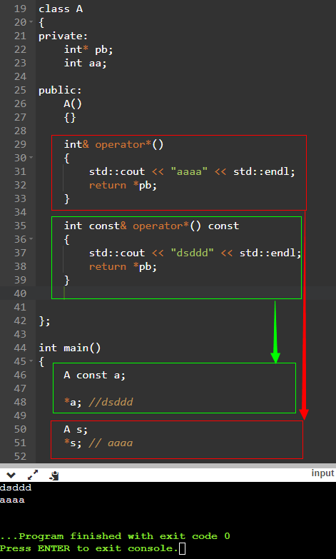

# TemplatesAndGenerics

http://www.mycode.net.cn/

c++模板与泛型，元编程

使用数组名作为函数参数，会退化为指针

# C语言中结构体成员变量前的点的作用

结构体中成员变量前的点： 结构体成员指定初始化
1.该结构体要先定义 
2.一个成员变量赋值完后用逗号而不是分号 
3.初始化语句的元素以固定的顺序出现，和被初始化的数组或结构体中的元素顺序一样
 这样可以不用按顺序初始化 
4.C99才开始支持的 

------

typora免费版

https://www.typora.io/windows/dev_release.html
